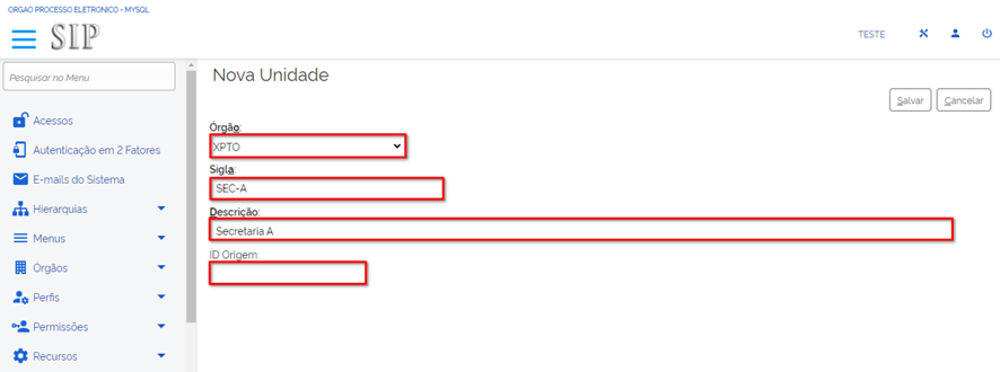

Criação e Configuração de Unidade
=================================

Após a criação do órgão no SIP e de sua configuração no SEI, é necessário criar as unidades administrativas que farão parte da estrutura da instituição. Seguindo a mesma lógica utilizada na criação do órgão no modelo multiórgãos, as unidades também são criadas no SIP e configuradas no SEI. Para facilitar esse entendimento e exemplificar o conteúdo tratado aqui, continuaremos utilizando o organograma do Ministério XPTO.

Nova Unidade no SIP
-------------------

Para criar uma nova Unidade no SIP deve-se seguir os seguintes passos:

01. Acessar o sistema com os dados fornecidos pela equipe do PEN.

02. Acessar o Menu Principal;

03. Selecionar a opção “Unidades”;

04. Clicar na opção “Nova”.

.. figure:: _static/images/02-02_Criacao-Orgaos_MenuSIP_Unidades-Nova.png

Após clicar na opção “Nova”, abrirá uma tela denominada “Nova Unidade” com quatro campos, conforme mostra a figura a seguir:

05. Preencher os campos da Nova Unidade, conforme o órgão está estruturado

- **Órgão**: Deverá ser selecionado a qual órgão pertence a unidade. No nosso exemplo utilizaremos o órgão recém-criado "XTPO".
- **Sigla**: Deverá ser preenchido com a sigla atribuída para a unidade. No nosso exemplo utilizaremos a sigla “SEC-A”.
- **Descrição**: Deverá ser preenchido com o nome completo da unidade. No nosso exemplo utilizaremos o nome “Secretaria A”.
- **ID Origem**: Esta opção só deverá ser preenchida caso o órgão deseje importar os dados da unidade de outro servidor. Nesse caso deverá ser preenchido com o identificador da unidade no servidor original. No nosso exemplo deixaremos o campo em branco.

Após o preenchimento, clicar em “Salvar”. Com isso, a unidade será criada e será exibida a lista de todas as unidades pertencentes ao órgão.

.. admonition:: Nota

   Essa operação de criação deverá ser realizada para todas as unidades do órgão e deverá refletir o organograma da instituição. Caberá aos gestores do sistema analisarem a necessidade de incluir unidades temporárias, colegiados ou outras estruturas não representadas no organograma do órgão.

Configuração de Unidades no SEI
-------------------------------

Após a criação das unidades no SIP, é necessário configurá-las no SEI para que possam ser utilizadas. Para isso, deve-se seguir os passos abaixo:

1. Acessar o SEI com os dados fornecidos.
2. No Menu Principal, selecionar a opção “Administração”.
3. Clicar em “Unidades”.
4. Selecionar a unidade recém-criada para configuração.

Na tela de configuração de unidades, preencher os seguintes campos:

- **Código**: Número de controle da unidade. No Poder Executivo Federal, recomenda-se que seja preenchido com o código de Unidade Protocolizadora (UP).
- **Sigla**: Sigla da unidade, por exemplo, “SEC-A”.
- **Nome**: Nome completo da unidade, por exemplo, “Secretaria A”.
- **Contato**: Dados de contato da unidade, como endereço, telefone e e-mail.
- **Checkboxes**:
    - **Disponível para envio de processos**: Habilita a unidade para envio de processos.
    - **Enviar e-mail de aviso quando um processo for remetido para a unidade**: O sistema enviará um e-mail de aviso para a unidade.
    - **Unidade de arquivamento**: Define a unidade como unidade de arquivamento.
    - **Unidade de ouvidoria**: Define a unidade como unidade de ouvidoria.
    - **Unidade de protocolo**: Define a unidade como unidade de protocolo.

Após o preenchimento, clicar em “Salvar” para finalizar a configuração da unidade.

Finalizando a Configuração das Unidades no SEI
----------------------------------------------

Após a configuração das unidades no SEI, será exibida a mensagem "Operação realizada com sucesso", indicando que a unidade está pronta para ser utilizada.

A configuração das unidades é um passo essencial para garantir a correta operação e integração das unidades no ambiente do SEI. Após a configuração inicial, recomenda-se realizar um teste para verificar se todas as unidades foram cadastradas e configuradas corretamente.

Em caso de dúvidas ou problemas durante a configuração das unidades, recomenda-se contatar a equipe de suporte técnico do SEI para auxílio na resolução de possíveis dificuldades.

.. admonition:: Nota

    Para mais detalhes sobre a administração e configuração do SEI, consulte os manuais e documentos técnicos disponibilizados pela equipe do PEN.
