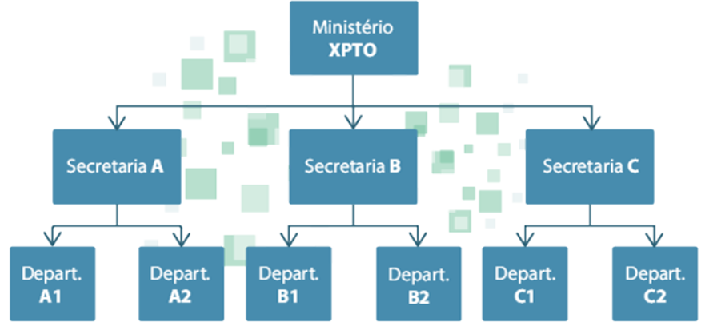
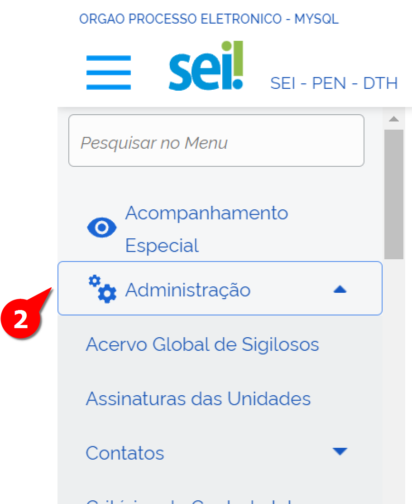
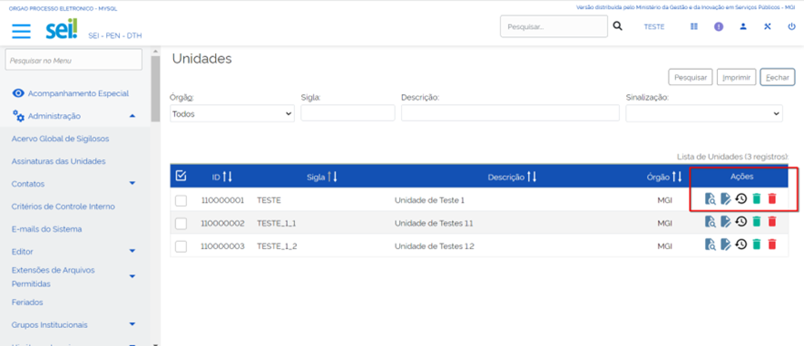
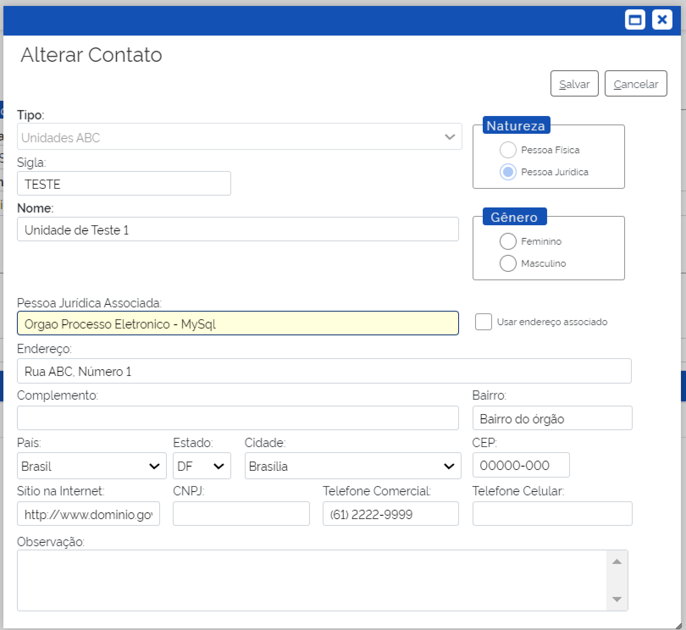
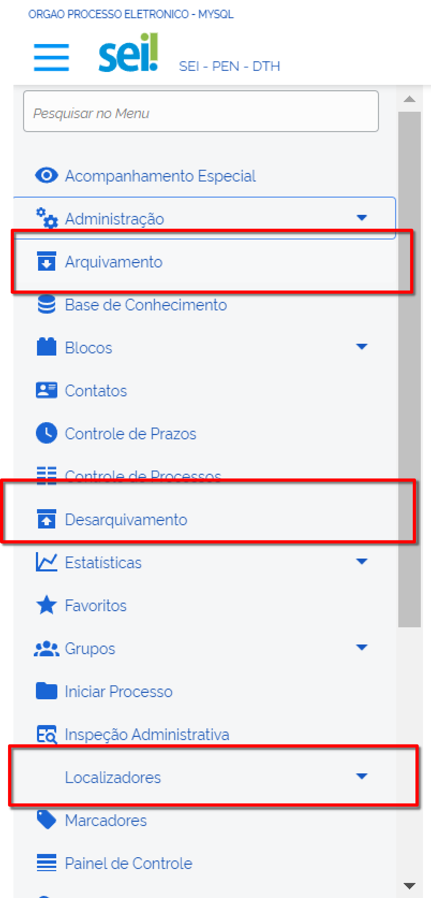

Montagem e Gestão de Hierarquias
=================================

A hierarquia no SEI é a maneira como as unidades se relacionam e indica qual a posição de cada uma no organograma da instituição. A inclusão das unidades na hierarquia é requisito indispensável para sua utilização. 

Após a criação de todas as unidades do órgão no SIP é necessário montar a hierarquia entre elas refletindo o organograma da instituição. 

Será continuado a utilizar o exemplo do ministério criado (bem como as suas unidades) XPTO.

Montagem de Hierarquia no SIP
-----------------------------

Para realizar a montagem de uma hierarquia deve-se seguir os seguintes passos:

1. Acessar o sistema com os dados fornecidos pela equipe do PEN.

.. figure:: _static/images/02-03_Mont-Gest-Hierarquias_Tela_SIP.png

2. Acessar o Menu Principal.
3. Selecionar a opção “Hierarquias”.
4. Clicar na opção “Montar”.

.. figure:: _static/images/02-03_Mont-Gest-Hierarquias_MenuSIP_Montar-Hierarquias.png

.. admonition:: Nota

    Para montar uma nova hierarquia é comum imaginar que o caminho seja acessar o menu “Hierarquias” e clicar na opção “Nova”. No entanto, como o SIP é um sistema criado para administrar outros sistemas além do SEI, estaríamos criando uma nova hierarquia para um novo sistema ao selecionar a opção “Nova”. Logo a montagem da nossa hierarquia sempre acontecerá na hierarquia do SEI, por isso a seleção da opção “Montar”.

Ao clicar na opção “Montar” uma nova tela chamada “Montar Hierarquia” será exibida. Essa tela apresenta uma lista contendo todas as unidades que já possuem hierarquia montada.

.. figure:: _static/images/02-03_Mont-Gest-Hierarquias_TelaSIP_Montar-Hierarquia.png

05. Para incluir as novas unidades do Ministério XPTO na hierarquia SEI é necessário clicar no botão “Adicionar Unidade” localizado no canto superior direito da página.

.. figure:: _static/images/02-03_Mont-Gest-Hierarquias_TelaSIP_Montar-Hierarquia_Adc-Und.png

Após clicar no botão “Adicionar Unidade” você terá acesso a uma página composta da seguinte maneira:

.. figure:: _static/images/02-03_Mont-Gest-Hierarquias_TelaSIP_Adc-Und-Hierarquia.png

- Hierarquia: Deverá ser selecionado o sistema no qual a hierarquia será montada. As unidades sempre serão montadas na hierarquia SEI.
- Checkbox Raiz: Deverá ser selecionada quando se tratar de uma unidade superior. No caso do nosso organograma, quando incluirmos as três secretarias.
- Unidade Superior na Hierarquia: Este campo só aparece quando a checkbox "Raiz" não está selecionada. Deve ser indicada a unidade imediatamente superior à que estamos cadastrando. No caso do nosso organograma, as secretarias devem ser indicadas como unidades superiores quando incluirmos os departamentos.
- Órgão da Unidade: Deve ser selecionado o órgão em que se encontra a unidade.
- Unidade: Deve ser selecionada a unidade que será incluída na hierarquia. Só serão exibidas unidades que ainda não fazem parte de uma hierarquia.
- Data Inicial: Define a data de entrada da unidade na hierarquia. No nosso exemplo, indicaremos a data do cadastro.
- Data Final: Indica a data final da unidade na hierarquia. No nosso exemplo deixaremos este campo em branco.

06. Após o preenchimento, clicar em “Salvar”. 

Pronto, a Unidade foi inserida na Hierarquia.

Explorando a Funcionalidade "Montar Hierarquias"
------------------------------------------------

Ao final da montagem da hierarquia, a estrutura do organograma será representada na tela “Montar Hierarquia” do SIP.

.. figure:: _static/images/02-03_Mont-Gest-Hierarquias_TelaSIP_Montar-Hierarquia_Acoes.png

Nessa mesma tela é possível realizar quatro ações:

1. **Adicionar Subunidade** .. figure:: _static/images/ÍconeSIP_Adicionar.png: Otimiza a montagem da hierarquia. Ao clicar nesta opção, a nova subunidade será incluída.
2. **Alterar Unidade na Hierarquia** .. figure:: _static/images/ÍconeSEI_Alterar.png: Reorganiza a unidade na hierarquia.
3. **Desativar Unidade na Hierarquia** .. figure:: _static/images/ÍconeSEI_Desativar.png: Desativa a unidade dentro daquela hierarquia. Uma vez desativada, a unidade continuará sendo exibida na lista, mas não estará mais disponível para acesso via SEI. A opção “Reativar Unidade na Hierarquia” será exibida ao selecionar esta ação.
4. **Excluir Unidade na Hierarquia** .. figure:: _static/images/ÍconeSEI_Excluir.png: Exclui definitivamente a unidade, a qual não será mais exibida na lista da hierarquia.

Introdução à Configuração dos Dados na Funcionalidade "Gestão de Hierarquia
----------------------------------------------------------------------------

Após a criação das unidades e a definição de sua hierarquia no SIP, é necessário configurar seus dados para que estejam prontas para serem utilizadas. O primeiro passo para configurar os dados é acessar e logar no SEI. Para isso, deve-se seguir os seguintes passos:

01. Acessar o SEI.

Como ainda não foram cadastrados usuários para o órgão, utilizaremos o usuário “teste” e a senha “teste” para acessar o menu que permite a configuração das unidades recém-criadas. No caso de uma instalação multiórgãos, essa configuração será feita acessando com o mesmo usuário e senha, porém no órgão raiz (ID 0), neste caso o órgão ME.

02. Acessar Administração no Menu Principal.
03. Selecionar a opção “Unidades”;
04. Clicar na opção "Listar".

.. figure:: _static/images/02-03_Mont-Gest-Hierarquias_Menu01_Unidades-Listar.png

Ao clicar na opção “Listar” você terá acesso a uma tela chamada “Unidades” que exibe uma relação das unidades cadastradas no ambiente. Por meio da coluna “Ações” é possível executar quatro ações. Acompanhe na imagem a seguir a disposição dos campos que compõem a tela "Unidades":

Vamos explorar a seguir cada ação disponível na funcionalidade "Listar Unidades":

- **Consultar Unidade**  .. figure:: _static/images/ÍconeSEI_Consultar.png: Permite consultar os dados cadastrados naquela unidade.
- **Alterar Unidade** .. figure:: _static/images/ÍconeSEI_Alterar.png : Permite cadastrar e editar os dados daquela unidade (esta será mais detalhada adiante).
- **Histórico da Unidade** .. figure:: _static/images/ÍconeSEI_Histórico.png: Permite visualizar o histórico daquela unidade.
- **Desativar Unidade** .. figure:: _static/images/ÍconeSEI_Desativar.png: Permite desativar a unidade no SEI. Essa ação remove a unidade da lista, porém é possível consultar a lista de unidades desativadas bem como reativá-las acessando o menu “Administração”, em seguida "Unidades" e clicando em “Reativar”.
- **Excluir Unidade** .. figure:: _static/images/ÍconeSEI_Excluir.png: Permite excluir definitivamente uma unidade no SEI que não será mais exibida na lista de unidades.

Explorando a Ação "Alterar Unidade" no SEI
------------------------------------------

Clicando na opção “Alterar Unidade”, o segundo ícone da coluna “Ações”, você terá acesso a uma nova tela com o formulário para cadastramento das informações base da instituição.
Vamos explorar a seguir cada seção que compõe o formulário (Códigos, Contato Associado, E-mail, checkboxes):

.. figure:: _static/images/02-03_Mont-Gest-Hierarquias_Tela_Alterar-Unidade.png

- **Códigos**

  Esta seção está dividida em três campos:

  - **SIP**: campo preenchido automaticamente. Refere-se ao número de controle interno de relacionamento da unidade no SIP com o SEI. Ressalta-se que não é recomendado sua alteração.
  - **SEI**: deve ser preenchido com um número de controle da unidade. No Poder Executivo Federal recomenda-se que seja preenchido com o código de Unidade Protocolizadora (UP), uma vez que pode ser usado para compor o Número Único de Protocolo (NUP). Esse número pode ser repetido em várias unidades dependendo da maneira como foram definidas as Unidades Protocolizadoras, por exemplo, todas as unidades que estão abaixo da Secretaria A podem usar o mesmo código desde que o órgão defina que a Secretaria A é a UP daquele conjunto de unidades.
  - **Origem**: é o número que se relaciona com o campo “ID Origem” exibido durante a criação das unidades no SIP. Indica o número de relacionamento de unidades importadas de outros servidores.

- **Contato Associado**

  Esta seção está dividida em três partes:

  - **Sigla**: deve ser preenchido com a sigla associada à unidade que está sendo configurada.
  - **Nome**: deve ser preenchido com o nome completo da unidade que está sendo configurada.
  - **Alterar Dados do Contato Associado**: esta opção abre uma tela para cadastro de dados do contato associado àquela unidade. Devem ser indicados, entre outras coisas, endereço, e-mail e telefones da unidade.

.. admonition:: Nota

    Não preencher as informações de contato fará com que aquela unidade não seja capaz de inserir novos documentos.

- **E-mail**

  Local destinado para adicionar e-mails daquela unidade. É possível inserir quantos e-mails forem necessários. No campo "E-mail" deve-se inserir o endereço de e-mail, por exemplo, "sec.a@xpto.gov.br". No campo “Descrição” deve-se informar um nome para aquele e-mail, por exemplo, "caixa corporativa da unidade SEC-A". Depois de inseridas as informações, é necessário clicar em "Adicionar E-mail" para executar a ação.

- **Checkboxes**

  Essa seção é composta por cinco checkboxes:

- **Disponível para envio de processos**: ao selecionar essa opção a unidade estará habilitada para enviar processos. Desmarcar essa opção se aplica aos casos em que não é interessante que as unidades enviem processos, por exemplo, no caso de extinção da unidade.
**Enviar e-mail de aviso quando um processo for remetido para a unidade**: ao selecionar essa opção o sistema enviará para o e-mail cadastrado da unidade uma mensagem sobre o recebimento de novos processos.
- **Unidade de arquivamento**: essa opção define que a unidade é também uma unidade de arquivamento. Isso implica que todos os usuários cadastrados nela terão acesso aos menus “Arquivamento”, “Desarquivamento” e “Localizadores”, podendo arquivar as partes analógicas dos processos.

- **Unidade de ouvidoria**: seleciona a unidade como a unidade de ouvidoria do órgão.

 A unidade de ouvidoria recebe todas as manifestações externas como elogios, sugestões, reclamações e denúncias.

- **Unidade de protocolo**: define a unidade como a unidade de protocolo do órgão.

  Após o preenchimento de todos os campos e seleção das checkboxes desejadas, clique em “Salvar” para finalizar o cadastro da unidade. Pronto, a unidade foi cadastrada e está configurada para uso.

Finalizando a Configuração das Unidades no SEI
-----------------------------------------------

Após a configuração das unidades no SEI, será exibida a mensagem "Operação realizada com sucesso" indicando que a unidade está pronta para ser utilizada.

**Foto número 4**

A configuração das unidades é um passo essencial para garantir a correta operação e integração das unidades no ambiente do SEI. Após a configuração inicial, recomenda-se realizar um teste para verificar se todas as unidades foram cadastradas e configuradas corretamente. 

**Foto número 5**

Em caso de dúvidas ou problemas durante a configuração das unidades, recomenda-se contatar a equipe de suporte técnico do SEI para auxílio na resolução de possíveis dificuldades.

.. admonition:: Nota

    Para mais detalhes sobre a administração e configuração do SEI, consulte os manuais e documentos técnicos disponibilizados pela equipe do PEN.