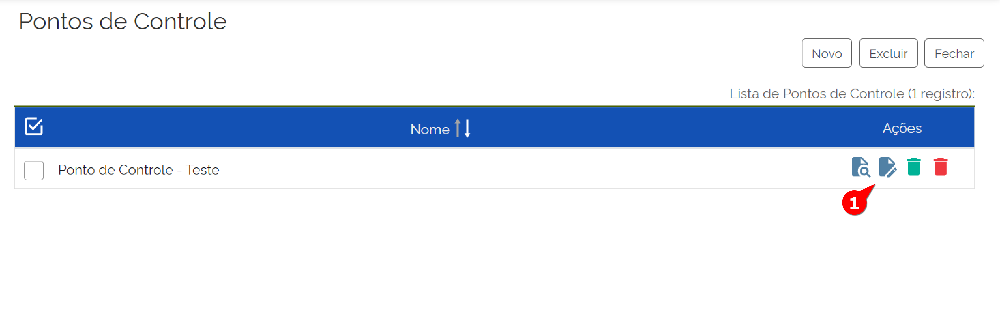
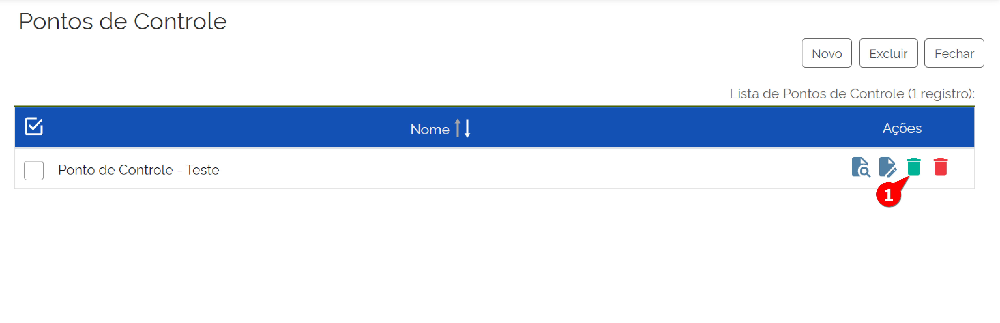

Administração SEI – Ponto de Controle
=========================================

A funcionalidade “Ponto de Controle” é utilizada para marcar situações temporárias e realizar o monitoramento dos status do processo.
Para acessá-la, o administrador deve acompanhar o caminho descrito a seguir:

.. figure:: _static/images/4-10_Ponto-de-controle_Menu.png04-10

01.	No Menu Principal, acessar Administração
02.	Clicar em “Pontos de Controle”.
A tela “Pontos de Controle” será exibida 

.. figure:: _static/images/04-10_Ponto-de-controle_Tela.png

Nessa tela temos a lista de Pontos de Controle determinadas pelo Admnistrador, bem como os seguintes comandos: 
- Criar um novo Ponto de controle
- Excluir um ponto de controle.
Além desses comandos, para os Pontos de Controle já criados, na lista é possível visualizar as funcionalidades para cada um dos pontos de controle: 
- Consultar Ponto de Controle 
- Alterar Pontos de Controle
- Desativar Ponto de Controle
- Excluir Ponto de Controle

CRIAR PONTO DE CONTROLE
-----------------------------

Após acessar a tela de Ponto de controle:

.. figure:: _static/images/04-10_Ponto-de-controle_Lista_Novo.png

01.	Clicar no Botão Novo
A tela de Novo Ponto de Controle será exibida.

.. figure:: _static/images/04-10_Ponto-de-controle_Tela_Novo.png

02.	Preencher os seguintes campos: 
- Nome: Nome do Ponto de controle
- Descrição: Descrição do Ponto de Controle
- Unidade: Selecionar as Unidades que o Ponto de Controle a ser criado serão acionadas.

03.	Clicar em Salvar
Pronto! O ponto de Controle foi criado!

ALTERAR PONTO DE CONTROLE
-----------------------------

Após acessar a tela de Ponto de controle e localizar o Ponto de Controle a ser alterado: 

01.	Clicar no respectivo botão Alterar Ponto de Controle
A tela “Alterar Ponto de Controle” será exibida.

.. figure:: _static/images/04-10_Ponto-de-controle_Tela_Alterar.png

02.	Alterar os campos desejados: 
- Nome: Nome do Ponto de controle
- Descrição: Descrição do Ponto de Controle
- Unidade: Editar as Unidades que o Ponto de Controle a ser criado serão acionadas.

03.	Clicar em Salvar

Pronto! O ponto de Controle foi alterado!

EXCLUIR PONTO DE CONTROLE
-----------------------------

A exclusão de um Ponto de Controle é uma ação irreversível, ao contrário do comando Desativar Ponto de Controle. 
Ciente dessa diferença, caso desejar excluir um ponto de controle, o Administrador deve acessar a tela de Ponto de controle e localizar o Ponto de Controle a ser excluído. 

.. figure:: _static/images/04-10_Ponto-de-controle_Lista_Excluir.png

01.	Clicar no respectivo botão Excluir Ponto de Controle

02.	Confirmar Ação, clicando em Ok.
Pronto, o Ponto de controle foi excluído

DESATIVAR PONTO DE CONTROLE
-----------------------------

A desativação de um Ponto de Controle é uma ação reversível, que será abordada no tópico seguinte.
Caso desejar desativar um Ponto de Controle, o Administrador deve acessar a tela de Ponto de controle e localizar o Ponto de Controle a ser desativado.

01.	Clicar no respectivo botão Desativar Ponto de Controle

02.	Confirmar Ação, clicando em Ok.
Pronto, o Ponto de controle foi desativado e na lista de Pontos de Controle ele estará com preenchimento em vermelho:

.. figure:: _static/images/04-10_Ponto-de-controle_Tela_Desativado.png

REATIVAR PONTO DE CONTROLE
-----------------------------

A reativação de um Ponto de Controle é a ação reversível da desativação do ponto de controle, que foi abordada no tópico anterior.
Caso desejar reativar um Ponto de Controle, o Administrador deve acessar a tela de Ponto de controle e localizar o Ponto de Controle a ser reativado. Note que os Pontos de Controle desativados estão em Vermelho

.. figure:: _static/images/04-10_Ponto-de-controle_Lista_Reativar.png

01.	Clicar no respectivo botão reativar Ponto de Controle

02.	Confirmar Ação, clicando em Ok.
Pronto, o Ponto de controle foi reativado.

