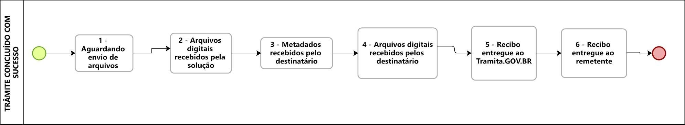

Acesso ao Ambiente de Produção
==============================

Após a conclusão dos procedimentos em ambiente de homologação, o órgão ou a entidade será autorizado a replicar as configurações de que tratam os capítulos `Configuração da Estrutura <https://manuais.processoeletronico.gov.br/pt_BR/latest/TRAMITA.GOV.BR/CONFIGURACAO_DA_ESTRUTURA.html#configuracoes-da-estrutura>`_ , `Implantação do Módulo de Conexão <https://manuais.processoeletronico.gov.br/pt_BR/latest/TRAMITA.GOV.BR/IMPLANTACAO_DO_MODULO_DE_CONEXAO.html#implantacao-do-modulo-de-conexao>`_ e `Acesso ao Ambiente de Produção <https://manuais.processoeletronico.gov.br/pt_BR/latest/TRAMITA.GOV.BR/ACESSO_AO_AMBIENTE_DE_PRODUCAO.html#acesso-ao-ambiente-de-producao>`_ em ambiente de produção, de modo a minimizar a possibilidade de erros que possam vir a impactar os trâmites na plataforma. Como é no ambiente de Produção que os trâmites reais são realizados, os requisitos estabelecidos em ambiente de homologação são realmente necessários para que a experiência de utilização do Tramita.GOV.BR seja positiva.

O acesso ao Portal de Administração do Tramita.GOV.BR é feito pelo endereço http://gestaopen.processoeletronico.gov.br.

.. admonition:: Notas
   
   Deve-se observar que o presente Manual Técnico versa, em maiores detalhes, sobre as configurações do portal e sobre os procedimentos de teste para validação da integração. As configurações referentes ao módulo de integração ao SEI e às demais soluções de integração devem ser consultadas na documentação específica dos referidos projetos.

   Vide o item `Definição dos Status <https://manuais.processoeletronico.gov.br/pt_BR/latest/TRAMITA.GOV.BR/ACESSO_AO_AMBIENTE_DE_PRODUCAO.html#id3>`_ deste manual para referência completa sobre os diferentes status de tramitação.

**Somente após o cumprimento dos requisitos mínimos descritos nos capítulos anteriores** e validação dos mesmos pela equipe técnica do PEN, será autorizado o acesso ao **ambiente de Produção**, sendo que nesse ambiente, após a realização das configurações no portal do Tramita.GOV.BR, **devem ser realizados novamente TODOS  os  requisitos mínimos**.

**Em produção**, os processos de testes de que trata o Capítulo `Acesso ao Ambiente de Produção <https://manuais.processoeletronico.gov.br/pt_BR/latest/TRAMITA.GOV.BR/ACESSO_AO_AMBIENTE_DE_PRODUCAO.html#acesso-ao-ambiente-de-producao>`_ devem ser enviados para a unidade “Divisão de Gestão de Sistemas de Documentação e Informação – DISIS”, do Ministério da Gestão e da Inovação em Serviços Públicos.

.. admonition:: Nota

   Ao enviar o processo acima citado, é necessário incluir a descrição que se trata de um teste (por exemplo: TESTE – órgão X). Os testes em ambiente de produção são acompanhados por técnicos do PEN. Após o envio do processo de teste, deve-se comunicar, por meio de e-mail institucional processo.eletronico@economia.gov.br, que os testes foram iniciados.

Funcionamento dos Trâmites de Processos ou Documentos
+++++++++++++++++++++++++++++++++++++++++++++++++++++

O trâmite é o envio de um documento avulso, em meio eletrônico, ou de um processo administrativo eletrônico do remetente até o destinatário. O trâmite pode ser concluído de três formas: cancelado, recusado ou com sucesso. Em qualquer situação de conclusão, o trâmite percorre por vários status até a sua conclusão. A compreensão desses status é importante para que os Gestores de Protocolo saibam identificar eventuais problemas no andamento de trâmite no qual o seu órgão/ entidade está envolvido. Os vários status possíveis de um trâmite são explicados nos próximos tópicos.
 
Fluxo de Status
+++++++++++++++

.. figure:: _static/images/Tramite_Concluido_com_Recusa.jpg

.. figure:: _static/images/Tramite_Concluido_com_Cancelamento.jpg

Definição dos Status
++++++++++++++++++++

O trâmite de um processo administrativo eletrônico e/ou documento avulso, em meio eletrônico, pode passar pelos seguintes “status”:

+---------------------------------------------------------------------------------------------------------------------------------------------------------------------------------------------------------------------+
| Status 1                                                                                                                                                                                                            | 
+========================+============================================================================================================================================================================================+
|  Descrição             | Aguardando o envio dos arquivos digitais.                                                                                                                                                  |
+------------------------+--------------------------------------------------------------------------------------------------------------------------------------------------------------------------------------------+
|O que signifca o status?| As informações básicas (número, descrição, interessado, relação de documentos etc.) foram fornecidas e recebidas pelo Tramita GOV.BR, porém o sistema está aguardando o envio dos arquivos.|
+------------------------+--------------------------------------------------------------------------------------------------------------------------------------------------------------------------------------------+
|Onde está o processo?   | Sistema de processo eletrônico de origem.                                                                                                                                                  |
+------------------------+--------------------------------------------------------------------------------------------------------------------------------------------------------------------------------------------+
|O que pode ser feito?   | O trâmite do processo pode ser cancelado manualmente pelo usuário do sistema de origem.                                                                                                    |
+------------------------+--------------------------------------------------------------------------------------------------------------------------------------------------------------------------------------------+

+---------------------------------------------------------------------------------------------------------------------------------------------------------------------------------------------------------------------------------------------+
| Status 2                                                                                                                                                                                                                                    | 
+========================+====================================================================================================================================================================================================================+
|  Descrição             | Arquivos digitais recebidos pelo Tramita GOV.BR.                                                                                                                                                                   |
+------------------------+--------------------------------------------------------------------------------------------------------------------------------------------------------------------------------------------------------------------+
|O que signifca o status?| Os arquivos digitais do processo foram recebidos e validados quanto à integridade pelo Tramita GOV.BR. A plataforma aguarda o Sistema de Processo Eletrônico de destino buscar as informações do processo.         |
+------------------------+--------------------------------------------------------------------------------------------------------------------------------------------------------------------------------------------------------------------+
|Onde está o processo?   | Tramita GOV.BR                                                                                                                                                                                                     |
+------------------------+--------------------------------------------------------------------------------------------------------------------------------------------------------------------------------------------------------------------+
|O que pode ser feito?   | O trâmite do processo pode ser cancelado pelo usuário do sistema de origem.                                                                                                                                        |
|                        |                                                                                                                                                                                                                    | 
|                        | Caso o processo esteja parado no status 2, é muito provável que o sistema de destino esteja com problemas para recebimento. Nessa situação, entre em contato com um dos gestores de protocolo do órgão de destino. |                                                                                          
+------------------------+--------------------------------------------------------------------------------------------------------------------------------------------------------------------------------------------------------------------+

+-------------------------------------------------------------------------------------------------------------------------------------------------------------------------------------------------------------------------------------------------------------------------------------+
| Status 3                                                                                                                                                                                                                                                                            | 
+========================+============================================================================================================================================================================================================================================================+
|  Descrição             | Metadados recebidos pelo sistema de processo eletrônico destinatário                                                                                                                                                                                       |
+------------------------+------------------------------------------------------------------------------------------------------------------------------------------------------------------------------------------------------------------------------------------------------------+
|O que signifca o status?| As informações básicas (número, descrição, interessado, relação de documentos etc.) foram informadas e recebidas pelo Sistema de Processo Eletrônico de destino e o sistema está aguardando a transferência dos arquivos digitais para o referido sistema  |
+------------------------+------------------------------------------------------------------------------------------------------------------------------------------------------------------------------------------------------------------------------------------------------------+
|Onde está o processo?   | Tramita GOV.BR                                                                                                                                                                                                                                             |
+------------------------+------------------------------------------------------------------------------------------------------------------------------------------------------------------------------------------------------------------------------------------------------------+
|O que pode ser feito?   | Caso o processo esteja parado no status 3, provavelmente o sistema de destino está com problemas para recebimento. Nessa situação, entre em contato com um dos gestores de protocolo do órgão de destino.                                                  |
+------------------------+------------------------------------------------------------------------------------------------------------------------------------------------------------------------------------------------------------------------------------------------------------+

+-------------------------------------------------------------------------------------------------------------------------------------------------------------------------------------------------------------------------------------------------------------------------------------+
| Status 4                                                                                                                                                                                                                                                                            | 
+========================+============================================================================================================================================================================================================================================================+
|  Descrição             | Arquivos digitais recebidos pelo destinatário                                                                                                                                                                                                              |
+------------------------+------------------------------------------------------------------------------------------------------------------------------------------------------------------------------------------------------------------------------------------------------------+
|O que signifca o status?| Os arquivos digitais foram recebidos pelo Sistema de Processo Eletrônico de destino e o Tramita GOV.BR está aguardando o sistema de destino enviar o recibo de conclusão do trâmite.                                                                       |
+------------------------+------------------------------------------------------------------------------------------------------------------------------------------------------------------------------------------------------------------------------------------------------------+
|Onde está o processo?   | Sistema de Processo Eletrônico de destino                                                                                                                                                                                                                  |
+------------------------+------------------------------------------------------------------------------------------------------------------------------------------------------------------------------------------------------------------------------------------------------------+
|O que pode ser feito?   | Caso o processo esteja parado no status 4, provavelmente o sistema de destino está com problemas para recebimento. Nessa situação, entre em contato com um dos gestores de protocolo do órgão de destino.                                                  |
+------------------------+------------------------------------------------------------------------------------------------------------------------------------------------------------------------------------------------------------------------------------------------------------+

+-------------------------------------------------------------------------------------------------------------------------------------------------------------------------------------------------------------------------------------------------------------------------------------+
| Status 5                                                                                                                                                                                                                                                                            | 
+========================+============================================================================================================================================================================================================================================================+
|  Descrição             | Recibo de conclusão recebido pelo Tramita GOV.BR                                                                                                                                                                                                           |
+------------------------+------------------------------------------------------------------------------------------------------------------------------------------------------------------------------------------------------------------------------------------------------------+
|O que signifca o status?| O Sistema de Processo Eletrônico de destino validou a integridade do processo e enviou o recibo de conclusão do trâmite para o Tramita GOV.BR.                                                                                                             |
+------------------------+------------------------------------------------------------------------------------------------------------------------------------------------------------------------------------------------------------------------------------------------------------+
|Onde está o processo?   | Sistema de Processo Eletrônico de destino                                                                                                                                                                                                                  |
+------------------------+------------------------------------------------------------------------------------------------------------------------------------------------------------------------------------------------------------------------------------------------------------+
|O que pode ser feito?   | Caso o processo esteja parado no status 5, provavelmente o sistema de origem está indisponível. Nessa situação, entre em contato com um dos gestores de protocolo do órgão de origem.                                                                      |
+------------------------+------------------------------------------------------------------------------------------------------------------------------------------------------------------------------------------------------------------------------------------------------------+

+-------------------------------------------------------------------------------------------------------------------------------------------------------------------------------------------------------------------------------------------------------------------------------------+
| Status 6                                                                                                                                                                                                                                                                            | 
+========================+============================================================================================================================================================================================================================================================+
|  Descrição             | Recibo de conclusão recebido pelo remetente                                                                                                                                                                                                                |
+------------------------+------------------------------------------------------------------------------------------------------------------------------------------------------------------------------------------------------------------------------------------------------------+
|O que signifca o status?| O recibo de conclusão do trâmite foi recebido com sucesso pelo Sistema de Processo Eletrônico de origem.                                                                                                                                                   |
+------------------------+------------------------------------------------------------------------------------------------------------------------------------------------------------------------------------------------------------------------------------------------------------+
|Onde está o processo?   | Sistema de Processo Eletrônico de destino                                                                                                                                                                                                                  |
+------------------------+------------------------------------------------------------------------------------------------------------------------------------------------------------------------------------------------------------------------------------------------------------+
|O que pode ser feito?   | _                                                                                                                                                                                                                                                          |
+------------------------+------------------------------------------------------------------------------------------------------------------------------------------------------------------------------------------------------------------------------------------------------------+

+-------------------------------------------------------------------------------------------------------------------------------------------------------------------------------------------------------------------------------------------------------------------------------------+
| Status 7                                                                                                                                                                                                                                                                            | 
+========================+============================================================================================================================================================================================================================================================+
|  Descrição             | Recibo de conclusão recebido pelo remetente                                                                                                                                                                                                                |
+------------------------+------------------------------------------------------------------------------------------------------------------------------------------------------------------------------------------------------------------------------------------------------------+
|O que signifca o status?| O recibo de conclusão do trâmite foi recebido com sucesso pelo Sistema de Processo Eletrônico de origem.                                                                                                                                                   |
+------------------------+------------------------------------------------------------------------------------------------------------------------------------------------------------------------------------------------------------------------------------------------------------+
|Onde está o processo?   | Sistema de Processo Eletrônico de destino                                                                                                                                                                                                                  |
+------------------------+------------------------------------------------------------------------------------------------------------------------------------------------------------------------------------------------------------------------------------------------------------+
|O que pode ser feito?   | _                                                                                                                                                                                                                                                          |
+------------------------+------------------------------------------------------------------------------------------------------------------------------------------------------------------------------------------------------------------------------------------------------------+

+---------------------------------------------------------------------------------------------------------------------------------------------------------------------------------------------------------------------------------------------------------------------------------------------------------------+
| Status 8                                                                                                                                                                                                                                                                                                      | 
+========================+======================================================================================================================================================================================================================================================================================+
|  Descrição             | Trâmite recusado. Aguardando ciência do remetente                                                                                                                                                                                                                                    |
+------------------------+--------------------------------------------------------------------------------------------------------------------------------------------------------------------------------------------------------------------------------------------------------------------------------------+
|O que signifca o status?| O trâmite foi recusado pelo Sistema de Processo Eletrônico de destino por alguma falha na validação dos dados recebidos e está aguardando a ciência do sistema de origem para realizar o desbloqueio do processo. Exemplo: o Formato de arquivo não é aceito pelo sistema de destino |
+------------------------+--------------------------------------------------------------------------------------------------------------------------------------------------------------------------------------------------------------------------------------------------------------------------------------+
|Onde está o processo?   | Tramita GOV.BR                                                                                                                                                                                                                                                                       |
+------------------------+--------------------------------------------------------------------------------------------------------------------------------------------------------------------------------------------------------------------------------------------------------------------------------------+
|O que pode ser feito?   | Cenários Possíveis:                                                                                                                                                                                                                                                                  |
|                        |                                                                                                                                                                                                                                                                                      |
|                        | 1. Caso o trâmite esteja parado no status 8, provavelmente o sistema de origem está com problema de comunicação com o Tramita GOV.BR. Nessa situação, entre em contato com um dos gestores de protocolo do órgão de origem.                                                          |          
|                        |                                                                                                                                                                                                                                                                                      |
|                        | 2. Após mudanças de estruturas de órgãos no SIORG, algumas unidades podem ser inativadas. Por esse motivo, um trâmite em andamento que foi recusado ficará parado no status 8, visto que não é possível localizar a unidade de origem para concluir o trâmite.                       |
|                        |                                                                                                                                                                                                                                                                                      |
|                        | Uma solução possível é verificar se a unidade de origem ainda permanece disponível no Portal de Administração e mapear novamente essa unidade para receber processos.                                                                                                                |
|                        |                                                                                                                                                                                                                                                                                      |
|                        | 3. Nos casos de recusa com justificativa com mais de 500 caracteres, caso o erro seja reportado, atualizar o módulo para no mínimo a versão 3.1.8.                                                                                                                                   |
+------------------------+--------------------------------------------------------------------------------------------------------------------------------------------------------------------------------------------------------------------------------------------------------------------------------------+

+-------------------------------------------------------------------------------------------------------------------------------------------------------------------------------------------------------------------------------------------------------------------------------------+
| Status 9                                                                                                                                                                                                                                                                            | 
+========================+============================================================================================================================================================================================================================================================+
|  Descrição             | Ciência da recusa recebido pelo remetente                                                                                                                                                                                                                  |
+------------------------+------------------------------------------------------------------------------------------------------------------------------------------------------------------------------------------------------------------------------------------------------------+
|O que signifca o status?| A notificação da recusa do trâmite foi recebida pelo Sistema de Processo Eletrônico de origem e o processo foi desbloqueado.                                                                                                                               |
+------------------------+------------------------------------------------------------------------------------------------------------------------------------------------------------------------------------------------------------------------------------------------------------+
|Onde está o processo?   | Sistema de Processo Eletrônico de origem                                                                                                                                                                                                                   |
+------------------------+------------------------------------------------------------------------------------------------------------------------------------------------------------------------------------------------------------------------------------------------------------+
|O que pode ser feito?   | Verificar o motivo da recusa e entrar em contato com um dos gestores de protocolo do órgão de destino.                                                                                                                                                     |
+------------------------+------------------------------------------------------------------------------------------------------------------------------------------------------------------------------------------------------------------------------------------------------------+

+-------------------------------------------------------------------------------------------------------------------------------------------------------------------------------------------------------------------------------------------------------------------------------------+
| Status 10                                                                                                                                                                                                                                                                           | 
+========================+============================================================================================================================================================================================================================================================+
|  Descrição             | Trâmite cancelado automaticamente                                                                                                                                                                                                                          |
+------------------------+------------------------------------------------------------------------------------------------------------------------------------------------------------------------------------------------------------------------------------------------------------+
|O que signifca o status?| O trâmite é cancelado automaticamente pelo Tramita GOV.BR após o prazo estabelecido pelos Administradores do Tramita GOV.BR.                                                                                                                               |
|                        |                                                                                                                                                                                                                                                            | 
|                        | Apenas os trâmites com status 1, 2, 3 e 4 podem ser cancelados automaticamente.                                                                                                                                                                            |
+------------------------+------------------------------------------------------------------------------------------------------------------------------------------------------------------------------------------------------------------------------------------------------------+
|Onde está o processo?   | Sistema de Processo Eletrônico de origem                                                                                                                                                                                                                   |
+------------------------+------------------------------------------------------------------------------------------------------------------------------------------------------------------------------------------------------------------------------------------------------------+
|O que pode ser feito?   | _                                                                                                                                                                                                                                                          |
+------------------------+------------------------------------------------------------------------------------------------------------------------------------------------------------------------------------------------------------------------------------------------------------+
 