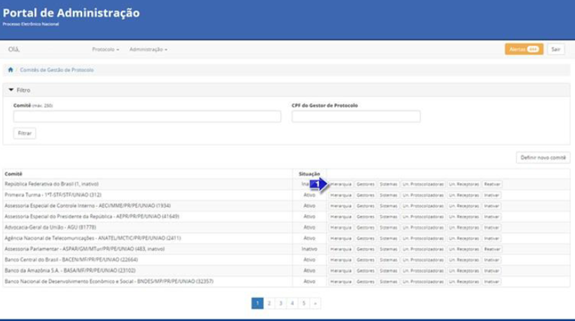
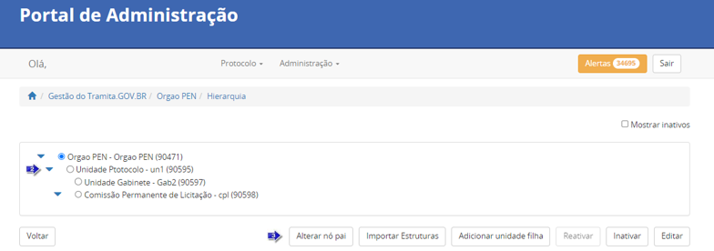
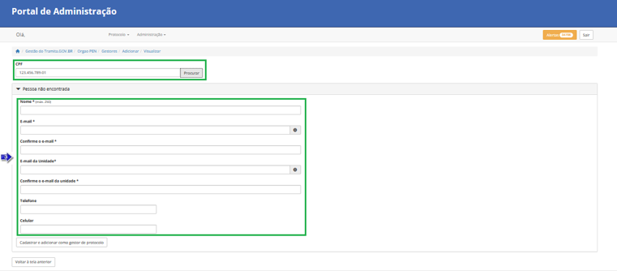
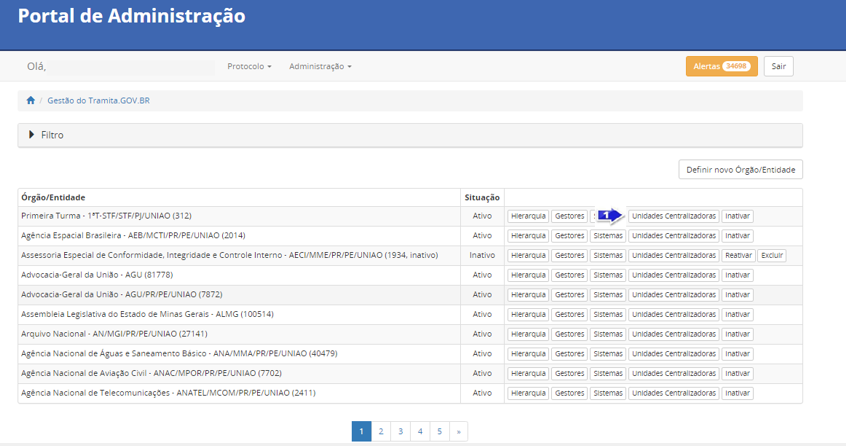
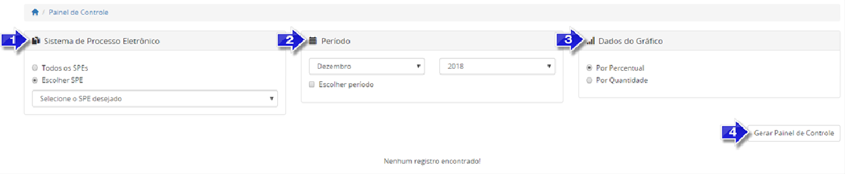
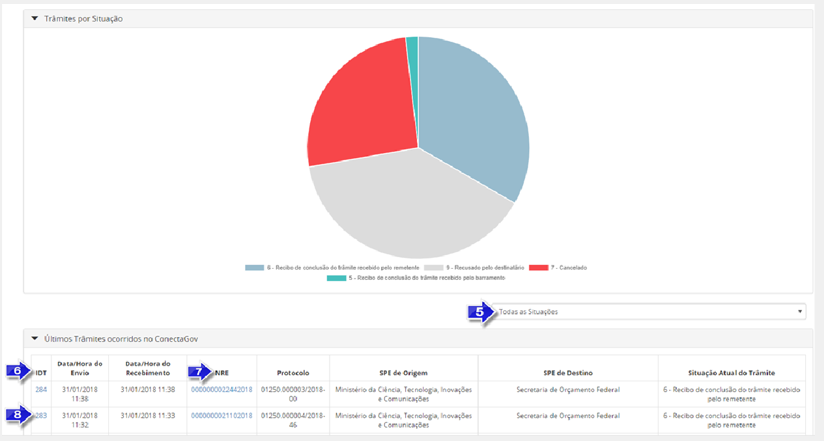

Configurações da Estrutura
===========================

Tendo o cadastro aprovado, o Gestor do protocolo terá o acesso liberado ao Portal de Administração, visando a configuração da estrutura organizacional da instituição.

No fluxo abaixo, estão consolidadas as principais atividades a serem realizadas pelo gestor responsável pelo Tramita.GOV.BR:
 

.. figure:: _static/images/fluxo_adesao_configuracao_tramita.png

Geração do certificado digital
++++++++++++++++++++++++++++++

* O certificado digital é a garantia, dentro do Tramita.GOV.BR, de que o SPE conectado pertence de fato ao órgão que realizou o cadastro no Portal.

* Ele é gerado pelos gestores de protocolo no Portal do Tramita.GOV.BR, por meio da funcionalidade localizada no menu Administração > Opção “Sistemas de Processo Administrativo Eletrônico”.

* O certificado é gerado por meio da ação “Gerar Certificado”. Antes de sair da tela de geração, não se esqueça de salvar a senha e o certificado em algum lugar seguro. O certificado é vinculado automaticamente ao órgão ou a entidade no Portal de administração e se torna confiável para o Tramita.GOV.BR.

.. figure:: _static/images/Geracao_de_Certificado_por_meio_do_Portal_do_Barramento.png

Cadastro da Hierarquia
++++++++++++++++++++++

.. admonition:: Nota

   Aos órgãos/entidades com estrutura hierárquica mantida pelo **SIORG, não é permitido** o cadastro de novas unidades, snedo necessário solicitar eventuais ajustes, quando necessários, à área responsável pela gestão do SIORG na organização.

 
Já os órgãos e as entidades que não se enquadram no disposto acima poderão cadastrar ou modificar a sua estrutura, por meio da funcionalidade “Gestão do Tramita.GOV.BR ”.

É responsabilidade do órgão e da entidade, em processo de implantação, definir quais e quantas unidades da sua estrutura hierárquica serão cadastradas no Portal.

Para realizar o cadastro ou alteração de uma árvore de Unidades Administrativas, clique no botão “Hierarquia”. O sistema apresentará uma tela com algumas funcionalidades.

 
Estrutura de Unidades Administrativas: As unidades são exibidas em formato de lista expansível: havendo unidades abaixo delas na hierarquia, é possível exibi-las clicando-se na seta para a direita (|seta_direita|) para expandir a lista. A lista já expandida fica assinalada com a seta para baixo (|seta_baixo|), na qual se pode clicar novamente para recolhê-la. Os níveis hierárquicos serão exibidos da esquerda para a direita, ou seja, uma unidade abaixo na hierarquia estará alinhada mais à direita que sua superior.

.. |seta_direita| image:: _static/images/icone_seta_direita.png
   :align: middle
   :width: 15

.. |seta_baixo| image:: _static/images/icone_seta_baixo.png
   :align: middle
   :width: 20

Funcionalidades de alteração na Estrutura de Unidades Administrativas:

**a.Alterar “nó pai”** – Ao clicar, o usuário seleciona uma unidade administrativa para indicar um novo **“nó pai”**, ou seja, uma unidade - dentre as já cadastradas - que estará acima da unidade selecionada na hierarquia.

**b.Adicionar unidade filha** – Operação inversa à descrita acima: ao clicar, o usuário cria Unidade Administrativa abaixo da unidade selecionada, devendo preencher um formulário com os dados: **Nome, Sigla, Código no Órgão/Entidade e Descrição** da unidade filha:

**OBS.:** Como boa prática, indica-se cadastrar apenas a primeira letra de cada palavra em caixa alta, por exemplo: “Diretoria de Informações, Serviços e Sistemas de Gestão”. Portanto, evite cadastrar todo o nome da unidade em caixa alta.

.. figure:: _static/images/Cadastro_de_Unidade_Filha.png

**c.Reativar** – Após o usuário habilitar a caixa de seleção “Mostrar inativos” e selecionar uma unidade na estrutura, o sistema possibilita reativar a unidade selecionada na estrutura organizacional.

**d.Inativar** – Ao clicar, o sistema permite inativar a estrutura organizacional.

**e.Visualizar** – Ao clicar, o sistema apresenta as informações cadastrais da Unidade Administrativa selecionada.

Cadastro de novos Gestores do Órgão/Entidade
++++++++++++++++++++++++++++++++++++++++++++

Nesta funcionalidade, o Gestor de Protocolo, previamente cadastrado e devidamente aprovado pelos administradores do Tramita.GOV.BR, poderá adicionar novos Gestores de Protocolo, que poderão auxiliar na administração das configurações de seu sistema. Esta funcionalidade está disponível no menu **Protocolo > Gestão do Tramita.GOV.BR**.

Para cadastrar o Gestor, basta clicar no botão “Gestores”, como na captura de tela a seguir:

.. figure:: _static/images/Menu_Gestores.png

Na tela seguinte, basta clicar em “Adicionar gestor”.

.. figure:: _static/images/Adicionar_Gestor.png

Em seguida, deve ser inserido o CPF do gestor a ser cadastrado, clicando-se em seguida no Botão “Procurar”. Caso o novo gestor não seja localizado, o usuário deverá preencher os dados no formulário e clicar no botão “Cadastrar e adicionar como gestor de protocolo”. O acesso dos novos gestores é realizado por meio da autenticação Gov.Br.

Se o Gestor já estiver cadastrado, ao inserir um CPF e clicar no botão “Procurar”,os dados já serão resgatados automaticamente, bastando ao usuário clicar no botão “Adicionar como gestor de protocolo”.

.. figure:: _static/images/Busca_de_Gestor_de_Protocolo_pelo_CPF.png

Uma vez efetivado o cadastro, o sistema apresentará os dados do(s) Gestor(es) de Protocolo cadastrado(s).
 
.. figure:: _static/images/Lista_dos_Gestores_de_Protocolo_do_orgao_entidade.png

Definição de unidades administrativas para envio e recebimento de processos externos
++++++++++++++++++++++++++++++++++++++++++++++++++++++++++++++++++++++++++++++++++++

A principal configuração para iniciar a integração é **definir quais as unidades administrativas do órgão ou da entidade serão utilizadas para realizar o envio e/ou recebimento de processos externos**.

Também é importante lembrar que estas unidades estarão disponíveis para os demais órgãos ou entidades externas quando estes forem enviar processos e documentos para o órgão cadastrado.

O Tramita.GOV.BR permite customizar esta configuração de diversas maneiras, possibilitando que somente algumas unidades do órgão ou da entidade estejam disponíveis para envio, por exemplo somente as unidades de protocolo, ou liberando o acesso para toda a estrutura organizacional realizar livremente o envio de processos. Desta forma, o Gestor deverá definir qual a melhor abordagem para sua instituição, alinhada às suas políticas interna de expedição de processos e documentos.

Após esta definição, as unidades selecionadas estarão aptas a realizar o envio de processos/documentos e estarão visíveis para os demais sistemas externos como unidades disponíveis para envio de processos/documentos.

A configuração é feita por meio da funcionalidade **Protocolo > Gestão do Tramita.GOV.BR**.
 
.. figure:: _static/images/Botao_Sistemas.png

O Gestor deverá localizar seu órgão/entidade na listagem e, em seguida, clicar no botão Sistemas.

.. figure:: _static/images/Botao_Unidades_Administrativas.png

Em seguida, o Gestor deverá clicar no botão **“Unidades Administrativas”**, para definir quais serão utilizadas pelos órgãos e pelas entidades para realizar o envio externo e/ou recebimento de processos.

.. figure:: _static/images/Selecao_de_Unidades_Administrativas.png

Na tela seguinte, poderá assinalar quais unidades, dentro de sua hierarquia, estarão aptas a:

a.Enviar e Receber Processos e documentos;
b.Somente enviar; ou
c.Somente receber.

Após esta vinculação, as unidades administrativas selecionadas estarão aptas para realizar o envio e/ou recebimento de processos/ documentos, ficando visíveis para os demais sistemas externos como unidades disponíveis para envio de processos/documentos.

Em seguida, clicar no botão **Salvar alterações**. O sistema apresentará uma mensagem de sucesso.

Definição de unidades centralizadoras de processos/documentos
+++++++++++++++++++++++++++++++++++++++++++++++++++++++++++++

Em complemento à definição das unidades administrativas que poderão fazer o envio e recebimento de processos externos (vide `Definição de unidades para envio e recebimento de processos externos <https://manuais.processoeletronico.gov.br/pt_BR/latest/TRAMITA.GOV.BR/CONFIGURACAO_DA_ESTRUTURA.html#definicao-de-unidades-administrativas-para-envio-e-recebimento-de-processos-externos>`_), o Tramita.GOV.BR também permite que sejam definidas unidades centralizadoras, que serão responsáveis por receber todos os processos enviados para a instituição – independente da unidade indicada pelo órgão ou pela entidade remetente na hora do envio do processo ou documento – funcionando como unidades de protocolo.`Acesso ao Ambiente de Produção.

Por Exemplo: considere o cenário em que o órgão ABC definiu as seguintes unidades:
 
•	Órgão ABC **(raiz da organização)**
•	Secretaria de Assuntos Especiais
•	Secretaria Executiva
•	Secretaria de Planejamento e Orçamento
•	Gabinete do Ministro
•	Protocolo Central

Neste cenário, as unidades acima também estariam visíveis externamente para que qualquer outro órgão ou entidade externo possa enviar processos/documentos diretamente para elas, sem passagem por nenhuma outra área.

Com a configuração de uma unidade centralizadora, será possível definir regras de encaminhamento, isto é, direcionando que os processos externos enviados para as unidades acima exemplificadas sejam automaticamente **redirecionados** para a **unidade centralizadora definida**.
 
Ou seja, considerando os dados acima, poderíamos configurar o **Protocolo Central** como **Unidade Centralizadora do órgão ABC**. Com isto, um processo enviado diretamente para o Gabinete do Ministro seria automaticamente redirecionado para o Protocolo Central do órgão. Após esta definição, as regras de redirecionamento já serão aplicadas para os novos processos/documentos recebidos.

Essa configuração é feita a partir da funcionalidade **Protocolo > Gestão do Tramita.GOV.BR**.

Para iniciar, o Gestor deverá escolher seu órgão/entidade e clicar no botão “Unidades Centralizadoras”.

.. figure:: _static/images/Botao_Definir_novas_unidades_centralizadoras.png

Na tela seguinte, o Gestor deverá clicar no botão “Definir novas unidades centralizadoras” para definir quais serão as unidades centralizadoras do órgão.

.. figure:: _static/images/Definir_Unidades_Centralizadoras.png

A escolha da unidade para redirecionamento de processos é realizada por meio da marcação da caixa de seleção da referida unidade na estrutura hierárquica.

Esta será a unidade centralizadora, à qual os processos serão enviados, em vez das unidades indicadas no trâmite original. Após o cadastro desta unidade centralizadora, será necessário indicar por quais unidades administrativas ela responde. Esta indicação é fundamental para que o Tramita.GOV.BR realize o correto encaminhamento dos processos.

As unidades administrativas selecionadas são exibidas como unidades habilitadas para o recebimento de processos na funcionalidade do Tramita.GOV.BR. Contudo, no momento do recebimento o processo administrativo eletrônico ou documento avulso, em meio eletrônico, é recebido pela unidade centralizadora à qual a unidade administrativa está vinculada, ou seja, o recebimento ser dará por meio da unidade centralizadora definida.

Painel de Controle
++++++++++++++++++

O Painel de Controle é uma funcionalidade, disponível aos Gestores de Protocolo, para o acompanhamento das tramitações de processos administrativos eletrônicos ou documento avulso, em meio eletrônico, realizados pelo Tramita.GOV.BR.

Esta funcionalidade pode ser acessada por meio do menu **Administração > Painel de Controle**.
 

Função que permite consultar por todos os Sistemas de Processo Administrativo Eletrônico - SPE ou selecionar um SPE específico.

Função que permite escolher o período do trâmite desejado. O período poderá ser selecionado por Mês e Ano, respectivamente. Caso a caixa de seleção “Escolher período” seja selecionada, o sistema apresentará o componente “Calendário" para selecionar uma data inicial e uma data final.

Função que permite selecionar os dados do Gráfico por percentual ou por quantidade.

Função que permite gerar o Painel de Controle dos trâmites por situação.

Função que permite selecionar uma situação do trâmite ou todas as situações.

IDT, ou “Identificação do Trâmite”. É um número único que identifica cada trâmite específico.

NRE significa o Número do Registro do Trâmite. O NRE é o número de protocolo do Tramita.GOV.BR, independente de quantas vezes o processo for tramitado entre SPEs, esse recebe o mesmo número.
 
Ao clicar no Número do IDT, o sistema apresentará uma tela com as **Informações** do remetente e do destinatário, informações do **Recibo**, **Situação** atual do trâmite e os **Componentes** do trâmite, conforme abaixo:

.. figure:: _static/images/Informações_do_Tramite.png

**A. Informações** – Informações detalhada do trâmite, o sistema apresenta o Repositório, órgão, SPE vinculado, tipo de autenticação do remetente e do destinatário.

**B. Recibo** – São os recibos que são trocados entre os dois sistemas para confirmar os envios e recebimento dos documentos.

**C. Situações** – O sistema apresenta a situação atual do trâmite com data e hora. Para Cada IDT, pode haver uma ou várias situações do Trâmite. Se o trâmite é concluído com recusa, será exibida uma nova aba com o motivo da recusa.

**D. Componentes** – São os arquivos que foram tramitados no IDT. o sistema apresenta o nome, Hash, tipo de conteúdo, MimeType e o tamanho em bytes dos arquivos.

**E. Recusa** –  É exibida apenas quando o trâmite é concluído com recusa. Com essa aba é possível consultar a justificativa de recusa do processo ou documento avulso.
