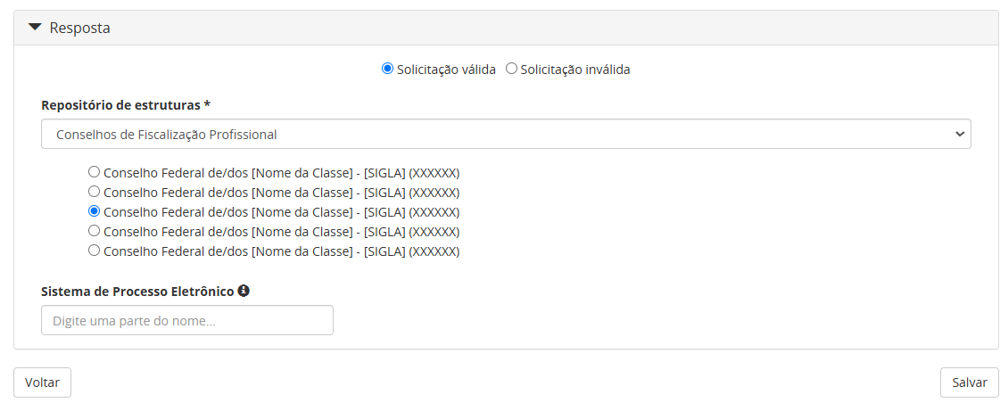
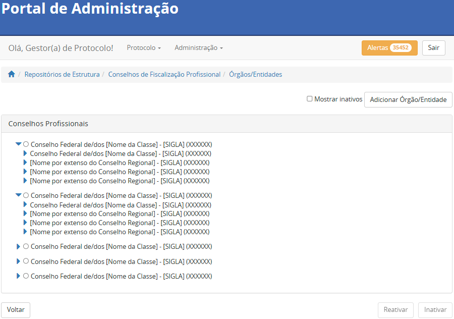

Conselhos de Fiscalização Profissional 
=======================================

Nessa seção é explicada como são inseridos os Conselhos de Fiscalização Profissional (CFP) no âmbito Federal e Regional, os quais devem ser inseridos, exclusivamente, no repositório específico dos Conselhos de Fiscalização Profissional. 

 
Nomenclatura do repositório dos Conselhos de Fiscalização Profissional 
----------------------------------------------------------------------

O repositório criado para concentrar os órgãos pertencentes às classes profissionais dos Conselhos de Fiscalização Profissional deve possuir nome e descrição inseridas conforme a instrução que segue. 

   **Nome do repositório:** Conselhos de Fiscalização Profissional 

   **Descrição do repositório:** O repositório centraliza os Conselhos de Fiscalização Profissional em âmbito Federal e Regional. 
 
Exemplo:

Categorias do repositório dos Conselhos de Fiscalização Profissional 
--------------------------------------------------------------------

A estruturação do repositório tem por base o conjunto dos Conselhos Profissionais registrados no país. Atualmente, não são todas as classes profissionais que possuem um Conselho de Fiscalização, de forma que no Brasil são contabilizados 31 Conselhos Federais. Dessa forma, esses 31 Conselhos Profissionais Federais estarão apresentados no primeiro nível do repositório, em ordem alfabética. A saber, são classificadas como categorias, os diversos Conselhos Federais pertencentes a cada uma das classes profissionais elencadas no primeiro nível do repositório. 

.. admonition:: Nota

   Conselhos no Brasil – Disponível em: https://pt.wikipedia.org/wiki/Associa%C3%A7%C3%A3o_profissional#Conselhos_no_Brasil – Acessado em outubro de 2024.

Conselhos Federais – CF  
+++++++++++++++++++++++

A configuração da categoria dos Conselhos Federais deve seguir a instrução abaixo. 

  **Nome:** Conselho Federal de/dos [Nome da Classe] 

  **Sigla:** [Cada conselho possui sigla própria já definida] 

  **Descrição:** Composto pelo Conselho Federal e pelos Conselhos Regionais de/dos [Nome da Classe]. 

.. admonition:: Nota

   Em específico, quatro conselhos possuem grafia diferente dos demais. Para estes serão criadas seções específicas de forma a estabelecer um consoante grau de padronização. 

Exemplo: 

Conselho Federal da Ordem dos Advogados do Brasil - OAB 
+++++++++++++++++++++++++++++++++++++++++++++++++++++++

A configuração da categoria Conselho Federal da Ordem dos Advogados do Brasil deve seguir a instrução abaixo. 

  **Nome:** Conselho Federal da Ordem dos Advogados do Brasil  

  **Sigla:** OAB 

  **Descrição:** Composto pelo Conselho Federal e pelos Conselhos Regionais dos Advogados do Brasil. 

 
Conselho de Arquitetura e Urbanismo do Brasil – CAU-BR 
++++++++++++++++++++++++++++++++++++++++++++++++++++++

A configuração da categoria Conselho Federal da Ordem dos Advogados do Brasil deve seguir a instrução abaixo. 

  **Nome:** Conselho de Arquitetura e Urbanismo do Brasil 

  **Sigla:** CAU-BR 

  **Descrição:** Composto pelo Conselho Federal e pelos Conselhos Regionais de Arquitetura e Urbanismo do Brasil. 

Conselho Nacional de Técnicos em Radiologia - Coter 
+++++++++++++++++++++++++++++++++++++++++++++++++++

A configuração da categoria Conselho Nacional de Técnicos em Radiologia deve seguir a instrução abaixo. 

  **Nome:** Conselho Nacional de Técnicos em Radiologia 

  **Sigla:** Coter 

  **Descrição:** Composto pelo Conselho Federal e pelos Conselhos Regionais de Técnicos em Radiologia. 

 
Ordem dos Músicos do Brasil Conselho Federal - OMB 
+++++++++++++++++++++++++++++++++++++++++++++++++++

A configuração da categoria Conselho Nacional de Técnicos em Radiologia deve seguir a instrução abaixo. 

  **Nome:** Ordem dos Músicos do Brasil Conselho Federal 

  **Sigla:** OMB 

  **Descrição:** Composto pelo Conselho Federal e pelos Conselhos Regionais dos Músicos do Brasil. 

Consolidação do repositório dos Conselhos de Fiscalização Profissional 
----------------------------------------------------------------------

Uma vez criado o repositório e estruturadas as suas categorias, é esperado que este se apresente conforme a imagem abaixo. 

Inserção de órgãos de referência no repositório dos Conselhos de Fiscalização Profissional 
------------------------------------------------------------------------------------------

A nível de explicação, se entende por órgãos de referência neste documento, os órgãos a serem inseridos no Portal de Administração pelo administrador do Tramita GOV.BR, na categoria específica do repositório, no momento da autorização de acesso a plataforma. 

 
Conselhos Federais 
+++++++++++++++++++
 

Uma vez criada a categoria, os órgãos de referência poderão ser incluídos. Para este caso os Conselhos de Federais serão cadastrados como um órgão de referência conforme instrução abaixo. 

  **Nome:** Conselho Federal de/dos [Nome da Classe] 

  **Sigla:** [Cada conselho possui sigla própria já definida] 

  **Descrição:** Composto pela estrutura interna do Conselho Federal de/dos [Nome da Classe]. 

.. admonition:: Nota

   Em específico, quatro conselhos possuem grafia diferente dos demais. Para estes serão criadas seções específicas de forma a estabelecer um consoante grau de padronização.

Exemplo: 

Conselhos Regionais 
++++++++++++++++++++

A distribuição de Conselhos Regionais varia de acordo com a classe profissional. Como exemplo é possível citar os Conselhos Regionais de Nutrição e de Farmácia. Para a classe profissional de Nutrição atualmente existem onze Conselhos Regionais, separados por Região, enquanto para a classe profissional de Farmácia existem vinte e sete Conselhos Regionais, uma para cada Unidade Federativa. 

Cabe ressaltar que diante da inexistência de uma padronização entre a grafia dos Conselhos Regionais, no momento da inserção, é importante que cada classe profissional registre os Órgãos de Referência de acordo com o padrão já existente para os seus Conselhos Regionais. A configuração dos Órgãos de Referência relacionados aos Conselhos Regionais deve seguir a instrução abaixo. 

  **Nome:** [Nome por extenso do Conselho Regional] 

  **Sigla:** [Sigla do Conselho Regional] 

  **Descrição:** Composto pela estrutura interna do [Nome por extenso do Conselho Regional]. 

.. admonition:: Nota

   No caso específico do repositório dos Conselhos de Fiscalização Profissional, a inserção dos Conselhos Regionais é de responsabilidade dos Gestores de cada um dos Conselhos Federais.

 
Exemplo: 

 
Visualização final do repositório dos Conselhos de Fiscalização Profissional 
-----------------------------------------------------------------------------
 

À medida que os órgãos desse repositório são liberados na plataforma, a estrutura do repositório se molda, conforme a imagem abaixo.

