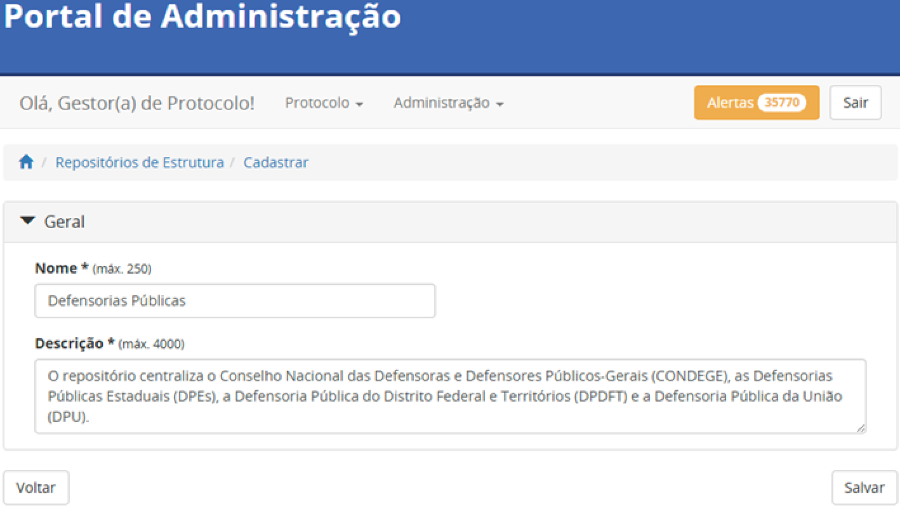
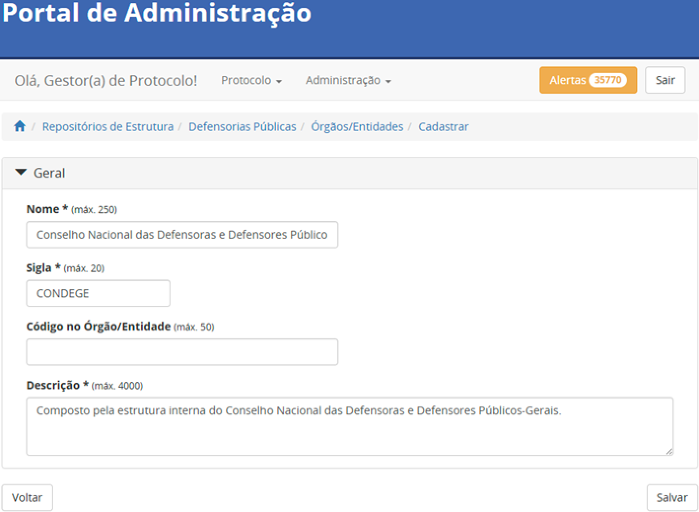
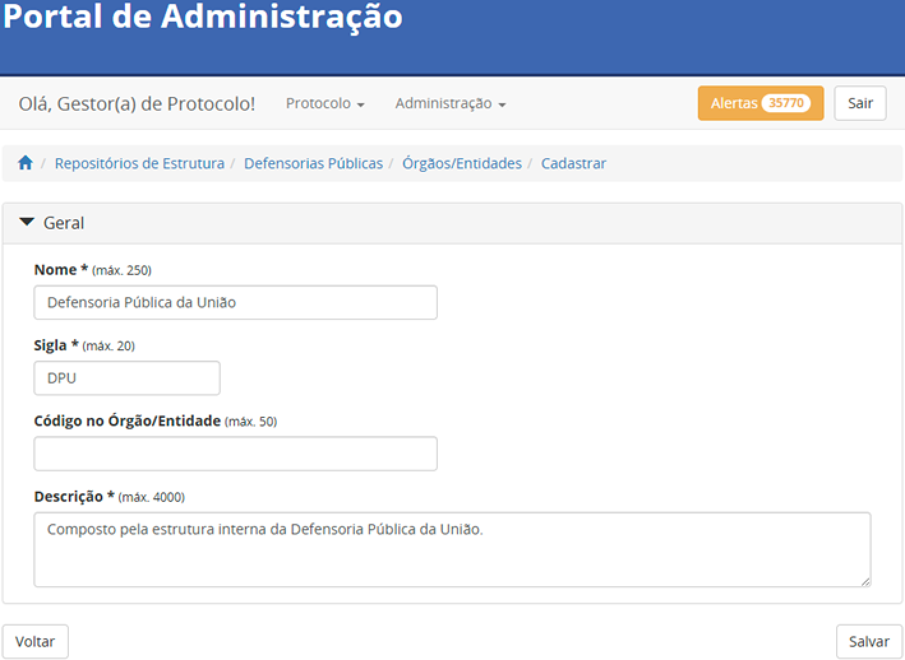
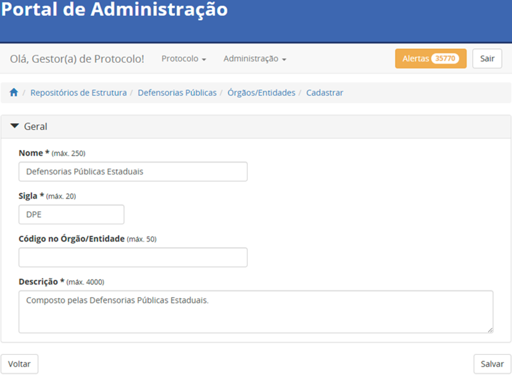
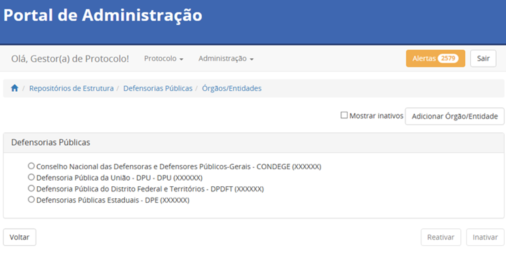
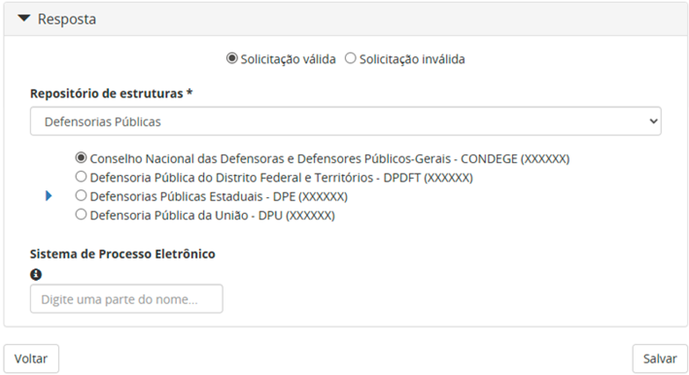
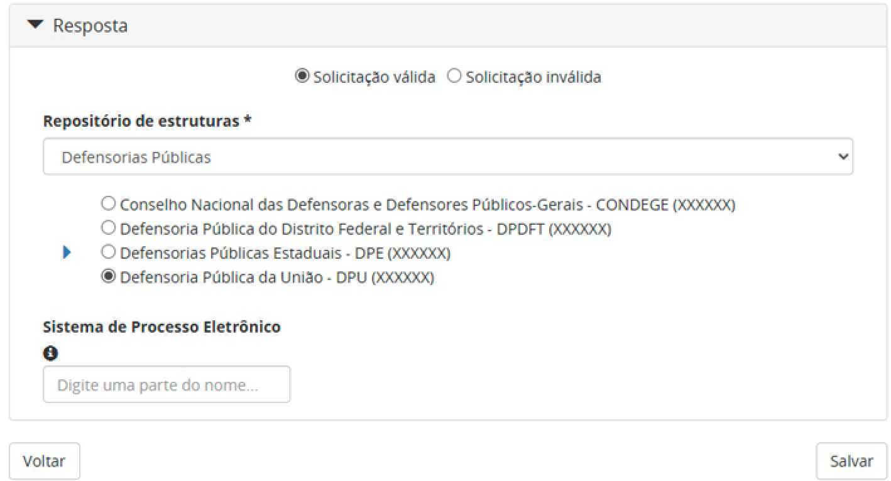
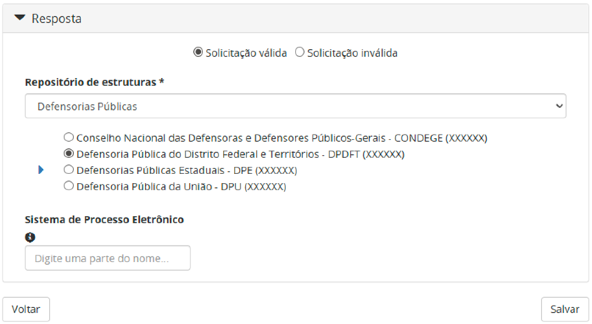
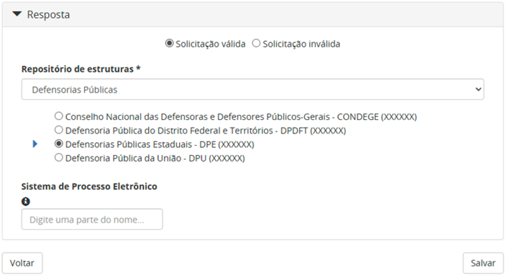
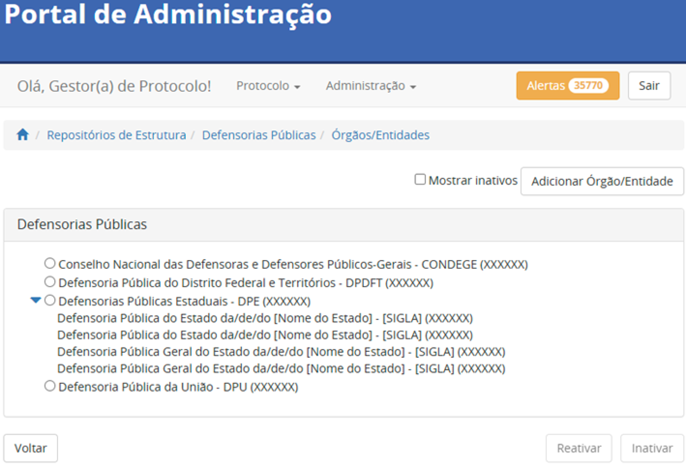

DEFENSORIAS PÚBLICAS
====================

Nessa seção, são explicados os critérios para inserção das Defensorias Públicas. Os órgãos inseridos incluem as Defensorias Públicas Estaduais (DPEs), a Defensoria Pública do Distrito Federal e Territórios (DPDFT) e a Defensoria Pública da União (DPU). Além disso, o Conselho Nacional das Defensoras e Defensores Públicos-Gerais (CONDEGE), órgão máximo representativo das DPEs e DPDFT, também faz parte desse repositório. Assim sendo, esses órgãos devem ser inseridos, exclusivamente, no repositório específico das Defensorias Públicas. 

Nomenclatura do repositório das Defensorias Públicas 
----------------------------------------------------

.. admonition:: Nota

   Apenas os Administradores da Plataforma podem cadastrar o repositório e os nós do primeiro nível da árvore (Seções 5.1 e 5.2).

O repositório centraliza o Conselho Nacional das Defensoras e Defensores Públicos-Gerais (CONDEGE), as Defensorias Públicas Estaduais (DPEs), a Defensoria Pública do Distrito Federal e Territórios (DPDFT) e a Defensoria Pública da União (DPU), e deve possuir nome e descrição inseridos conforme a instrução que segue. 

  **Nome do repositório:** Defensorias Públicas

  **Descrição do repositório:** O repositório centraliza o Conselho Nacional das Defensoras e Defensores Públicos-Gerais (CONDEGE), as Defensorias Públicas Estaduais (DPEs), a Defensoria Pública do Distrito Federal e Territórios (DPDFT) e a Defensoria Pública da União (DPU).

Exemplo:

Categorias do repositório das Defensorias Públicas
--------------------------------------------------

Para fins de esclarecimento, se entende por categoria, neste documento, os nomes exibidos no primeiro nível do repositório. Este repositório centraliza o Conselho Nacional das Defensoras e Defensores Públicos-Gerais (CONDEGE), as Defensorias Públicas Estaduais (DPEs), a Defensoria Pública do Distrito Federal e Territórios (DPDFT) e a Defensoria Pública da União (DPU) . Dessa forma, essas serão as categorias, exibidas na ordem que segue.

Conselho Nacional das Defensoras e Defensores Públicos-Gerais - CONDEGE
+++++++++++++++++++++++++++++++++++++++++++++++++++++++++++++++++++++++

A categoria Conselho Nacional das Defensoras e Defensores Públicos-Gerais deve ser inserida conforme as orientações que seguem.

  **Nome:** Conselho Nacional das Defensoras e Defensores Públicos-Gerais

  **Sigla:** CONDEGE

  **Descrição:** Composto pela estrutura interna do Conselho Nacional das Defensoras e Defensores Públicos-Gerais.

Exemplo:

Defensoria Pública da União - DPU
+++++++++++++++++++++++++++++++++

A categoria Defensoria Pública da União deve ser inserida conforme as orientações que seguem.

  **Nome:** Defensoria Pública da União

  **Sigla:** DPU
  
  **Descrição:** Composto pela estrutura interna da Defensoria Pública da União.

Exemplo:

Defensoria Pública do Distrito Federal e Territórios - DPDFT
++++++++++++++++++++++++++++++++++++++++++++++++++++++++++++

A categoria Defensoria Pública do Distrito Federal e Territórios deve ser inserida conforme as orientações que seguem.

  **Nome:** Defensoria Pública do Distrito Federal e Territórios

  **Sigla:**  DPDFT

  **Descrição:** Composto pela estrutura interna da Defensoria Pública do Distrito Federal e Territórios.

Exemplo:

Defensorias Públicas Estaduais - DPE
++++++++++++++++++++++++++++++++++++

A categoria Defensorias Públicas Estaduais deve ser inserida conforme a instrução que segue.

  **Nome:** Defensoria Pública do Estado da/de/do [Nome do Estado]

  **Sigla:**  [Cada Defensoria Pública possui sigla própria já definida]

  **Descrição:** Composto pelas Defensorias Públicas Estaduais.

Exemplo:

Consolidação do repositório das Defensorias Públicas
----------------------------------------------------

Concluída a criação do repositório e a organização de suas categorias, sua estrutura deverá refletir o padrão ilustrado na imagem que segue.

Inserção de órgãos de referência no repositório das Defensorias Públicas
------------------------------------------------------------------------

.. admonition:: Nota

   Apenas os Administradores e os Supervisores da Plataforma podem autorizar o acesso à plataforma (Seção 5.4).

Para fins de esclarecimento, se entende por órgãos de referência, neste documento, os órgãos a serem inseridos por meio do Portal de Administração pela equipe administradora do Tramita GOV.BR, na categoria específica do repositório, no momento da autorização de acesso a plataforma.

Conselho Nacional das Defensoras e Defensores Públicos-Gerais
+++++++++++++++++++++++++++++++++++++++++++++++++++++++++++++

Cada categoria é composta por órgãos de referência. Entretanto, no caso específico desta categoria, deverá ser cadastrado apenas um órgão, conforme as instruções que seguem.

  **Nome:** Conselho Nacional das Defensoras e Defensores Públicos-Gerais

  **Sigla:**  CONDEGE

Referência para inserção adequada à categoria:

Defensoria Pública da União
+++++++++++++++++++++++++++

Cada categoria é composta por órgãos de referência. Entretanto, no caso específico desta categoria, deverá ser cadastrado apenas um órgão, conforme as instruções que seguem.

  **Nome:** Defensoria Pública da União

  **Sigla:**  DPU

Referência para inserção adequada à categoria:

Defensoria Pública do Distrito Federal e Territórios
++++++++++++++++++++++++++++++++++++++++++++++++++++

Cada categoria é composta por órgãos de referência. Entretanto, no caso específico desta categoria, deverá ser cadastrado apenas um órgão, conforme as instruções 

  **Nome:** Defensoria Pública do Distrito Federal e Territórios

  **Sigla:**  DPDFT

Referência para inserção adequada à categoria:

Defensorias Públicas Estaduais
+++++++++++++++++++++++++++++++

Uma vez criada, é possível inserir o órgão de referência da categoria conforme a instrução que segue.

  **Nome:** Defensoria Pública do Estado da/de/do [Nome do Estado]

  **Sigla:**  [Cada Defensoria Pública possui sigla própria já definida]

Referência para inserção adequada à categoria:

Visualização final do repositório Defensorias Públicas
------------------------------------------------------

À medida que os órgãos desse repositório são liberados na plataforma, a estrutura do repositório se ajusta, conforme a imagem que segue.

