Estados e Municípios
====================

Nessa seção é explicado como são inseridos os órgãos municipais e estaduais do Poder Legislativo e Executivo, pelo Administrador do Tramita, no repositório do Estado adequado.

Nomenclatura do Repositório da Unidade Federativa
-------------------------------------------------

.. admonition:: Nota

   Apenas os Administradores da Plataforma podem cadastrar o repositório e os nós do primeiro nível da árvore (Seções 1 e 2).

O repositório criado para uma determinada Unidade Federativa deve possuir nome e descrição inseridas conforme a instrução que segue.

  **Nome do repositório:** Estado - [Nome do Estado].

  **Descrição do repositório:** O repositório centraliza órgãos dos poderes executivos e legislativos, tanto municipais quanto estaduais.

.. admonition:: Nota

    A utilização de termos entre colchetes se refere ao preenchimento de um determinado dado a ser inserido naquele espaço em específico do texto. Ou seja, [Nome do Estado] significa dizer que o nome do Estado deve ser substituído naquele determinado local do texto. A saber “Estado – Acre”, “Estado – Pernambuco”

Exemplo:

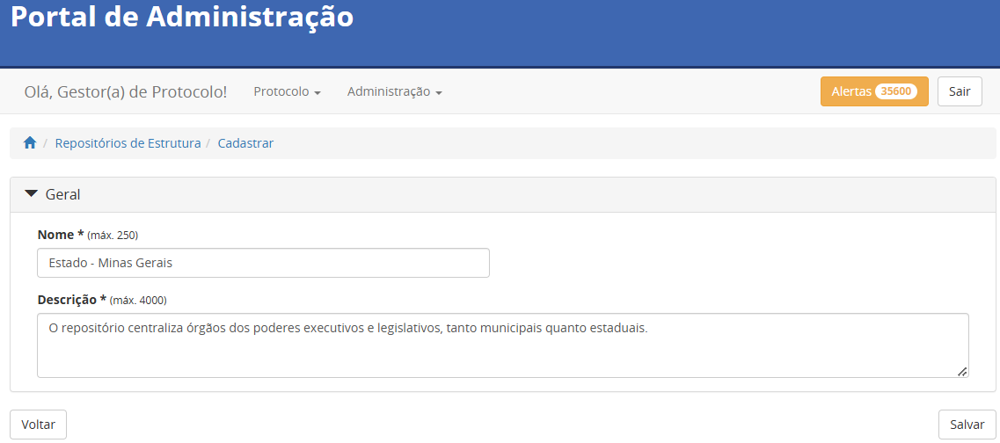

Categorias do repositório da Unidade Federativa
------------------------------------------------

A estruturação do repositório da Unidade Federativa sé configurada por meio do cadastro de quatro nós que estão no primeiro nível do repositório. A saber, dois deles 
são relacionados ao poder executivo e outros dois ao poder legislativo, que por sua vez são classificados em Municipal e Estadual.

Poder Executivo Estadual
+++++++++++++++++++++++++

A configuração da categoria do Poder Executivo Estadual deve possuir nome, sigla e descrição inseridas conforme a instrução que segue.

  **Nome:** Poder Executivo Estadual do/da/de [Nome do Estado]

  **Sigla:** PEE[UF]

  **Descrição:** Composto por secretarias e órgãos pertencentes ao poder executivo estadual.

Exemplo:

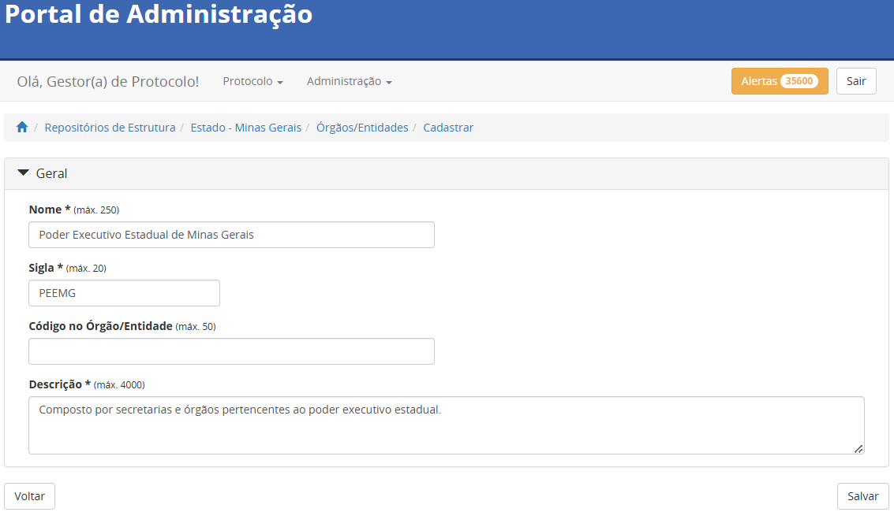

Poder Legislativo Estadual
+++++++++++++++++++++++++++

A configuração da categoria do Poder Legislativo Estadual deve possuir nome, sigla e descrição inseridas conforme a instrução que segue.

  **Nome:** Poder Legislativo Estadual do/da/de [Nome do Estado]

  **Sigla:** PLE[UF]

  **Descrição:** Composto pela estrutura interna da assembleia legislativa do/da/de [Nome do Estado].

Exemplo:

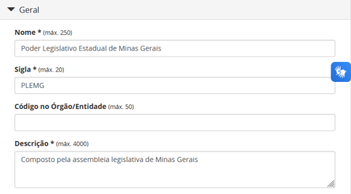

Poder Executivo Municipal
+++++++++++++++++++++++++

A configuração da categoria do Poder Executivo Municipal deve possuir nome, sigla e descrição inseridas conforme a instrução que segue.

  **Nome:** Poderes Executivos Municipais do/da/de [Nome do Estado]

  **Sigla:**  PEM[UF]

  **Descrição:** Composto por secretarias e órgãos pertencentes ao poder executivo dos municípios do/da/de [Nome do Estado].

Exemplo:

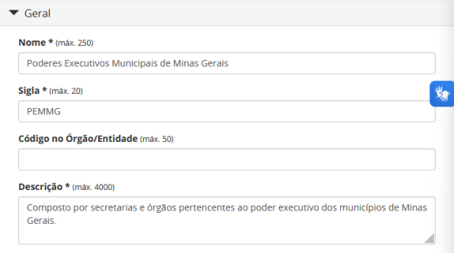

Poder Legislativo Municipal
+++++++++++++++++++++++++++

A configuração da categoria do Poder Legislativo Municipal deve possuir nome, sigla e descrição inseridas conforme a instrução que segue.

  **Nome:** Poderes Legislativos Municipais do/da/de [Nome do Estado]

  **Sigla:**  PLM[UF]

  **Descrição:** Composto pelas câmaras municipais dos municípios do/da/de [Nome do Estado].

Exemplo:

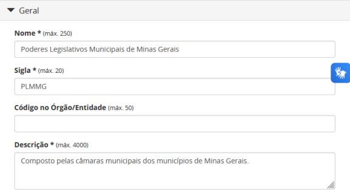

Uma vez criada a categoria, os poderes legislativos municipais poderão ser incluídos. Para este caso o poder legislativo de cada município será cadastrado como um órgão.

Consolidação do repositório da Unidade Federativa
--------------------------------------------------

Uma vez criado o repositório e estruturadas as suas categorias, é esperado que este se apresente conforme a imagem abaixo.

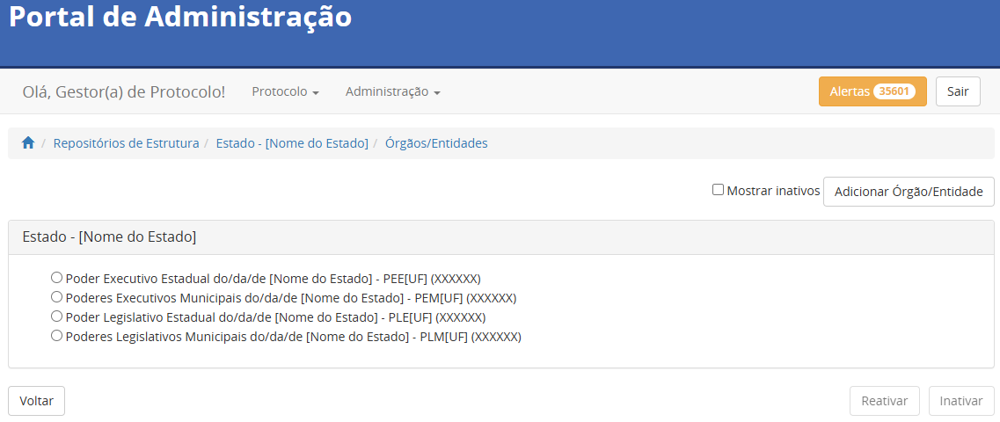

Inserção de órgãos de referência no repositório da Unidade Federativa
----------------------------------------------------------------------

.. admonition:: Observação

   Apenas os Administradores e os Supervisores da Plataforma podem autorizar o acesso a plataforma (Seção 4).

A nível de explicação, se entende por órgãos de referência neste documento, os órgãos a serem inseridos no grupo específico do repositório, no momento da autorização de acesso a plataforma.

Poder Executivo Estadual
+++++++++++++++++++++++++

Uma vez criada a categoria é possível inserir o órgão de referência da categoria. Para o caso específico desta categoria somente um órgão será cadastrado e deve possuir nome, sigla e descrição inseridas conforme a instrução que segue.

  **Nome:** Governo do Estado do/da/de [Nome do Estado]

  **Sigla:** [SIGLA]

Referência para inserção adequada à categoria:

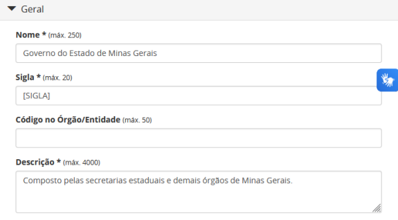

Poder Legislativo Estadual
+++++++++++++++++++++++++++

Uma vez criada a categoria é possível inserir o órgão de referência da categoria. Para o caso específico desta categoria somente um órgão será cadastrado e deve 
possuir nome, sigla e descrição inseridas conforme a instrução que segue.

  **Nome:**  Assembleia Legislativa do/da/de [Nome do Estado]

  **Sigla:** [SIGLA]

Referência para inserção adequada à categoria:

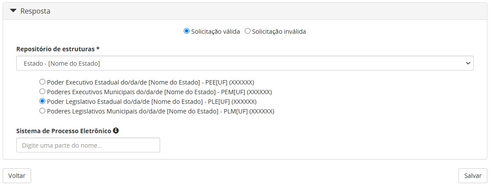

Poder Executivo Municipal
+++++++++++++++++++++++++

Uma vez criada a categoria, os órgãos de referência poderão ser incluídos. Para este caso o poder executivo de cada município será cadastrado como um órgão de referência e deve possuir nome, sigla e descrição inseridas conforme a instrução que segue.

  **Nome:** Prefeitura Municipal do/e [Nome do Município]

  **Sigla:** Conforme Fornecido (Caso não fornecido, solicitar ao requisitante e não passar de 5 dígitos)

Referência para inserção adequada à categoria:

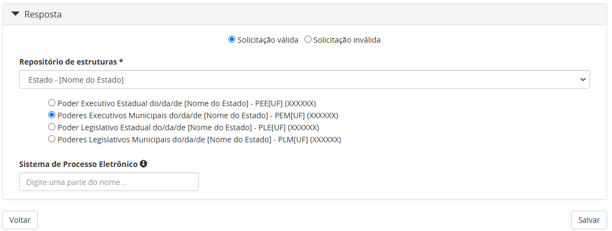

Poder Legislativo Municipal
+++++++++++++++++++++++++++

Uma vez criada a categoria, os órgãos de referência poderão ser incluídos. Para este caso o poder legislativo de cada município será cadastrado como um órgão de referência e deve possuir nome, sigla e descrição inseridas conforme a instrução que segue.

  **Nome:** Câmara Municipal do/e [Nome do Município]

  **Sigla:** Conforme Fornecido (Caso não fornecido, solicitar ao requisitante e não passar de 5 dígitos)

Referência para inserção adequada à categoria:

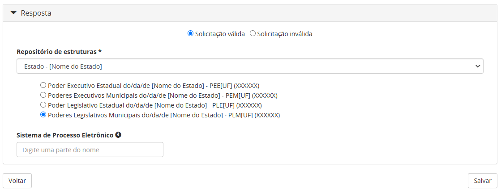

Visualização final do repositório da Unidade Federativa
--------------------------------------------------------

À medida que os órgãos desse repositório são liberados na plataforma, a estrutura do repositório se molda, conforme a imagem abaixo. Ressalta-se que a quantidades de órgãos do poder executivo e legislativo municipais depende da quantidade de municípios presentes no Estado do repositório.

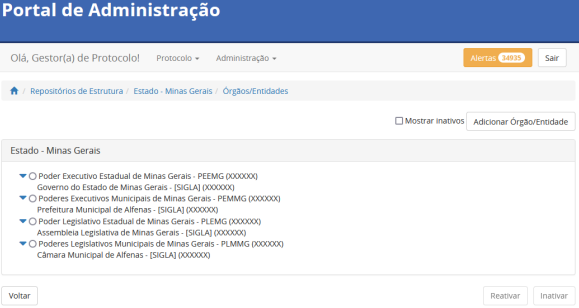
