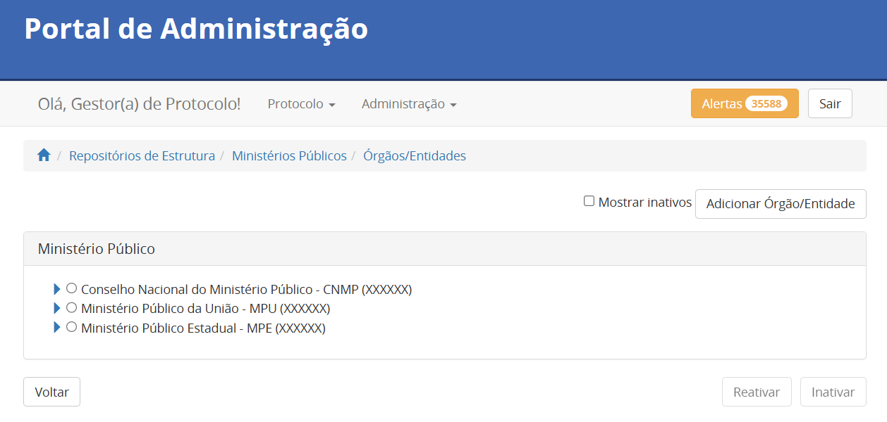
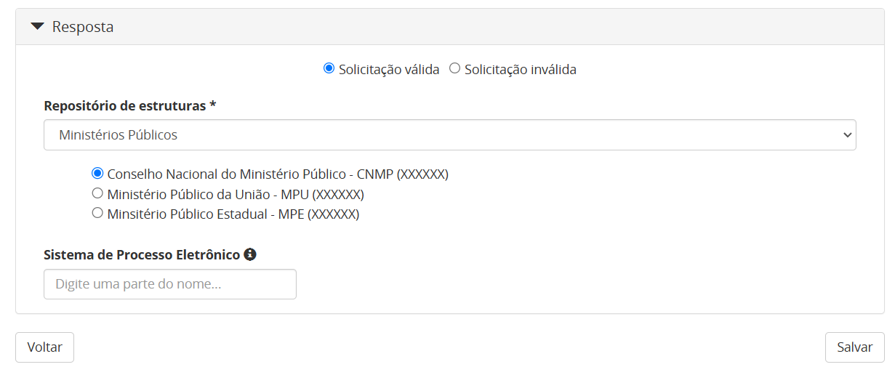
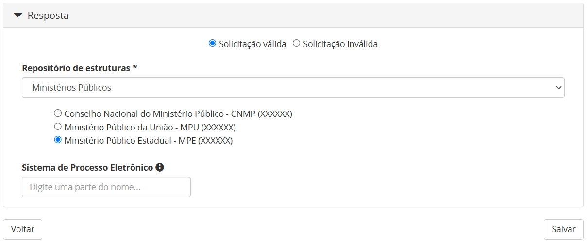
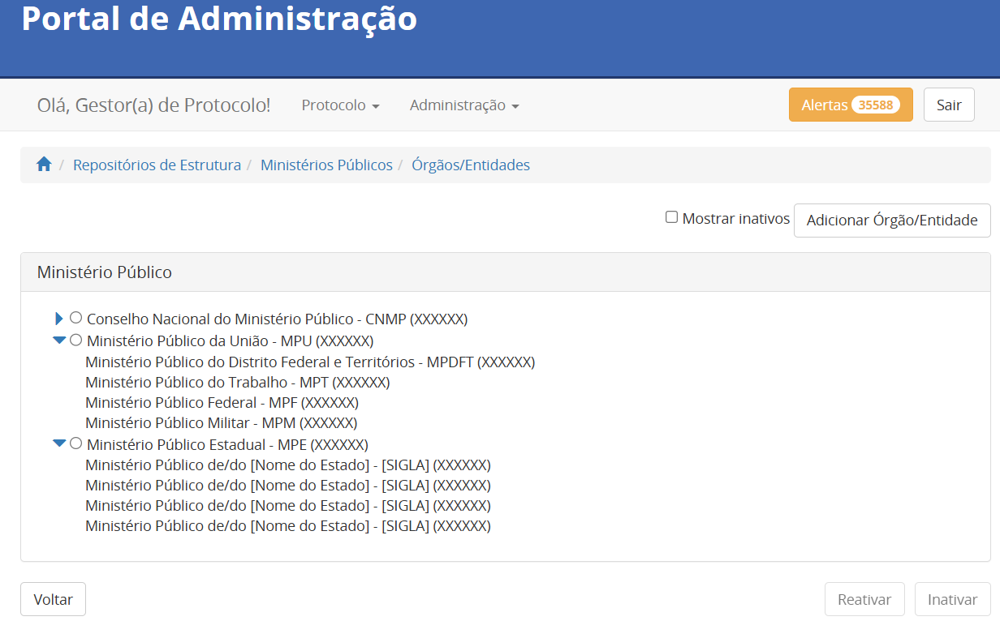

Ministérios Públicos
=====================

Nessa seção, são explicados os critérios para inserção dos Ministérios Públicos. Os órgãos inseridos incluem os Ministérios Públicos Estaduais (MPEs) e os quatro ramos do Ministério Público da União (MPU): Ministério Público Federal (MPF), Ministério Público do Trabalho (MPT), Ministério Público Militar (MPM) e Ministério Público do Distrito Federal e Territórios (MPDFT). Além disso, o Conselho Nacional do Ministério Público (CNMP), órgão responsável pelo controle administrativo e financeiro do Ministério Público, também faz parte desse repositório. Assim sendo, esses órgãos devem ser inseridos, exclusivamente, no repositório específico dos Ministérios Públicos.

 
Nomenclatura do repositório dos Ministérios Públicos
-----------------------------------------------------

.. admonition:: Observação

   Apenas os Administradores da Plataforma podem cadastrar o repositório e os nós do primeiro nível da árvore (Seções 4.1 e 4.2).

O repositório criado para concentrar os ramos que compõem o Ministério Público da União (MPU), os Ministérios Públicos Estaduais (MPEs) e o Conselho Nacional do Ministério Público (CNMP), deve possuir seu *nome* e *descrição* inseridos conforme a instrução que segue. 

   **Nome do repositório:** Ministérios Públicos

   **Descrição do repositório:** O repositório centraliza os ramos que compõem o Ministério Público da União (MPU), os Ministérios Públicos Estaduais (MPEs) e o Conselho Nacional do Ministério Público (CNMP).

Exemplo:

Categorias do repositório dos Ministérios Públicos
--------------------------------------------------

Para fins de esclarecimento, se entende por categoria, neste documento, os nomes exibidos no primeiro nível do repositório. Este repositório tem como base a estrutura do Ministério Público, contemplando o Ministério Público da União (MPU), os Ministérios Públicos Estaduais (MPEs) e o Conselho Nacional do Ministério Público (CNMP) [1]_. Dessa forma, essas serão as categorias, exibidas na ordem que segue.

.. [1] Estrutura do Ministério Público Brasileiro – Disponível em: https://www.mpdft.mp.br/portal/index.php/sobre-o-mpdft/10784-estrutura - Acessado em fevereiro de 2025.

Conselho Nacional do Ministério Público - CNMP
+++++++++++++++++++++++++++++++++++++++++++++++

A categoria do Conselho Nacional do Ministério Público deve ser inserida conforme as orientações que seguem. 

   **Nome:** Conselho Nacional do Ministério Público

   **Sigla:** CNMP

   **Descrição:** Composto pela estrutura interna do Conselho Nacional do Ministério Público. 

Exemplo:
 

Ministério Público da União - MPU
++++++++++++++++++++++++++++++++++

A categoria do Ministério Público da União deve ser inserida conforme as orientações que seguem. 

   **Nome:** Ministério Público da União

   **Sigla:** MPU

   **Descrição:** Composto pelos órgãos que compõem o Ministério Público da União.

Exemplo:

Ministério Público Estadual - MPE
++++++++++++++++++++++++++++++++++

A categoria do Ministério Público Estadual deve ser inserida conforme as orientações que seguem. 

   **Nome:** Ministério Público Estadual

   **Sigla:** MPE

   **Descrição:** Composto pelos órgãos que compõem o Ministério Público Estadual.

Exemplo:

.. figure:: _static/images/Nomenclatura_MPE.png

Consolidação do repositório dos Ministérios Públicos
-----------------------------------------------------

Concluída a criação do repositório e a organização de suas categorias, sua estrutura deverá refletir o padrão ilustrado na imagem que segue. 

 

Inserção de órgãos de referência no repositório dos Ministérios Públicos
-------------------------------------------------------------------------

.. admonition:: Observação

   Apenas os Administradores e os Supervisores da Plataforma podem autorizar o acesso à plataforma (Seção 4.4). 

Para fins de esclarecimento, se entende por órgãos de referência, neste documento, os órgãos a serem inseridos por meio do Portal de Administração pela equipe administradora do Tramita GOV.BR, na categoria específica do repositório, no momento da autorização de acesso a plataforma. 

Conselho Nacional do Ministério Público
+++++++++++++++++++++++++++++++++++++++++

Cada categoria é composta por órgãos de referência. Entretando, no caso específico desta categoria, deverá ser cadastrado apenas um órgão, conforme as instruções que seguem. 

   **Nome:** Conselho Nacional do Ministério Público

   **Sigla:** CNMP

Referência para inserção adequada à categoria: 
 

Ministério Público do Distrito Federal e Territórios
++++++++++++++++++++++++++++++++++++++++++++++++++++++

Cada categoria é composta por órgãos de referência. No caso do Ministério Público do Distrito Federal e Territórios, este deve ser cadastrado conforme as instruções que seguem. 

   **Nome:** Ministério Público do Distrito Federal e Territórios

   **Sigla:** MPDFT

Referência para inserção adequada à categoria: 

.. figure:: _static/images/repositorio_MPDFT.png

Ministério Público do Trabalho
++++++++++++++++++++++++++++++

Cada categoria é composta por órgãos de referência. No caso do Ministério Público do Trabalho, este deve ser cadastrado conforme as instruções que seguem. 

   **Nome:** Ministério Público do Trabalho

   **Sigla:** MPT

Referência para inserção adequada à categoria: 

.. figure:: _static/images/repositorio_MPT.png

Ministério Público Federal
+++++++++++++++++++++++++++

Cada categoria é composta por órgãos de referência. No caso do Ministério Público do Federal, este deve ser cadastrado conforme as instruções que seguem. 

   **Nome:** Ministério Público Federal

   **Sigla:** MPF

Referência para inserção adequada à categoria: 

.. figure:: _static/images/repositorio_MPF.png

Ministério Público Militar
+++++++++++++++++++++++++++

Cada categoria é composta por órgãos de referência. No caso do Ministério Público do Militar, este deve ser cadastrado conforme as instruções que seguem. 

   **Nome:** Ministério Público Militar

   **Sigla:** MPM

Referência para inserção adequada à categoria: 

.. figure:: _static/images/repositorio_MPM.png

Ministérios Públicos Estaduais
+++++++++++++++++++++++++++++++

Cada categoria é composta por órgãos de referência. No caso desta categoria, deverão ser cadastrados órgãos conforme as instruções que seguem. 

   **Nome:**  Ministério Público de/da/do [Nome do Estado]

   **Sigla:** [Cada Ministério Público possui sigla própria já definida]

Referência para inserção adequada à categoria: 
 

Visualização final do repositório Ministérios Públicos
------------------------------------------------------

À medida que os órgãos desse repositório são liberados na plataforma, a estrutura do repositório se ajusta, conforme a imagem que segue. 
 

