Poder Judiciário
================

Nessa seção é explicado como são inseridos os órgãos do poder judiciário, os quais devem ser inseridos, exclusivamente, no repositório específico do Poder Judiciário.

Nomenclatura do repositório do Poder Judiciário 
-----------------------------------------------

.. admonition:: Observação

   Apenas os Administradores da Plataforma podem cadastrar o repositório e os nós do primeiro nível da árvore (Seções 1 e 2). 

O repositório criado para concentrar os órgãos pertencentes à esfera do poder judiciário brasileiro deve possuir nome e descrição inseridas conforme a instrução que segue.

  **Nome do repositório:** Poder Judiciário

  **Descrição do repositório:** O repositório centraliza os órgãos pertencentes à estrutura do Poder Judiciário Brasileiro, sejam esses cíveis ou militares.

Exemplo:

Categorias do repositório do Poder Judiciário
---------------------------------------------

A estruturação do repositório tem como base a estrutura do Poder Judiciário Brasileiro apresentada pelo Conselho Nacional de Justiça e é configurada por meio de onze nós que estão no primeiro nível do repositório. A saber, são classificadas como categorias, os diversos tipos de tribunais pertencentes à essa esfera de poder, bem como conselhos que fazem parte de sua estrutura.

.. admonition:: Nota

   Panorama e Estrutura do Poder Judiciário Brasileiro – Disponível em: https://www.cnj.jus.br/poder-judiciario/panorama-e-estrutura-do-poder-judiciario-brasileiro/ - Acessado em maio de 2024.

Supremo Tribunal Federal
++++++++++++++++++++++++

A configuração da categoria do Supremo Tribunal Federal é de composição única e deve possuir nome, sigla e descrição inseridas conforme a instrução que segue.

  **Nome:** Supremo Tribunal Federal

  **Sigla:** STF

  **Descrição:** Composto pela estrutura interna do Supremo Tribunal Federal.

Exemplo:

Superior Tribunal de Justiça
++++++++++++++++++++++++++++

A configuração da categoria do Superior Tribunal de Justiça é de composição única e deve possuir nome, sigla e descrição inseridas conforme a instrução que segue.

  **Nome:** Superior Tribunal de Justiça

  **Sigla:** STJ

  **Descrição:** Composto pela estrutura interna do Superior Tribunal de Justiça.

Exemplo:

Superior Tribunal Militar
+++++++++++++++++++++++++

A configuração da categoria Superior Tribunal Militar é de composição única e deve possuir nome, sigla e descrição inseridas conforme a instrução que segue.

  **Nome:** Superior Tribunal Militar

  **Sigla:** STM

  **Descrição:** Composto pela estrutura interna do Superior Tribunal Militar.

Exemplo:

.. figure:: _static/images/Nomenclatura_STM.png

Tribunal Superior do Trabalho
+++++++++++++++++++++++++++++

A configuração da categoria Tribunal Superior do Trabalho é de composição única e deve possuir nome, sigla e descrição inseridas conforme a instrução que segue.

  **Nome:** Tribunal Superior do Trabalho

  **Sigla:** TST

  **Descrição:** Composto pela estrutura interna do Tribunal Superior do Trabalho.

Exemplo:

Tribunal Superior Eleitoral
+++++++++++++++++++++++++++

A configuração da categoria Tribunal Superior Eleitoral é de composição única e deve possuir nome, sigla e descrição inseridas conforme a instrução que segue.

  **Nome:** Tribunal Superior Eleitoral

  **Sigla:** TSE

  **Descrição:** Composto pela estrutura interna do Tribunal Superior Eleitoral.

Exemplo:

Conselhos de Justiça
++++++++++++++++++++

A configuração da categoria dos Conselhos de Justiça e deve possuir nome, sigla e descrição inseridas conforme a instrução que segue.

  **Nome:** Conselhos de Justiça

  **Sigla:** CJ

  **Descrição:** Composto pelos Conselhos de Justiça.

Exemplo:

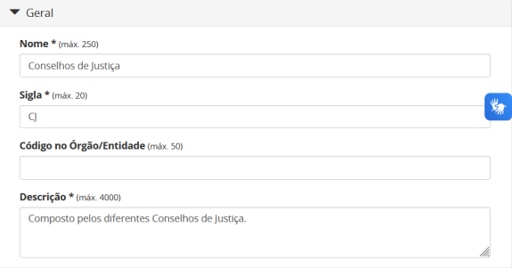

Tribunais de Justiça
++++++++++++++++++++

A configuração da categoria dos Tribunais de Justiça deve possuir nome, sigla e descrição inseridas conforme a instrução que segue.

  **Nome:** Tribunais de Justiça

  **Sigla:** TJ

  **Descrição:** Composto pelos Tribunais de Justiça.

Exemplo:

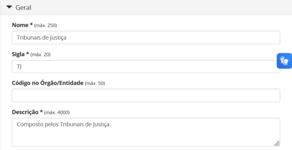

Tribunais de Justiça Militar
++++++++++++++++++++++++++++

A configuração da categoria dos Tribunais de Justiça Militar deve possuir nome, sigla e descrição inseridas conforme a instrução que segue.

  **Nome:** Tribunal de Justiça Militar

  **Sigla:** TJM

  **Descrição:** Composto pelos Tribunais de Justiça Militar.

Exemplo:

Tribunais Regionais do Trabalho
+++++++++++++++++++++++++++++++

A configuração da categoria dos Tribunais Regionais do Trabalho deve possuir nome, sigla e descrição inseridas conforme a instrução que segue.

  **Nome:** Tribunais Regionais do Trabalho

  **Sigla:** TRT

  **Descrição:** Composto pelos Tribunais Regionais do Trabalho.

Exemplo:

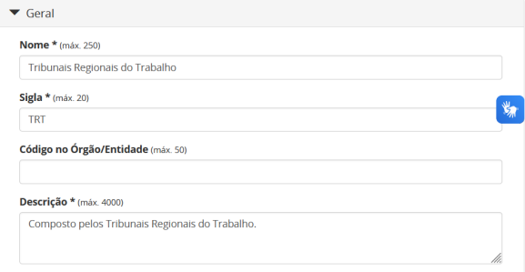

Tribunais Regionais Eleitorais
+++++++++++++++++++++++++++++++

A configuração da categoria dos Tribunais Regionais Eleitorais deve possuir nome, sigla e descrição inseridas conforme a instrução que segue.

  **Nome:** Tribunais Regionais Eleitorais

  **Sigla:** TRE

  **Descrição:** Composto pelos Tribunais Regionais Eleitorais.

Exemplo:

Tribunais Regionais Federais
+++++++++++++++++++++++++++++

A configuração da categoria dos Tribunais Regionais Federais deve seguir a instrução abaixo.

  **Nome:** Tribunais Regionais Federais

  **Sigla:** TRF

  **Descrição:** Composto pelos Tribunais Regionais Federais.

Exemplo:

Consolidação do repositório do Poder Judiciário
-----------------------------------------------

Uma vez criado o repositório e estruturadas as suas categorias, é esperado que este se apresente conforme a imagem abaixo.

Inserção de órgãos de referência no repositório do Poder Judiciário
-------------------------------------------------------------------

.. admonition:: Observação

   Apenas os Administradores e os Supervisores da Plataforma podem autorizar o acesso a plataforma (Seção 4).

A nível de explicação, se entende por órgãos de referência neste documento, os órgãos a serem inseridos no Portal de Administração pelo administrador do Tramita GOV.BR, na categoria específica do repositório, no momento da autorização de acesso a plataforma.

Supremo Tribunal Federal - STF
++++++++++++++++++++++++++++++

Uma vez criada a categoria é possível inserir o órgão de referência da categoria. Para o caso específico desta categoria somente um órgão será cadastrado e deve 
possuir nome, sigla e descrição inseridas conforme a instrução que segue.

  **Nome:** Supremo Tribunal Federal

  **Sigla:** STF

Referência para inserção adequada à categoria: 

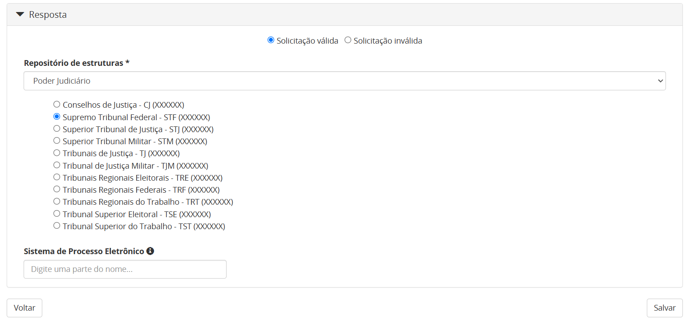

Superior Tribunal de Justiça - STJ
++++++++++++++++++++++++++++++++++++

Uma vez criada a categoria é possível inserir o órgão de referência da categoria. Para o caso específico desta categoria somente um órgão será cadastrado e deve 
possuir nome, sigla e descrição inseridas conforme a instrução que segue.

  **Nome:** Superior Tribunal de Justiça

  **Sigla:** STJ

Referência para inserção adequada à categoria: 

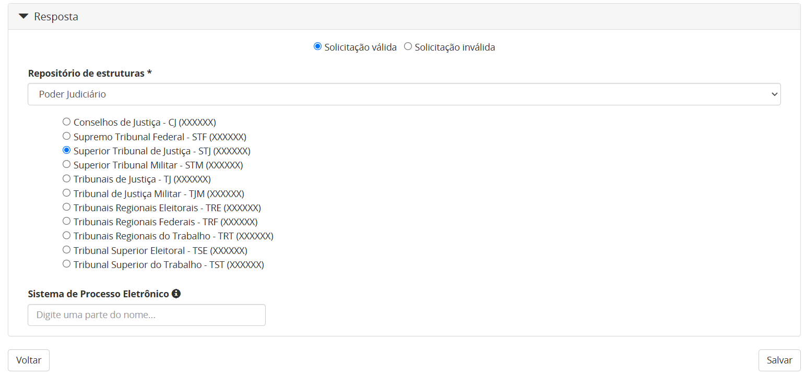

Superior Tribunal Militar - STM
++++++++++++++++++++++++++++++++

Uma vez criada a categoria é possível inserir o órgão de referência da categoria. Para o caso específico desta categoria somente um órgão será cadastrado e deve 
possuir nome, sigla e descrição inseridas conforme a instrução que segue.

  **Nome:** Superior Tribunal Militar

  **Sigla:** STM

Referência para inserção adequada à categoria: 

.. figure:: _static/images/referencia_categoria_STM.png

Tribunal Superior do Trabalho - TST
+++++++++++++++++++++++++++++++++++

Uma vez criada a categoria é possível inserir o órgão de referência da categoria. Para o caso específico desta categoria somente um órgão será cadastrado e deverá seguir a instrução abaixo.

  **Nome:** Tribunal Superior do Trabalho

  **Sigla:** TST

Referência para inserção adequada à categoria: 

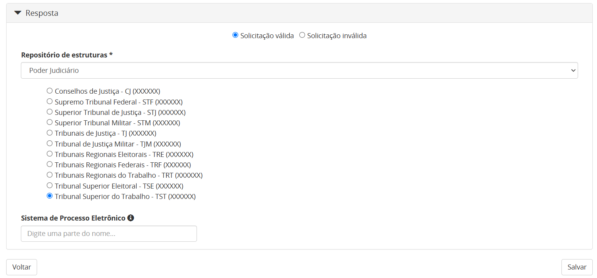

Tribunal Superior Eleitoral - TSE
+++++++++++++++++++++++++++++++++

Uma vez criada a categoria é possível inserir o órgão de referência da categoria.Para o caso específico desta categoria somente um órgão será cadastrado e deve 
possuir nome, sigla e descrição inseridas conforme a instrução que segue.

  **Nome:** Tribunal Superior Eleitoral

  **Sigla:** TSE

Referência para inserção adequada à categoria: 

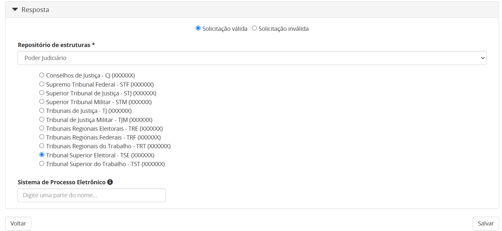

Conselhos de Justiça - CJ
+++++++++++++++++++++++++

Uma vez criada a categoria, os órgãos de referência poderão ser incluídos. Para este caso os Conselhos de Justiça serão cadastrados como um órgão de referência 
e devem possuir nome, sigla e descrição inseridas conforme a instrução que segue.

  **Nome:** [Nome do Conselho]

  **Sigla:** [Sigla do Nome do Conselho]

Referência para inserção adequada à categoria:

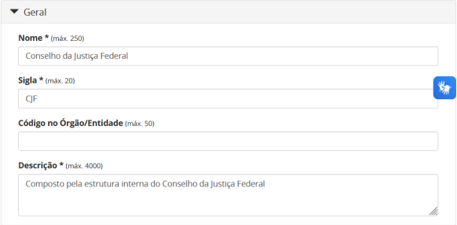

Tribunais de Justiça - TJ
++++++++++++++++++++++++++

Uma vez criada a categoria, os órgãos de referência poderão ser incluídos. Para este caso os Tribunais de Justiça serão cadastrados como um órgão de referência e 
devem possuir nome, sigla e descrição inseridas conforme a instrução que segue.

  **Nome:** Tribunal de Justiça do/da/de [Nome do Estado]

  **Sigla:** TJ[UF]

Referência para inserção adequada à categoria:

Tribunais de Justiça Militar - TJM
+++++++++++++++++++++++++++++++++++

Uma vez criada a categoria, os órgãos de referência poderão ser incluídos. Para este caso os Tribunais de Justiça Militar serão cadastrados como um órgão de 
referência e devem possuir nome, sigla e descrição inseridas conforme a instrução que segue.

  **Nome:** Tribunal de Justiça Militar do/da/de [Nome do Estado]

  **Sigla:** TJM[UF]

Referência para inserção adequada à categoria:

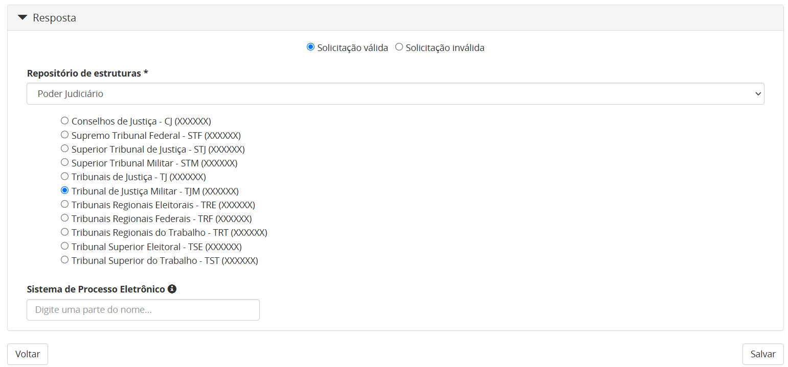

Tribunais Regionais do Trabalho - TRT
++++++++++++++++++++++++++++++++++++++

Uma vez criada a categoria, os órgãos de referência poderão ser incluídos. Para este caso os Tribunais Regionais do Trabalho serão cadastrados como um órgão de 
referência e devem possuir nome, sigla e descrição inseridas conforme a instrução que segue.

  **Nome:** Tribunal Regional do Trabalho da Xª Região

  **Sigla:** TRTXX

.. admonition:: Nota

   Para os tribunais da 1ª à 9ª região, será adicionado o dígito 0 à sigla com o propósito de manter o padrão.

Referência para inserção adequada à categoria:

Tribunais Regionais Eleitorais - TRE
+++++++++++++++++++++++++++++++++++++

Uma vez criada a categoria, os órgãos de referência poderão ser incluídos. Para este caso os Tribunais Regionais Eleitorais serão cadastrados como um órgão de 
referência e devem possuir nome, sigla e descrição inseridas conforme a instrução que segue.

  **Nome:**  Tribunal Regional Eleitoral do/da/de [Nome do Estado]

  **Sigla:**  TRE-[UF]

  **Descrição:** Composto pela estrutura interna do Tribunal Regional Eleitoral de/do [Nome do Estado].

Referência para inserção adequada à categoria:

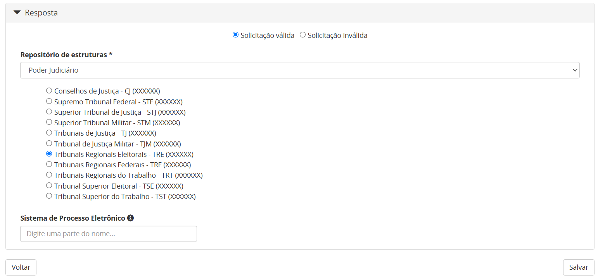

Tribunais Regionais Federais - TRF
+++++++++++++++++++++++++++++++++++

Uma vez criada a categoria, os órgãos de referência poderão ser incluídos. Para este caso os Tribunais Regionais Federais serão cadastrados como um órgão de 
referência e devem possuir nome, sigla e descrição inseridas conforme a instrução que segue.

  **Nome:**  Tribunal Regional Federal da Xª Região

  **Sigla:** TRFX

Referência para inserção adequada à categoria:

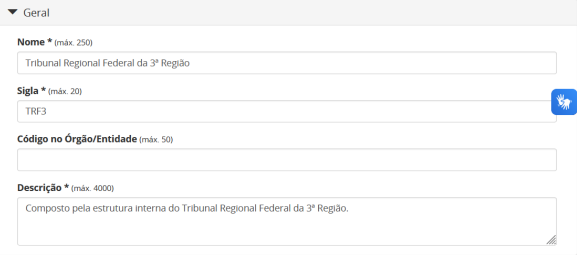

Visualização final do repositório do Poder Judiciário
------------------------------------------------------

À medida que os órgãos desse repositório são liberados na plataforma, a estrutura do repositório se molda, conforme a imagem abaixo. Ressalta-se que a quantidades de órgãos é limitada conforme a estrutura do poder judiciário.

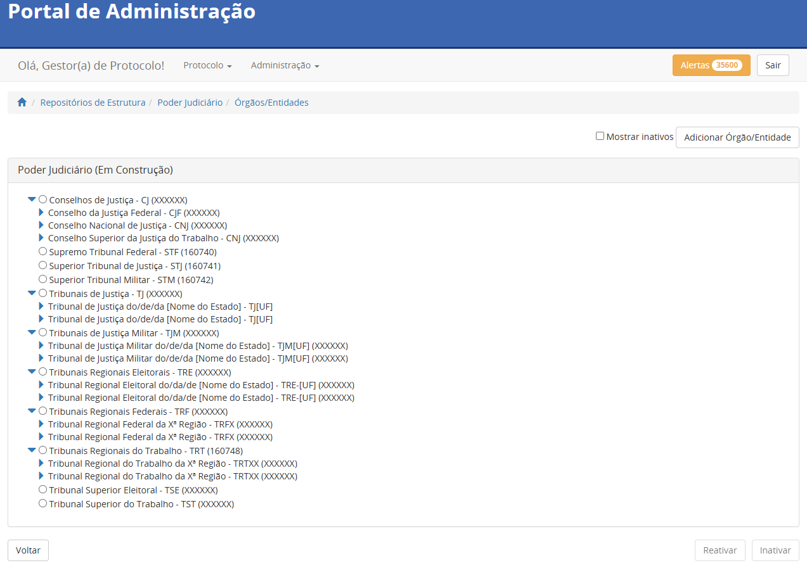
