TRIBUNAIS DE CONTAS
===================

Nessa seção, são explicados os critérios para inserção dos Tribunais de Contas. Os órgãos inseridos incluem o Tribunal de Contas da União (TCU), o Tribunal de Contas do Distrito Federal (TC-DF), os Tribunais de Contas dos Estados (TCE), os Tribunais de Contas dos Municípios (TCM) e os Tribunais de Contas Municipais (TCM). Assim sendo, esses órgãos devem ser inseridos, exclusivamente, no repositório específico dos Tribunais de Contas.

Nomenclatura do repositório dos Tribunais de Contas
---------------------------------------------------

.. admonition:: Nota

   Apenas os Administradores da Plataforma podem cadastrar o repositório e os nós do primeiro nível da árvore (Seções 6.1 e 6.2).

O repositório centraliza o Tribunal de Contas da União (TCU), o Tribunal de Contas do Distrito Federal (TC-DF), os Tribunais de Contas dos Estados (TCE), os Tribunais de Contas dos Municípios (TCM) e os Tribunais de Contas Municipais (TCM), e deve possuir nome e descrição inseridos conforme a instrução que segue.

  **Nome do repositório:** Tribunais de Contas

  **Descrição do repositório:** O repositório centraliza o Tribunal de Contas da União (TCU), o Tribunal de Contas do Distrito Federal (TC-DF), os Tribunais de Contas dos Estados (TCE), os Tribunais de Contas dos Municípios (TCM) e os Tribunais de Contas Municipais (TCM).

Exemplo:

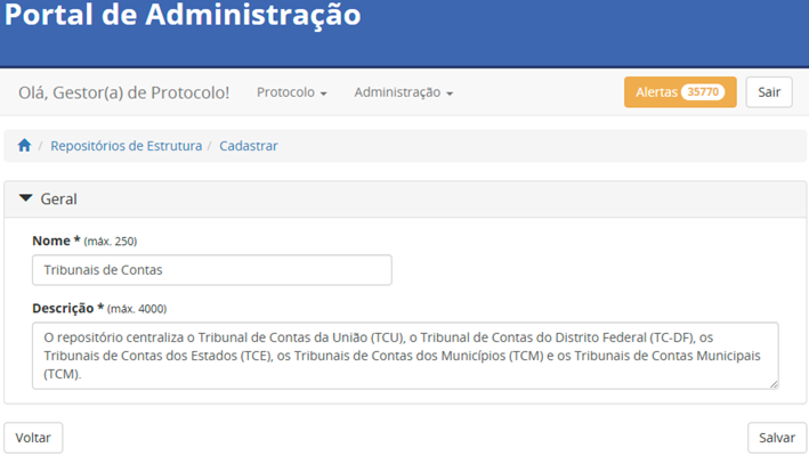

Categorias do repositório dos Tribunais de Contas
-------------------------------------------------

Para fins de esclarecimento, se entende por categoria, neste documento, os nomes exibidos no primeiro nível do repositório. Este repositório centraliza o Tribunal de Contas da União (TCU), o Tribunal de Contas do Distrito Federal (TC-DF), os Tribunais de Contas dos Estados (TCE), os Tribunais de Contas dos Municípios (TCM) e os Tribunais de Contas Municipais (TCM) [1]_ . Dessa forma, essas serão as categorias, exibidas na ordem que segue.

..[1] Tribunais de Contas – Disponível em: https://www.cnptcbr.org/tribunais-de-contas/ - Acessado em maio de 2025.

Tribunal de Contas da União - TCU
+++++++++++++++++++++++++++++++++

A categoria do Tribunal de Contas da União deve ser inserida conforme as orientações que seguem.

  **Nome:** Tribunal de Contas da União

  **Sigla:** TCU

  **Descrição:** Composto pela estrutura interna do Tribunal de Contas da União.

Exemplo:

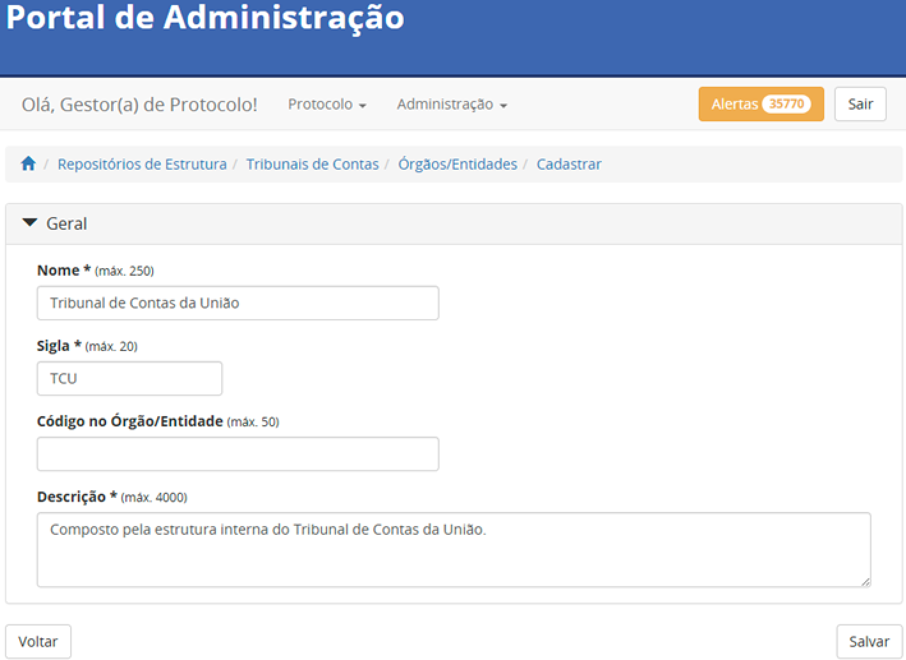

Tribunal de Contas do Distrito Federal - TCDF
+++++++++++++++++++++++++++++++++++++++++++++

A categoria do Tribunal de Contas do Distrito Federal deve ser inserida conforme as orientações que seguem.

  **Nome:** Tribunal de Contas do Distrito Federal

  **Sigla:** TCDF
  
  **Descrição:** Composto pela estrutura interna do Tribunal de Contas do Distrito Federal.

Exemplo:

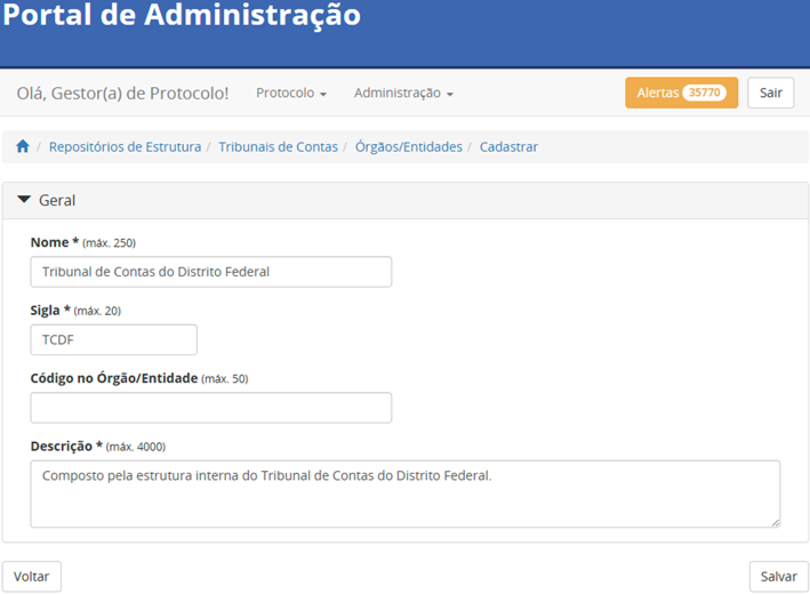

Tribunais de Contas dos Estados - TCE
+++++++++++++++++++++++++++++++++++++

A categoria Tribunais de Contas dos Estados deve ser inserida conforme as orientações que seguem.

  **Nome:** Tribunais de Contas dos Estados

  **Sigla:** TCE
  
  **Descrição:** Composto pelos Tribunais de Contas dos Estados.

Exemplo:

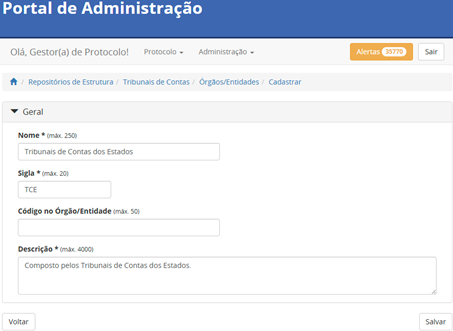

Tribunais de Contas dos Municípios - TCM
++++++++++++++++++++++++++++++++++++++++

A categoria Tribunais de Contas dos Municípios deve ser inserida conforme as orientações que seguem.

  **Nome:** Tribunais de Contas dos Municípios

  **Sigla:** TCM
  
  **Descrição:** Composto pelos Tribunais de Contas dos Municípios.

Exemplo:

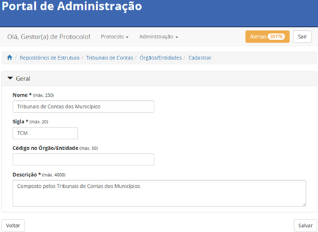

Tribunais de Contas Municipais - TCM
++++++++++++++++++++++++++++++++++++++++

A categoria Tribunais de Contas Municipais deve ser inserida conforme as orientações que seguem.

  **Nome:** Tribunais de Contas Municipais

  **Sigla:** TCM
  
  **Descrição:** Composto pelos Tribunais de Contas Municipais.

Exemplo:

.. figure:: _static/images/Nomenclatura_TCM.png

Consolidação do repositório dos Tribunais de Contas
---------------------------------------------------

Concluída a criação do repositório e a organização de suas categorias, sua estrutura deverá refletir o padrão ilustrado na imagem que segue.

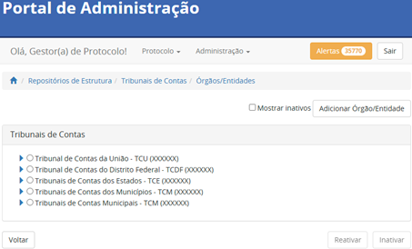

Inserção de órgãos de referência no repositório dos Tribunais de Contas
-----------------------------------------------------------------------

.. admonition:: Nota

   Apenas os Administradores e os Supervisores da Plataforma podem autorizar o acesso à plataforma (Seção 6.4).

Para fins de esclarecimento, se entende por órgãos de referência, neste documento, os órgãos a serem inseridos por meio do Portal de Administração pela equipe administradora do Tramita GOV.BR, na categoria específica do repositório, no momento da autorização de acesso a plataforma.

Tribunal de Contas da União
+++++++++++++++++++++++++++

Cada categoria é composta por órgãos de referência. Entretando, no caso específico desta categoria, deverá ser cadastrado apenas um órgão, conforme as instruções que seguem.

  **Nome:** Tribunais de Contas da União

  **Sigla:** TCU

Referência para inserção adequada à categoria:

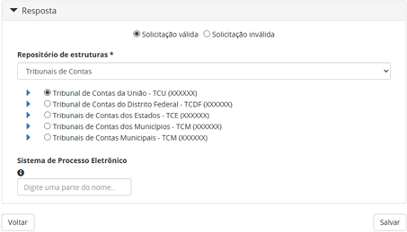

Tribunal de Contas dos Estados
++++++++++++++++++++++++++++++

Cada categoria é composta por órgãos de referência. No caso desta categoria, deverão ser cadastrados órgãos conforme as instruções que seguem.

  **Nome:** Tribunal de Contas do Estado da/de/do [Nome do Estado]

  **Sigla:** TCE[UF]

Referência para inserção adequada à categoria:

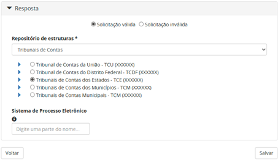

Tribunal de Contas dos Municípios
+++++++++++++++++++++++++++++++++

Cada categoria é composta por órgãos de referência. No caso desta categoria, deverão ser cadastrados órgãos conforme as instruções que seguem.

  **Nome:** Tribunal de Contas dos Municípios do Estado da/de/do [Nome do Estado]

  **Sigla:** TCM[UF]

Referência para inserção adequada à categoria:

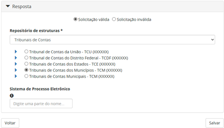

Tribunal de Contas Municipais
+++++++++++++++++++++++++++++

Cada categoria é composta por órgãos de referência. No caso desta categoria, deverão ser cadastrados órgãos conforme as instruções que seguem.

  **Nome:** Tribunal de Contas do Municípios de [Nome do Município]

  **Sigla:** TCM[Iniciais do nome do Município]

Referência para inserção adequada à categoria:

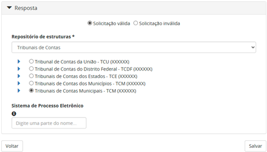

Visualização final do repositório Tribunais de Contas
-----------------------------------------------------

À medida que os órgãos desse repositório são liberados na plataforma, a estrutura do repositório se ajusta, conforme a imagem que segue.

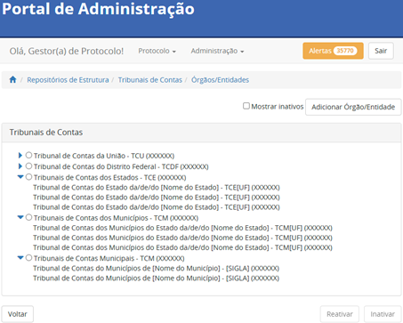
