Administração
==================

Sistema de Processo Eletrônico
+++++++++++++++++++++++++++++++

Pesquisar 
---------

O usuário tem a opção de pesquisar o Sistema de Processo Eletrônico por meio de filtros. É possível exibi-los clicando-se na seta para a direita, neste caso, ao clicar, abrirá uma tela contendo 05 (cinco) campos: 

* ID;
* Nome do Sistema ou Órgão;
* Data criação Inicial;
* Data criação Final;
* Órgão Responsável.

Preenchendo um dos campos e posteriormente clicar no botão Filtrar, a pesquisa retornada respeita os filtros preenchidos e se o perfil do usuário tem acesso a gestão dos sistemas filtrados na pesquisa.

A limpeza dos filtros é realizada ao clicar no botão Limpar. Caso não queira mais visualizar os campos dos filtros clique na seta para baixo.

.. figure:: _static/images/Sistema-Eletronico-Pesquisar.gif

Cadastrar 
---------

Nesta funcionalidade se cadastra o Sistema de Processo Eletrônico (SPE), os usuários devem seguir alguns padrões no preenchimento:

1. O Nome do Sistema é composto da seguinte forma: Sigla do Órgão - Sigla do Sistema. Por exemplo: MGI – SEI;

2. A Descrição é o nome por extenso do órgão;

3. Ao escolher um órgão que não pertence ao Poder Executivo Federal, os seguintes campos devem ser preenchidos de maneira adequada:

 * Esfera
 * Poder
 * Natureza Jurídica

4. O campo Público-alvo é marcado com sim quando o órgão responsável pelo Sistema Processo Eletrônico pertence a Administração Direta, Autárquica e Fundacional do Poder Executivo Federal.

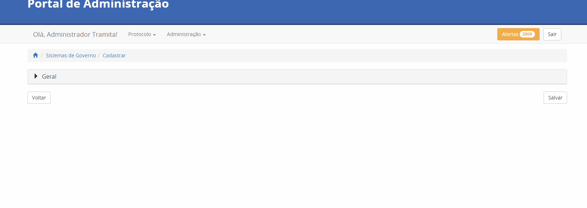

Editar 
-----

Ao clicar editar o usuário pode alterar as informações cadastradas anteriormente em Cadastrar. Para confirmar a alteração clicar no botão Salvar.

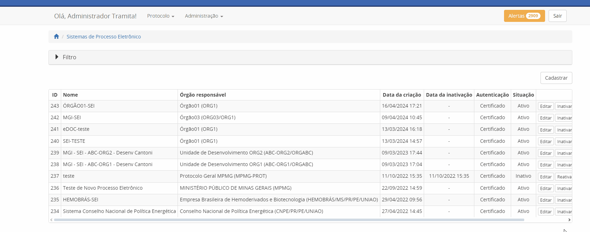

Inativar e Reativar
-------------------

Ao clicar no botão de Inativar o SPE selecionado é inativado. Caso necessário, o processo é reativado por meio do botão Reativar.

.. figure:: _static/images/Sistema-Eletronico-Inativar_Reativar.gif

Gerar Certificado
-----------------

* O certificado digital é a garantia, dentro do Tramita.GOV.BR, de que o SPE conectado pertence de fato ao órgão que realizou o cadastro no Portal.

* Ele é gerado pelos gestores de protocolo no Portal do Tramita.GOV.BR, por meio da funcionalidade localizada no menu Administração > Opção “Sistemas de Processo Administrativo Eletrônico”.

* O certificado é gerado por meio da ação “Gerar Certificado”. Antes de sair da tela de geração, não se esqueça de salvar a senha e o certificado em algum lugar seguro. O certificado é vinculado automaticamente ao órgão ou a entidade no Portal de administração e se torna confiável para o Tramita.GOV.BR.

.. figure:: _static/images/Geracao_de_Certificado_por_meio_do_Portal_do_Barramento.gif

Sistemas de Governo
+++++++++++++++++++

Pesquisar
---------

O usuário tem a opção de pesquisar os sistemas de governo cadastrados por meio de filtros. É possível exibi-los clicando-se na seta para a direita, neste caso, ao clicar, abrirá uma tela contendo 03 (três) campos: 

* Código;
* Nome;
* Descrição.  

No mínimo um dos campos deve ser preenchido antes de clicar no botão Filtrar. Com clique é retornada uma pesquisa respeitando os filtros preenchidos.

A limpeza é realizada ao clicar no botão Limpar. Caso não queira mais visualizar os campos dos filtros clique na seta para baixo.

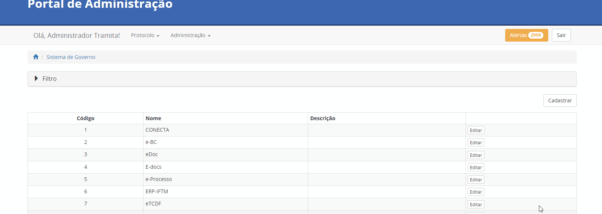

Cadastrar
---------

Nesta funcionalidade se cadastra o Sistema de Governo, o usuário deverá preencher os dados no formulário e clicar no botão Salvar. O Nome, a Sigla e a Descrição é o nome por extenso do Sistema de Governo.

Editar
------

Ao clicar em Editar o usuário pode alterar as informações cadastradas anteriormente em Cadastrar. Para confirmar a alteração, clicar no botão Salvar.

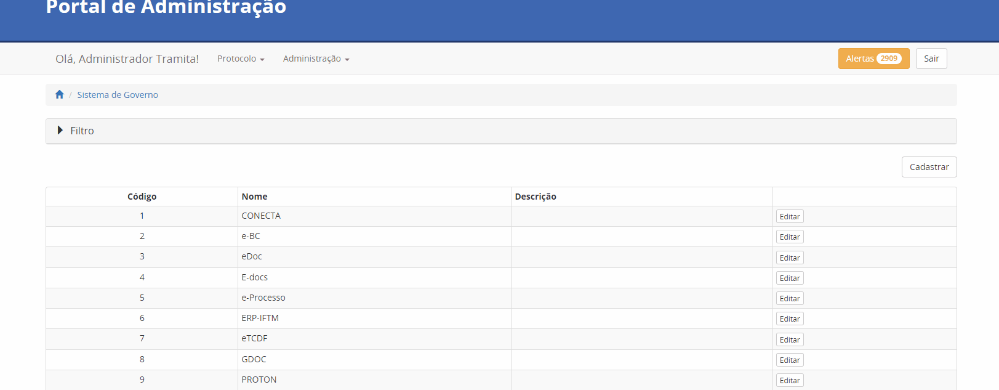

Estruturas organizacionais do PEN
+++++++++++++++++++++++++++++++++

Esta funcionalidade foi desenvolvida para definir quais órgãos estão habilitados junto com data de implantação para entrar na carga do painel de dados desenvolvido pela equipe do Processo Eletrônico Nacional. O painel é acessado por meio do seguinte endereço:  

https://paineis.processoeletronico.gov.br/painel.php?type=1&panel=19383b01-3e5f-4ba8-be94-4ca1be1686a5&sheet=12f5711f-e2c1-4f71-a26c-dcd03d7f5193

.. figure:: _static/images/Estrutra-Organizacionais-PEN-Painel.gif

Pesquisar
---------

O  usuário tem a opção de pesquisar a Estrutura organizacional do painel do PEN por meio do Filtro. 

É possível exibi-la clicando na seta para a direita, neste caso, ao clicar, abrirá uma tela contendo uma combo para seleção, Estrutura Organizacional. 

Ao clicar no botão Filtrar, o sistema apresenta todos os órgãos vinculados aquela Estrutura Organizacional caso já estejam definidos no portal. 

Para limpar as informações digitadas clicar no botão Limpar. Caso não queira mais visualizar os campos dos filtros clique na seta para baixo.

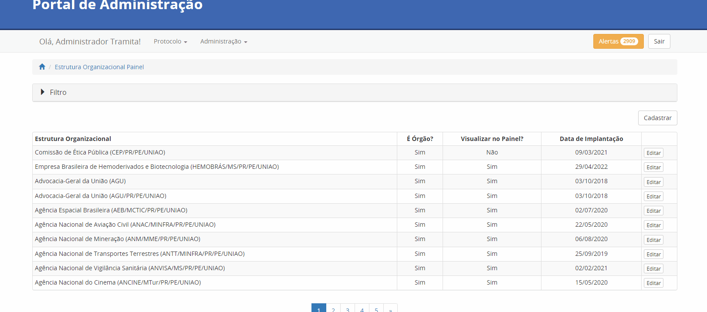

Cadastrar
---------

Nesta funcionalidade é definido o órgão que é incluído na carga do painel da plataforma Tramita GOV.BR. O cadastro é composto dos seguintes campos:

* Estrutura Organizacional: Nesse campo é escolhido o órgão a ser incluído a partir do repositório de estrutura;
* Data de implantação: A data que o órgão alcançou todos os requisitos mínimos para implantação e foi considerado como implantado;
* É Órgão? Considerar o órgão na contagem de órgãos implantados;
* Deve aparecer no painel PEN? O órgão é incluído na carga do painel.
    
Após salvar, o órgão cadastrado é incluído na carga e na próxima atualização os seus dados são apresentados no painel.

Editar
------

Ao clicar em editar o usuário pode alterar as informações cadastradas anteriormente em Cadastrar. Para confirmar a alteração clicar no botão Salvar.

.. figure:: _static/images/Estrutaras-Organizacionais-PEN-Editar.gif

Parâmetros da solução
++++++++++++++++++++++

Esta funcionalidade traz parâmetros específicos do Portal de Administração do Tramita.GOV.BR. A seguir, a tabela com todos os parâmetros gerenciados pelos Administradores.

+-----------------------------------------------------------------+------------------------------------------------------------------------------------------------------------------------------------------------------+
| Nome                                                            | Descrição                                                                                                                                            | 
+=================================================================+======================================================================================================================================================+
|.. centered:: **Configuração de envio e-mail**                                                                                                                                                                          |
+-----------------------------------------------------------------+------------------------------------------------------------------------------------------------------------------------------------------------------+
|Assunto de E-mail de acesso ao ambiente de homologação aprovado  |Define o padrão do assunto do e-mail de acesso ao ambiente de homologação aprovado.                                                                   |
+-----------------------------------------------------------------+------------------------------------------------------------------------------------------------------------------------------------------------------+
|Assunto de E-mail de cadastro de gestor em órgão                 |Define o padrão do assunto do e-mail de cadastro de gestor em órgão.                                                                                  |
+-----------------------------------------------------------------+------------------------------------------------------------------------------------------------------------------------------------------------------+
|Assunto de E-mail de reprovação de cadastro                      |Define o padrão do assunto do e-mail de reprovação de cadastro.                                                                                       |
+-----------------------------------------------------------------+------------------------------------------------------------------------------------------------------------------------------------------------------+
|Assunto de E-mail de solicitação de cadastro de órgão            |Define o padrão do assunto do e-mail de solicitação de cadastro de órgão.                                                                             |
+-----------------------------------------------------------------+------------------------------------------------------------------------------------------------------------------------------------------------------+
|Corpo de E-mail de acesso ao ambiente de homologação aprovado    |Define o padrão do corpo do e-mail de acesso ao ambiente de homologação aprovado.                                                                     |
+-----------------------------------------------------------------+------------------------------------------------------------------------------------------------------------------------------------------------------+
|Corpo de E-mail de cadastro de gestor em órgão                   |Define o padrão do corpo do e-mail de cadastro de gestor em órgão.                                                                                    |
+-----------------------------------------------------------------+------------------------------------------------------------------------------------------------------------------------------------------------------+
|Corpo de E-mail de reprovação de cadastro                        |Define o padrão do corpo do e-mail de reprovação de cadastro.                                                                                         |
+-----------------------------------------------------------------+------------------------------------------------------------------------------------------------------------------------------------------------------+
|Corpo de E-mail de solicitação de cadastro de órgão              |Define o padrão do corpo do e-mail de solicitação de cadastro de órgão.                                                                               |
+-----------------------------------------------------------------+------------------------------------------------------------------------------------------------------------------------------------------------------+
|.. centered:: **Expurgo e cancelamento automático**                                                                                                                                                                     |
+-----------------------------------------------------------------+------------------------------------------------------------------------------------------------------------------------------------------------------+
|Qtd. de dias para cancelamento automático de trâmite             |Define a quantidade de dias corridos, sem nenhuma atualização, que libera a solução para cancelar automaticamente um trâmite                          |
+-----------------------------------------------------------------+------------------------------------------------------------------------------------------------------------------------------------------------------+	
|Qtd. de dias para expurgo dos binários de trâmites cancelados    |Define a quantidade de dias corridos, após o cancelamento de um trâmite, para que a solução possa expurgar (excluir) os componentes digitais do mesmo |
+-----------------------------------------------------------------+------------------------------------------------------------------------------------------------------------------------------------------------------+
|Qtd. de dias para expurgo dos binários de trâmites concluídos    |Define a quantidade de dias corridos, após a conclusão de um trâmite, para que a solução possa expurgar (excluir) os componentes digitais do mesmo    |
+-----------------------------------------------------------------+------------------------------------------------------------------------------------------------------------------------------------------------------+
|.. centered:: **Importação de estruturas do SIORG**                                                                                                                                                                     |
+-----------------------------------------------------------------+------------------------------------------------------------------------------------------------------------------------------------------------------+
|Intervalo entre execuções                                        |Define a quantidade de horas de intervalo entre duas execuções da rotina de importação dos dados do SIORG                                             |
+-----------------------------------------------------------------+------------------------------------------------------------------------------------------------------------------------------------------------------+
|.. centered:: **Notificar via e-mail**                                                                                                                                                                                  |
+-----------------------------------------------------------------+------------------------------------------------------------------------------------------------------------------------------------------------------+
|Autorização de Acesso ao Tramita                                 |Define os e-mails destinatários para alertas de autorização de acesso ao Tramita.GOV.BR                                                               |
+-----------------------------------------------------------------+------------------------------------------------------------------------------------------------------------------------------------------------------+
|Corpo de Autorização de Acesso ao Tramita                        |Define o corpo da mensagem de autorização de acesso ao Tramita.GOV.BR                                                                                 |
+-----------------------------------------------------------------+------------------------------------------------------------------------------------------------------------------------------------------------------+
|Solicitação de Acesso ao Tramita.GOV.BR                          |Define os e-mails destinatários para alertas de novas solicitações do cadastro de Comitê Gestor de Protocolo.                                         |
+-----------------------------------------------------------------+------------------------------------------------------------------------------------------------------------------------------------------------------+
|.. centered:: **Paginação**                                                                                                                                                                                             |
+-----------------------------------------------------------------+------------------------------------------------------------------------------------------------------------------------------------------------------+
|Valor máximo para página de registros                            |Define o valor máximo que um SPE pode solicitar em uma página de registros                                                                            |
+-----------------------------------------------------------------+------------------------------------------------------------------------------------------------------------------------------------------------------+
|Valor padrão para página de registros                            |Define o valor padrão a ser utilziado quando um SPE solicitar uma página de registros                                                                 |
+-----------------------------------------------------------------+------------------------------------------------------------------------------------------------------------------------------------------------------+
  
Editar
------

Ao clicar em Editar, o usuário pode alterar as informações cadastradas anteriormente. Para confirmar a alteração clicar no botão Salvar.

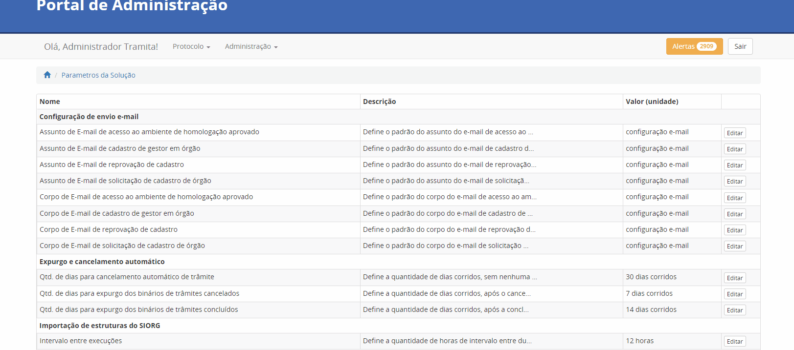

.. admonition:: Observação

   As informações alteradas mudam de acordo com o parâmetro. Posteriormente, cada parâmetro será documentado. 

Repositório de estrutura
++++++++++++++++++++++++

Pesquisar
---------

O usuário tem a opção de pesquisar os repositórios de estruturas por meio de filtros. É possível exibi-los clicando-se na seta para a direita, neste caso, ao clicar, abrirá uma tela contendo 03 (três) campos: 

* Código;
* Nome;
* Descrição.  

No mínimo um dos campos deve ser preenchido antes de clicar no botão Filtrar. Com clique é retornada uma pesquisa respeitando os filtros preenchidos.

A limpeza é realizada ao clicar no botão Limpar. Caso não queira mais visualizar os campos dos filtros clique na seta para baixo. 

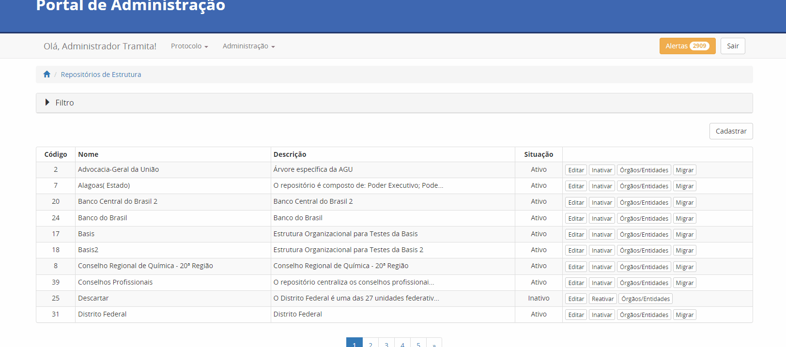

Cadastrar
---------

Nesta funcionalidade se cadastra o Repositório de Estrutura, o usuário deve preencher os dados no formulário e clicar no botão Salvar.

.. admonition:: Observações

   1. Os repositórios criados devem respeitar o padrão de Criação de Repositórios (Ler o documento :download:`Padrão de Criação de Repositrio V_2.0 <_static/Padrao_de_Criacao_de_Repositorio-V2.0.pdf>`).
   2. Novos repositórios apenas quando realmente necessário.
   3. Em caso de um repositório não respeitar o padrão de Criação de Repositório, utilizar a funcionalidade de migração para realizar a organização de um repositório existente.

Editar
------

Ao clicar em Editar o usuário pode alterar as informações cadastradas anteriormente em Cadastrar. Para confirmar a alteração clicar no botão Salvar.

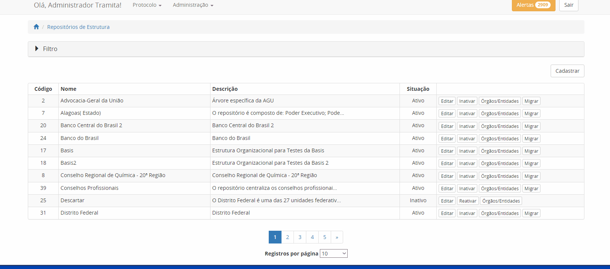

Inativar e Reativar
-------------------

Ao clicar no botão de Inativar o Repositório de Estrutura selecionado será inativado e aparecerá o botão de Reativar. Se clicar em Reativar, o Repositório de Estrutura é reativado.

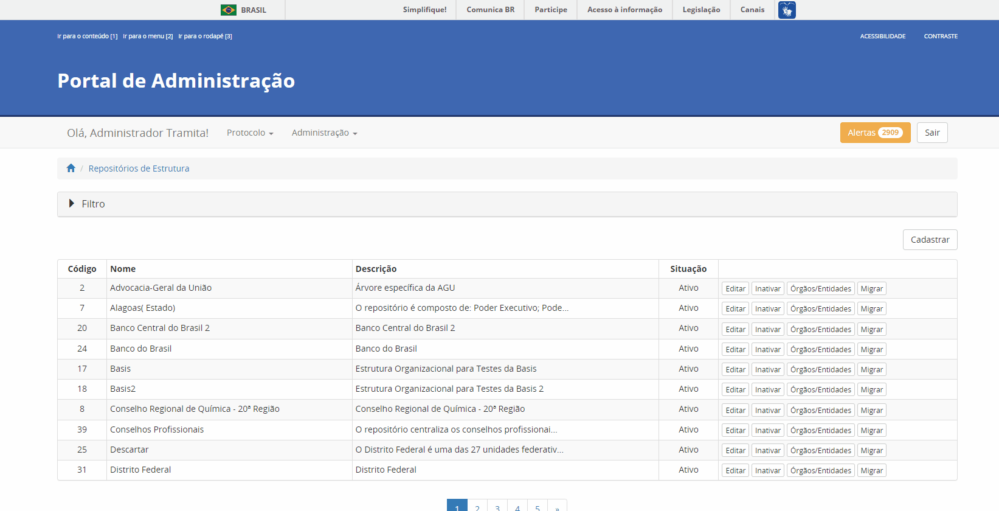

Órgãos/Entidades
----------------

Ao clicar em Órgãos/Entidades abre uma tela que o usuário com as seguintes opções:

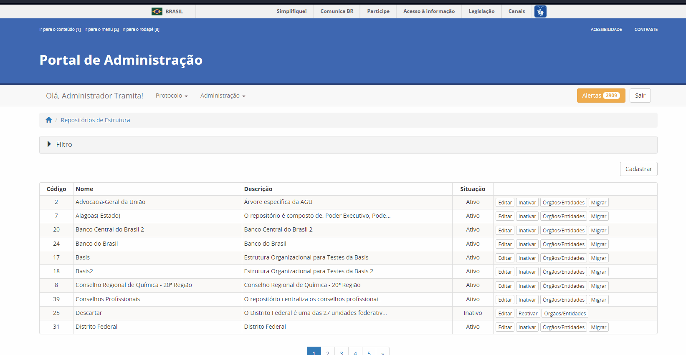

Mostrar inativos
^^^^^^^^^^^^^^^^

Ao selecionar essa funcionalidade, o usuário pode visualizar os órgãos/entidades inativos, caso contrário, visualiza somente os ativos.

Adicionar Órgão/Entidade
^^^^^^^^^^^^^^^^^^^^^^^^

O usuário preenche os seguintes dados para cadastro de um órgão no primeiro nível do repositório:

1. Nome: Nome do Órgão;
2. Sigla: Sigla do Órgão;
3. Código no Órgão/Entidade:  É possível incluir um código numérico com até 50 caracteres;
4. Descrição: Uma descrição concisa do Órgão.

Seleção do Órgão/Entidade
^^^^^^^^^^^^^^^^^^^^^^^^^

Ao selecionar o órgão/entidade desejado, se tiver ativo pode inativar, caso contrário, Reativar.

A opção editar o usuário poderá alterar os dados do órgão/entidade (Nome, Sigla, Código no Órgão/Entidade, Descrição). Para confirmar a alteração clicar no botão “Salvar”.

Migrar 
------

Esta funcionalidade permite a migração de unidades dentro do próprio repositório e para outro repositório. Independentemente do tipo de migração, o ID das unidades não é mudado. O objetivo dessa funcionalidade é possibilitar a organização dos repositórios de estrutura, sempre, respeitando o padrão de criação de repositórios.

A migração não é permitida no repositório Poder Executivo Federal, visto que a estrutura é mantida pelo Sistema de Organização e Inovação Institucional do Governo Federal (SIORG).

A migração é sempre composta por origem e pelo destino, após clicar em concluir em Migrar a migração é efetuada com sucesso.

.. admonition:: Observações

   1. Ao realizar a migração, todos os nós filhos são migrados junto com o nó pai.

   2. Os Gestores de Protocolo e o Sistema de Processo Eletrônico vinculado àquela unidade são mantidos após a realização da migração.

   3. Sempre respeitar o padrão de organização dos repositórios.

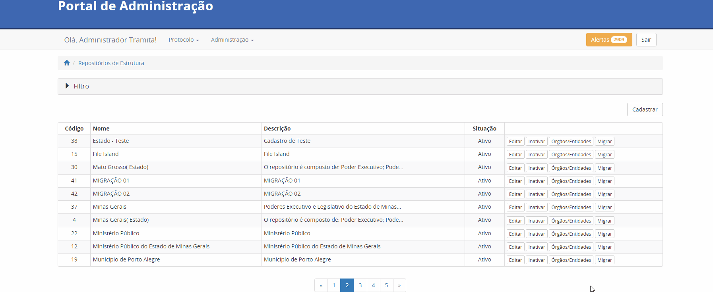

Hipóteses Legais
++++++++++++++++

Pesquisar
---------

O usuário tem a opção de pesquisar as Hipóteses Legais por meio de filtros. É possível exibi-los clicando-se na seta para a direita, neste caso, ao clicar, abrirá uma tela contendo 04 (quatro) campos:

* ID;
* Nome;
* Base Legal;
* Status.  

Preenchendo um dos campos e posteriormente clicar no botão “Filtrar”, a pesquisa retornada respeita os filtros preenchidos.

A limpeza é realizada ao clicar no botão Limpar. Caso não queira mais visualizar os campos dos filtros clique na seta para baixo.

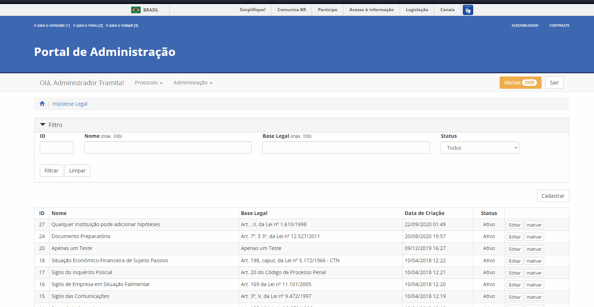

Cadastrar
---------

Nesta funcionalidade se cadastra a Hipótese Legal. O usuário deverá preencher os dados no formulário:

* Nome: Nome conciso da hipótese legal;
* Base Legal: Preencher com base normativa. Por exemplo: Lei que regulamenta.
* Descrição: Descrição concisa da hipótese legal.
* Status: Ativo ou Inativo. 

Após o preenchimento de todos os campos os obrigatórios, basta clicar em Salvar.

.. admonition: Observação

   A depender de como é utilizado o endpoint da API, as hipóteses legais inativas não são recuperadas.

Editar
------

Ao clicar Editar o usuário pode alterar as informações cadastradas anteriormente em Cadastrar. Para confirmar a alteração clicar no botão Salvar.

Inativar e Reativar 
-------------------

Ao clicar no botão de “Inativar” a Hipótese Legal selecionada será inativada e aparecerá o botão de “Reativar”. Se clicar em “Reativar” a Hipótese Legal é atividade novamente.

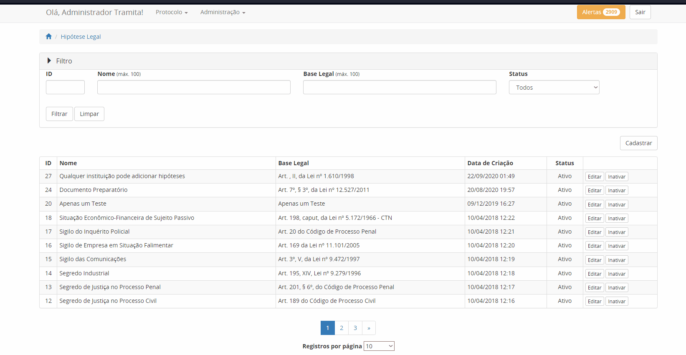

Painel de Controle
++++++++++++++++++

Gerar Painel de Controle
------------------------

O Painel de Controle é uma funcionalidade, disponível aos Gestores de Protocolo, para o acompanhamento das tramitações de processos administrativos eletrônicos ou documento avulso, em meio eletrônico, realizados pelo Tramita.GOV.BR.

Esta funcionalidade pode ser acessada por meio do menu **Administração > Painel de Controle**.
 
.. figure:: _static/images/Filtros_da_Funcionalidade_Painel_de_Controle.gif

Função que permite consultar por todos os Sistemas de Processo Administrativo Eletrônico - SPE ou selecionar um SPE específico.

Função que permite escolher o período do trâmite desejado. O período poderá ser selecionado por Mês e Ano, respectivamente. Caso a caixa de seleção “Escolher período” seja selecionada, o sistema apresentará o componente “Calendário" para selecionar uma data inicial e uma data final.

Função que permite selecionar os dados do Gráfico por percentual ou por quantidade.

Função que permite gerar o Painel de Controle dos trâmites por situação.

.. figure:: _static/images/Resultado_da_Pesquisa_do_Painel_de_Controle.gif

Função que permite selecionar uma situação do trâmite ou todas as situações.

IDT, ou “Identificação do Trâmite”. É um número único que identifica cada trâmite específico.

NRE significa o Número do Registro do Trâmite. O NRE é o número de protocolo do Tramita.GOV.BR, independente de quantas vezes o processo for tramitado entre SPEs, esse recebe o mesmo número.
 
Ao clicar no Número do IDT, o sistema apresentará uma tela com as Informações ( Trâmite, Remetente e Destinatário), Recibo ( Recibo de Envio e Recibo de Trâmite) , Situação ( Data/Hora e Situação Atual do Trâmite) e Componentes ( Ordem, Documento, Espécie, Nível de Restrição, Avulso, Hash, Tipo de Conteúdo, Mime Type e Tamanho de cada arquivo e o tamanho Total dos arquivos) do trâmite, conforme abaixo:

**A. Informações** – Informações detalhada do trâmite, o sistema apresenta do Trâmite ( Tipo, Descrição e Nível de Acesso) e do Remetente e do Destinatário ( Repositório, órgão, SPE vinculado, tipo de autenticação )

.. figure:: _static/images/Informações_do_Tramite.gif

**B. Recibo** – São os recibos que são trocados entre os dois sistemas para confirmar os envios e recebimento dos documentos.

.. figure:: _static/images/Painel_de_Controle_02_Informacoes_para_Recibo.gif

**C. Situações** – O sistema apresenta a situação atual do trâmite com data e hora. Para Cada IDT, pode haver uma ou várias situações do Trâmite. Se o trâmite é concluído com recusa, será exibida uma nova aba com o motivo da recusa.

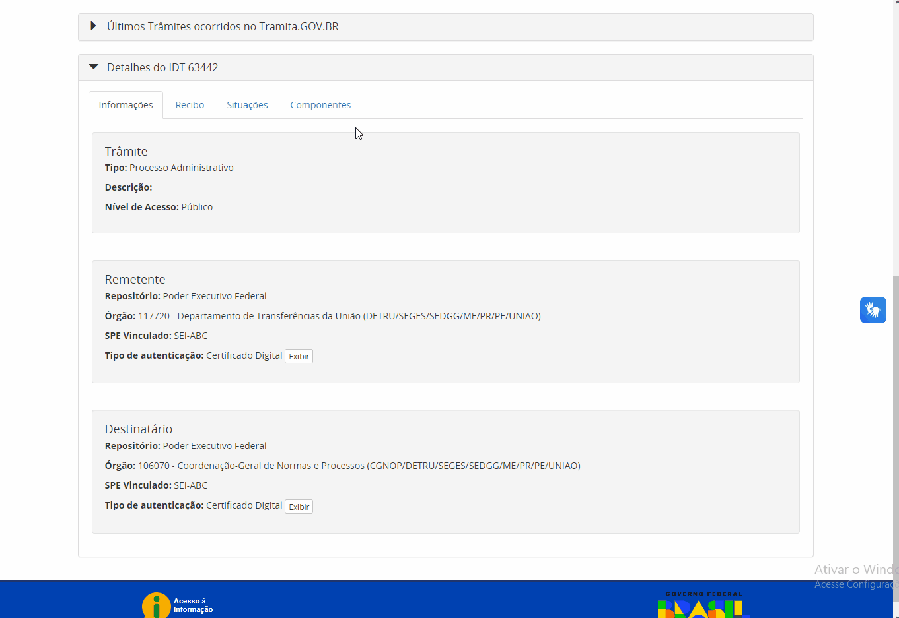

**D. Componentes** – São os componentes digitais que foram tramitados no IDT. O sistema apresenta a Ordem, Documento, Espécie, Nível de Restrição, Avulso, Hash, Tipo de Conteúdo, MimeType e Tamanho individual e Total dos arquivos do trâmite.

.. figure:: _static/images/Painel_de_Controle_04_Informacoes_para_Componentes.gif

**E. Recusa** –  É exibida apenas quando o trâmite é concluído com recusa. Com essa aba é possível consultar a justificativa de recusa do processo ou documento avulso.

.. figure:: _static/images/GifRecusasTramita.gif

Gerar Excel 
-----------

Ao clicar em Gerar Excel, a pesquisa é exportada em um arquivo com extensão .xls.

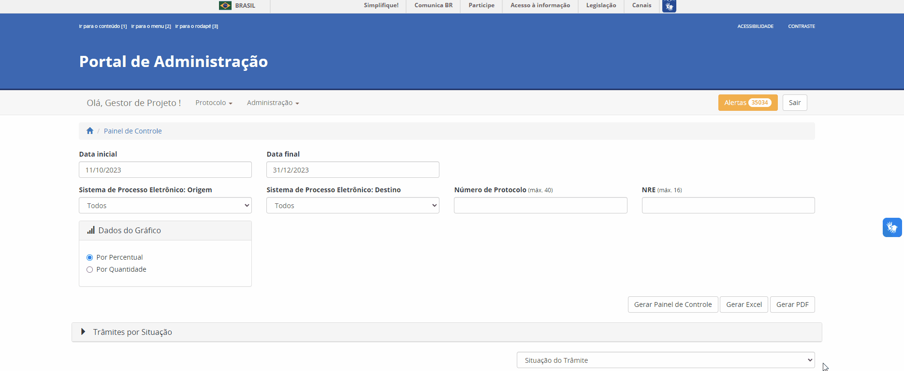

Gerar PDF
---------

Ao clicar em Gerar Excel, a pesquisa é exportada em um arquivo com extensão .pdf.

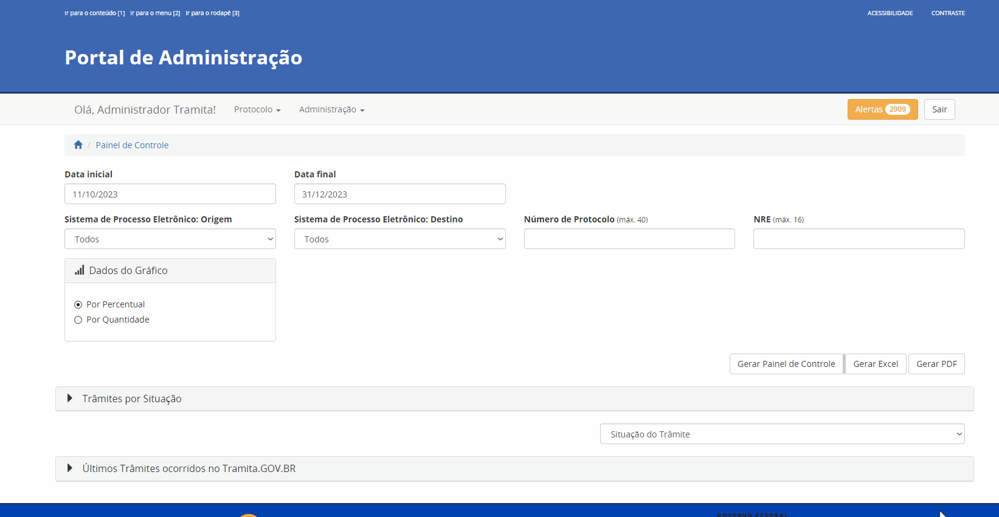

.. admonition:: Observação

   Em ambos os tipos de exportação, é necessário primeiro clicar em Gerar Painel de Controle.

Gerenciar Acesso ao Tramita GOV.BR
+++++++++++++++++++++++++++++++++++

Pesquisar
---------

O usuário tem a opção de pesquisar os órgãos por meio de filtros. É possível exibi-los clicando-se na seta para a direita, neste caso, ao clicar, abrirá uma tela contendo 05 (cinco) campos e 1 (um) checkbox:

Filtros:

* CPF do Gestor;
* Sigla do Órgão/Entidade;
* Nome do Órgão/Entidade;
* Período da Solicitação: Data inicial;
* Período da Solicitação: Data final;

Checkbox:

* Seleção das solicitações pendentes.

Preenchendo um dos campos e posteriormente clicar no botão “Filtrar”, a pesquisa retornada respeita os filtros preenchidos. O checkbox é marcado para restringir a pesquisa apenas em solicitações que ainda não foram analisadas.

A limpeza é realizada ao clicar no botão Limpar. Caso não queira mais visualizar os campos dos filtros clique na seta para baixo.

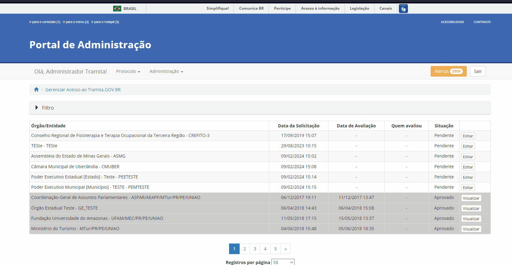

Analisar/Visualizar
-------------------

Ao clicar em Analisar, o usuário inicia o processo de análise das informações fornecidas pelo solicitante interessado em utilizar a plataforma Tramita GOV.BR. O objetivo dessa análise é ratificar se os dados informados estão corretos, junto com a avaliação dos documentos enviados pelo solicitante.

A seguir, os pontos de atenção a serem seguidos pelo avaliador:

1) Se o Órgão/Entidade é Executivo Federal?

Se a seleção for “Sim”, verificar a Portaria ou outro documento de designação do servidor, que comprove sua competência para exercer esta função para o Órgão/ Entidade solicitante e documentação pessoal. Utilize estes documentos para confirmar se o Órgão/Entidade está selecionado corretamente na estrutura organizacional do SIORG, caso não esteja, selecione corretamente.

Caso contrário, “Não”, se foi anexado o termo de adesão para acesso ao Tramita.GOV.BR, o termo de posse e o documento de identificação do dirigente do órgão ou entidade.   

2) Confirmar o Sistema de Governo, ou seja, qual o nome do Sistema de Processo Administrativo Eletrônico (SPE). O SPE é o termo utilizado para se referir aos sistemas internos utilizados pelos órgãos no gerenciamento de processos administrativos no exercício de suas atividades administrativas. Por exemplo: o SEI, o SIPAC, o SUAP, o Sapiens-AGU etc.

3) Confirmar o Gestor Tecnológico, ou seja, qual é o órgão responsável pela infraestrutura na qual o SPE está implantado. Na opção Interno, o SPE é instalado na infraestrutura interna do próprio órgão. Em contraste, o SPE pode ser implementado em uma infraestrutura externa, que não pertence ao órgão em questão. Um exemplo disso é a Dataprev, uma empresa pública de tecnologia que oferece serviços de hospedagem de sistemas em nuvem nas modalidades IAAS (Infrastructure as a Service) e SAAS (Software as a Service).

Durante o processo de avaliação, caso necessário o avaliador entra em contrato com o solicitante. A ausência de retorno resulta na invalidação da solicitação. 

Se algum dos requisitos da solicitação não for alcançado, a solicitação é invalidada.  Independente do caso, o solicitante é informado do motivo da recusa por meio de e-mail automático após a confirmação.

.. admonition:: Observações

   1. Sempre verificar se o nó marcado pelo solicitante é nó raiz. Se for outro nó, o avaliador deve realizar o ajuste para nó correto.
   
   2. Os órgãos não SIORG devem ser vinculados ao repositório correto respeitando o :download:`Padrão de Criação de Repositrio V_2.0 <_static/Padrao_de_Criacao_de_Repositorio-V2.0.pdf>`, antes de realizar o aceite da solicitação.

   3. O sistema de órgãos não SIORG são apenas vinculados após a criação do novo órgão no Banco de Dados.

Gerenciar Perfis 
++++++++++++++++

Pesquisar  
---------

O usuário tem a opção de pesquisar os usuários cadastrados por meio de filtros. É possível exibi-los clicando-se na seta para a direita, neste caso, ao clicar, abrirá uma tela contendo 06 (seis) campos:

* Nome;
* CPF;
* E-mail;
* Nome do Órgão;
* Sistema de Governo;
* Perfis.

No mínimo um dos campos deve ser preenchido antes de clicar no botão Filtrar. Com clique é retornada uma pesquisa respeitando os filtros preenchidos.

A limpeza é realizada ao clicar no botão Limpar. Caso não queira mais visualizar os campos dos filtros clique na seta para baixo.

Nas combos que é possível a multi-seleção (Sistemas de Governo e Perfis), com a tecla Ctrl é possível selecionar simultaneamente itens diferentes. Para fazer isso, basta clicar em um dos itens, selecionar a tecla “Ctrl” e clicar nos itens adicionais que queira selecionar.

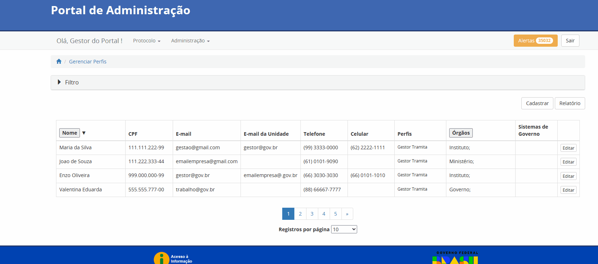

Cadastrar
---------

Nesta funcionalidade, o usuário deve inserir o CPF do usuário a ser cadastrado, clicando-se em seguida no Botão “Procurar”. Caso o novo usuário não seja localizado, após preencher dados no formulário, selecionar o perfil desejado e clicar no botão “Salvar”.

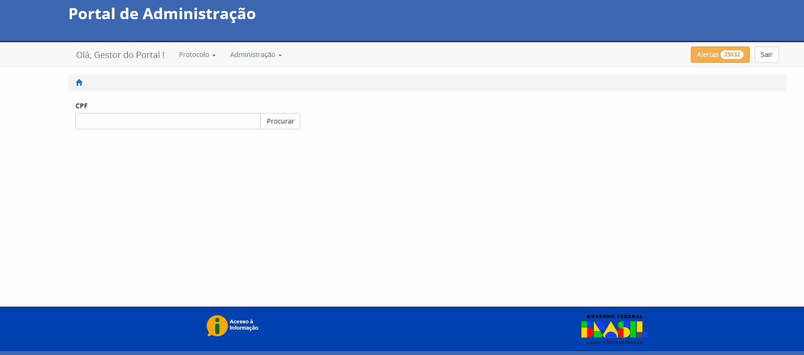

Relatório  
---------

Ao clicar no botão Relatório, o resultado da pesquisa é exportado para uma planilha do Microsoft Excel. Essa planilha é composta das seguintes colunas:

* Nome;
* CPF;
* E-mail;
* E-mail da Unidade;
* Telefone;
* Celular;
* Perfis;
* Órgãos;
* Sistema de Governo.

O arquivo exportado é um arquivo com extensão .xls.

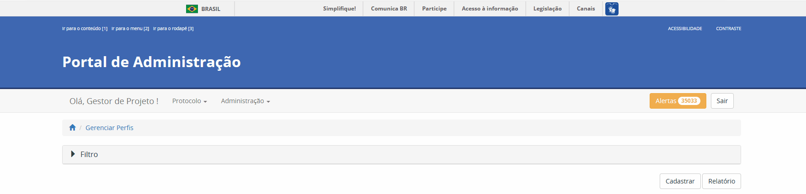

Editar
------

Ao clicar em Editar o usuário pode alterar as informações cadastradas anteriormente em Cadastrar. Para confirmar a alteração clicar no botão Salvar.

.. figure:: _static/images/Gerenciar-Perfis-Editar.gif

Gestores Tecnológicos
+++++++++++++++++++++

Pesquisar  
---------

O usuário tem a opção de pesquisar os gestores tecnológicos por meio de filtros.  Esta funcionalidade contém 03 (três) opções de filtros: 

* ID;
* Nome;
* Descrição.

No mínimo um dos campos deve ser preenchido antes de clicar no botão Filtrar. Com clique é retornada uma pesquisa respeitando os filtros preenchidos.

A limpeza é realizada ao clicar no botão Limpar. Caso não queira mais visualizar os campos dos filtros clique na seta para baixo.

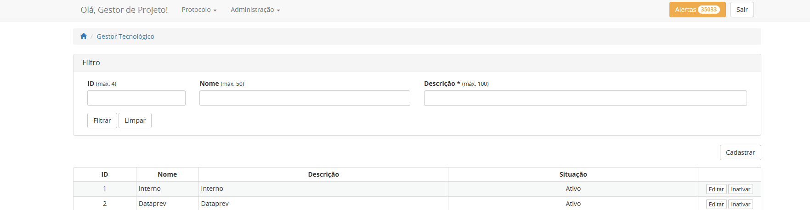

Cadastrar
---------

Nesta funcionalidade se cadastra o Gestor Tecnológico. O usuário deverá preencher os seguintes dados no formulário:

* Nome: Nome da Empresa Pública na qual o Sistema de Processo Eletrônico está implantado.
* Descrição: Uma descrição sucinta ou reutilização do que foi preenchido no campo Nome.

.. figure:: _static/images/Gestores-Tecnologicos-Cadastrar.gif

Editar
------

Ao clicar em Editar o usuário pode alterar as informações cadastradas anteriormente em Cadastrar. Para confirmar a alteração clicar no botão Salvar.

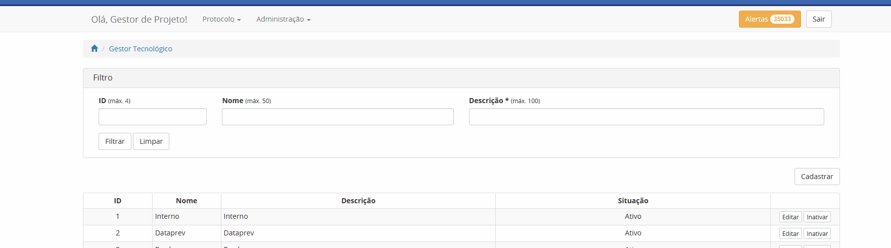

Meus Dados
++++++++++

A funcionalidade Meus dados é utilizada para atualização dos seus dados, tais como: e-mail, e-mail da unidade, telefone e celular.

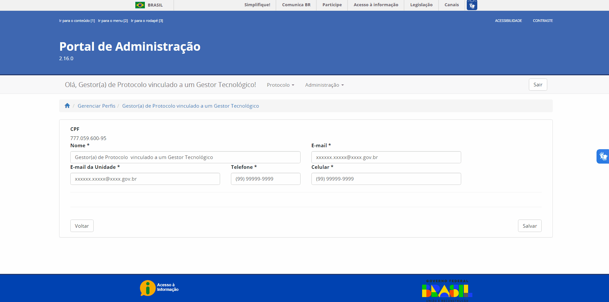

