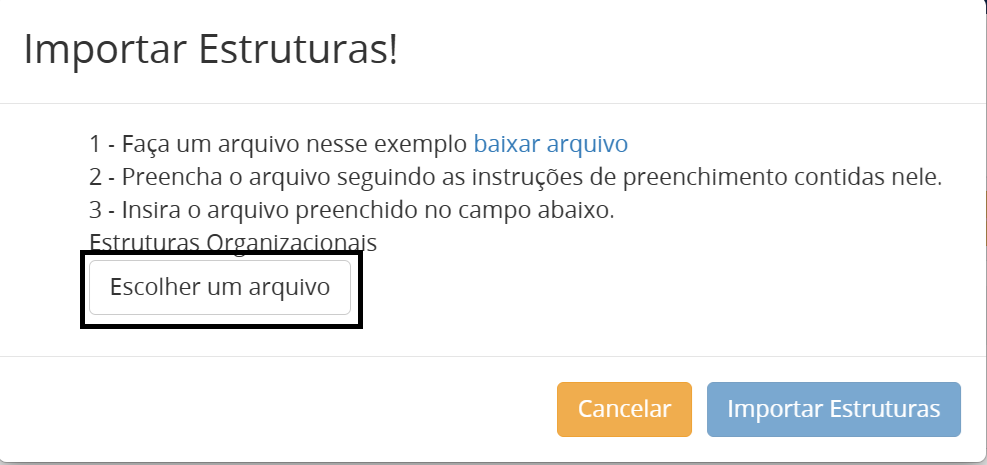

Guia de Importação de Estrutura 
===============================

.. admonition:: Observação

   Esta funcionalidade está apenas disponível para órgãos e entidades que a estrutura não é mantida pelo Sistema de Informações Organizacionais do Governo Federal (SIORG).

1. A importação de estrutura é acessada por meio da funcionalidade **Protocolo --> Gestão do Tramita GOV.BR.**

2. Depois que o usuário localizar o seu órgão, clicar em **Hierarquia**. 

3. Ao entrar na funcionalidade, selecionar qual o nó será a referência para as unidades que serão importadas:

4. Ao clicar em **Importar Estruturas**, a seguinte tela é exibida:

a. Clique no hiperlink presente no primeiro passo para baixar o modelo;

b. Ao baixar o arquivo, o template é apresentado (arquivo aberto no excel para facilitar o entendimento):

.. admonition:: Orientações Importantes:

   * O “Código/Código do Pai” não possui relação com nenhum com os IDs da plataforma (unidade e Tramita GOV.BR);
   
   * Os Códigos são utilizados para estabelecer a hierarquia para as unidades que serão importadas. Por exemplo: As unidades Administração Um e TI um são filhos do Ministério UM.

   * O “Código” terá sempre uma numeração SEQUENCIAL (Ex. 1, 2, 3, 4, 5.... 10).

   * Quando não indicar um código para o pai (vazio), a unidade se tornará filha da unidade da marcada para habilitar a funcionalidade Importar Estruturas;

   * O “Código do Pai” deve ser preenchido com o código da unidade desejada, conforme a coluna “Código” da planilha, nos casos em que a unidade é subordinada a outra unidade;

   * Este arquivo tem um formato específico, com extensão CSV (separado por vírgula).  

.. admonition:: Observação

   Ao manipular o arquivo por meio de um editor de planilha, é importante verificar antes de salvar se a separação das colunas está de acordo com o modelo.

              
5. A seguir, um exemplo de arquivo preenchido:

.. admonition:: Descrição:

   * A SIGLA COMPLETA respeita a hierarquia das unidades do órgão/entidade, ou seja, a sigla das unidades superiores é aglutinada à da unidade atual, separada por barra, sempre da unidade hierarquicamente inferior até a superior. Por exemplo: a Diretoria de Saúde está vinculada à Secretaria de Estado da Saúde, ou seja, DSAUDE está abaixo de SESAUDE. Logo, a SIGLA COMPLETA é composta da seguinte forma: DSAUDE/SESAUDE. 

   * As Secretarias são filhas da unidade Governo do Rio de Janeiro (nó marcado para habilitar a funcionalidade Importar Estrutura). Por esse motivo, o Código do PAI está vazio;

   * As Diretorias são filhas das unidades Secretaria. Uma da de Saúde, Código do Pai 1, e outra da de Transporte, Código do Pai 4;

   * A Coordenação Geral de Saúde é filha da Diretoria de Saúde, Código 2.

   * As duas Coordenações Gerais de Transporte são filhas da Diretoria de Transporte, Código 5.

6. O arquivo acima foi incluído no sistema para realização da importação da estrutura.

 
7. Ao clicar em **Importar Estruturas**, a seguinte tela é exibida:

8. Após clicar em **Importar**, as novas unidades são inseridas abaixo do nó selecionado na etapa 3.

9. Seguindo esses passos, você poderá realizar a importação de estrutura de maneira eficiente e organizada.
