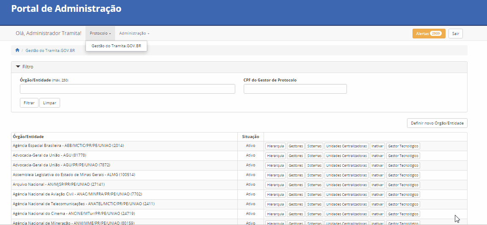
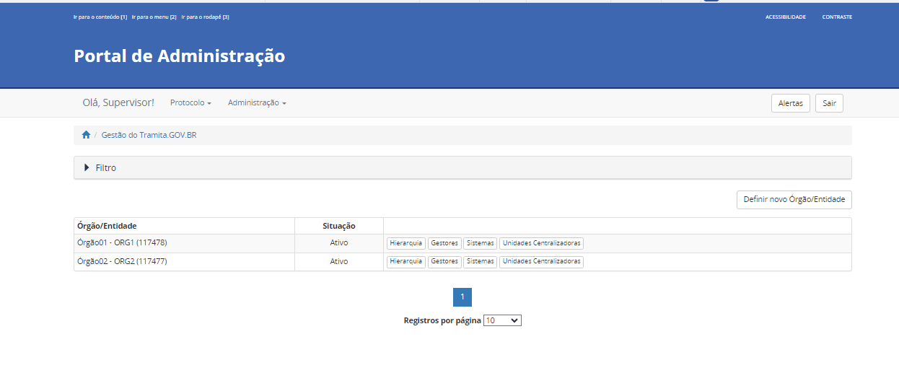
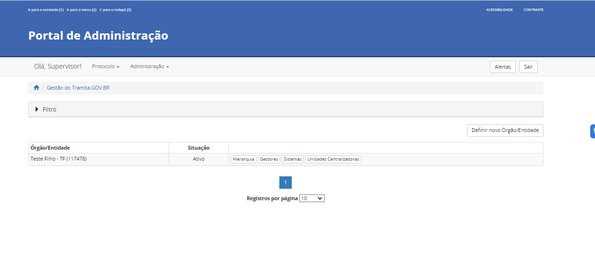
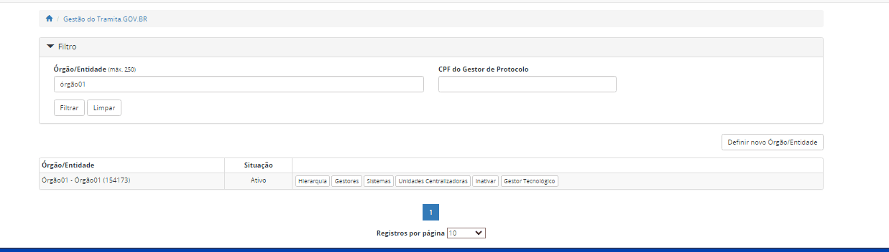

Protocolo
==========

Gestão do Tramita.GOV.BR 
++++++++++++++++++++++++

Pesquisar 
---------

O usuário pode pesquisar os órgãos nos quais ele gerencia por meio de filtros. Esses filtros são exibidos clicando na seta para a direita, neste caso, ao clicar, uma tela contendo 02 (dois) campos é exibida: 

* Órgão/Entidade,
* CPF do Gestor de Protocolo.  

Preenchendo um dos campos e posteriormente clicar no botão Filtrar, a pesquisa retornada respeita os filtros preenchidos e se o perfil do usuário tem acesso a gestão dos órgãos filtrados na pesquisa.

Para limpar as informações digitadas clicar no botão Limpar. Caso não queira mais visualizar os campos dos filtros clique na seta para baixo.

.. admonition:: Observação

   De acordo com o perfil, quais e quantos órgãos exibidos no resultado da pesquisa é diferente.

Definir novo órgão/entidade 
----------------------------

Nesta funcionalidade é possível definir um novo Órgão/Entidade para o gerenciamento na plataforma Tramita GOV.BR. Para definição de um novo Órgão/Entidade, basta clicar no botão “Definir novo Órgão/Entidade” e seguir o passo a passo a seguir:

Hierarquia
----------

.. admonition:: Nota

   Aos órgãos/entidades com estrutura hierárquica mantida pelo **SIORG, não é permitido** o cadastro de novas unidades, sendo necessário solicitar eventuais ajustes, quando necessários, à área responsável pela gestão do SIORG na organização.
 
Já os órgãos e as entidades que não se enquadram no disposto acima, ou seja não é SIORG, poderão importar cadastrar ou modificar a sua estrutura, por meio da funcionalidade “Gestão do Tramita.GOV.BR”.

A possibilidade de Importar Estruturas – Ao clicar, o sistema dá a possiblidade de importar Estruturas Organizacionais por meio de um arquivo.

É responsabilidade do órgão e da entidade, em processo de implantação, definir quais e quantas unidades da sua estrutura hierárquica serão cadastradas no Portal.

Para realizar o cadastro ou alteração de uma árvore de Unidades Administrativas, clique no botão “Hierarquia”. O sistema apresentará uma tela com algumas funcionalidades.

.. figure:: _static/images/Opcao_Hierarquia_do_Menu.gif

.. figure:: _static/images/Visualizacao_e_Edicao_da_Hierarquia.gif
 
Estrutura de Unidades Administrativas: As unidades são exibidas em formato de lista expansível: havendo unidades abaixo delas na hierarquia, é possível exibi-las clicando-se na seta para a direita (|seta_direita|) para expandir a lista. A lista já expandida fica assinalada com a seta para baixo (|seta_baixo|), na qual se pode clicar novamente para recolhê-la. Os níveis hierárquicos serão exibidos da esquerda para a direita, ou seja, uma unidade abaixo na hierarquia estará alinhada mais à direita que sua superior.

.. |seta_direita| image:: _static/images/icone_seta_direita.png
   :align: middle
   :width: 15

.. |seta_baixo| image:: _static/images/icone_seta_baixo.png
   :align: middle
   :width: 20

Funcionalidades de alteração na Estrutura de Unidades Administrativas:

**a.Alterar “nó pai”** – Ao clicar, o usuário seleciona uma unidade administrativa para indicar um novo **“nó pai”**, ou seja, uma unidade - dentre as já cadastradas - que estará acima da unidade selecionada na hierarquia.

**b.Adicionar unidade filha** – Operação inversa à descrita acima: ao clicar, o usuário cria Unidade Administrativa abaixo da unidade selecionada, devendo preencher um formulário com os dados: **Nome, Sigla, Código no Órgão/Entidade e Descrição** da unidade filha:

**OBS.:** Como boa prática, indica-se cadastrar apenas a primeira letra de cada palavra em caixa alta, por exemplo: “Diretoria de Informações, Serviços e Sistemas de Gestão”. Portanto, evite cadastrar todo o nome da unidade em caixa alta.

**c.Reativar** – Após o usuário habilitar a caixa de seleção “Mostrar inativos” e selecionar uma unidade na estrutura, o sistema possibilita reativar a unidade selecionada na estrutura organizacional.

**d.Inativar** – Ao clicar, o sistema permite inativar a estrutura organizacional.

**e.Visualizar** – Ao clicar, o sistema apresenta as informações cadastrais da Unidade Administrativa selecionada.

**f.Editar** - Ao clicar, o sistema apresenta as informações cadastrais da Unidade Administrativa selecionada que poderá ser editada e alterada.

.. admonition:: Observação
 
   Não existe limitação de sistemas para um órgão/entidade. Contudo, as unidades administrativas mapeadas em cada sistema não podem ser as mesmas.

Gestores 
--------

Nesta funcionalidade, o usuário, previamente cadastrado e devidamente aprovado pelos administradores do Tramita.GOV.BR, poderá adicionar novos Gestores de Protocolo, que poderão auxiliar na administração das configurações de seu sistema. Esta funcionalidade está disponível no menu **Protocolo > Gestão do Tramita.GOV.BR**.

Para cadastrar o Gestor, basta clicar no botão “Gestores”, como na captura de tela a seguir:

.. figure:: _static/images/Menu_Gestores.gif

Na tela seguinte, basta clicar em “Adicionar gestor”.

.. figure:: _static/images/Adicionar_Gestor.gif

Em seguida, deve ser inserido o CPF do gestor a ser cadastrado, clicando-se em seguida no Botão “Procurar”. Caso o novo gestor não seja localizado, o usuário deverá preencher os dados no formulário e clicar no botão “Cadastrar e adicionar como gestor de protocolo”. O acesso dos novos gestores é realizado por meio da autenticação Gov.Br.

.. figure:: _static/images/Dados_do_Gestor_de_Protocolo.gif

Se o Gestor já estiver cadastrado, ao inserir um CPF e clicar no botão “Procurar”,os dados já serão resgatados automaticamente, bastando ao usuário clicar no botão “Adicionar como gestor de protocolo”.

.. figure:: _static/images/Busca_de_Gestor_de_Protocolo_pelo_CPF.gif

Uma vez efetivado o cadastro, o sistema apresentará os dados do(s) Gestor(es) de Protocolo cadastrado(s).
 
.. figure:: _static/images/Lista_dos_Gestores_de_Protocolo_do_orgao_entidade.png

Sistemas 
--------

Vincular Sistemas
^^^^^^^^^^^^^^^^^

O usuário pode vincular um Sistema de Processo Eletrônico para o Órgão/Entidade cadastrado.

O usuário deve localizar o órgão/entidade na listagem e, em seguida, clicar no botão “Sistemas”. Ao clicar no botão “Vincular Sistemas”, aparecerá a lista dos sistemas com os botões de “Vincular” e “Desvincular”. No primeiro, o sistema é vinculado ao órgão, caso a segunda opção seja escolhida o sistema perde a vinculação com o órgão.

Unidades Administrativas
^^^^^^^^^^^^^^^^^^^^^^^^

A principal configuração para iniciar a integração é **definir quais as unidades administrativas do órgão ou da entidade serão utilizadas para realizar o envio e/ou recebimento de processos externos**.

Também é importante lembrar que estas unidades estarão disponíveis para os demais órgãos ou entidades externas quando estes forem enviar processos e documentos para o órgão cadastrado.

O Tramita.GOV.BR permite customizar esta configuração de diversas maneiras, possibilitando que somente algumas unidades do órgão ou da entidade estejam disponíveis para envio, por exemplo somente as unidades de protocolo, ou liberando o acesso para toda a estrutura organizacional realizar livremente o envio de processos. Desta forma, o usuário deverá definir qual a melhor abordagem para sua instituição, alinhada às suas políticas interna de expedição de processos e documentos.

Após esta definição, as unidades selecionadas estarão aptas a realizar o envio de processos/documentos e estarão visíveis para os demais sistemas externos como unidades disponíveis para envio de processos/documentos.

A configuração é feita por meio da funcionalidade **Protocolo > Gestão do Tramita.GOV.BR**.
 
.. figure:: _static/images/Botao_Sistemas.gif

O Gestor deverá localizar seu órgão/entidade na listagem e, em seguida, clicar no botão Sistemas.

.. figure:: _static/images/Botao_Unidades_Administrativas.gif

Em seguida, o Gestor deverá clicar no botão **“Unidades Administrativas”**, para definir quais serão utilizadas pelos órgãos e pelas entidades para realizar o envio externo e/ou recebimento de processos.

.. figure:: _static/images/Selecao_de_Unidades_Administrativas.gif

Na tela seguinte, poderá assinalar quais unidades, dentro de sua hierarquia, estarão aptas a:

a.Enviar e Receber Processos e documentos;
b.Somente enviar; ou
c.Somente receber.

Após esta vinculação, as unidades administrativas selecionadas estarão aptas para realizar o envio e/ou recebimento de processos/ documentos, ficando visíveis para os demais sistemas externos como unidades disponíveis para envio de processos/documentos.

Em seguida, clicar no botão **Salvar alterações**. O sistema apresentará uma mensagem de sucesso.

.. admonition:: Observação

   Caso as unidades administrativas não estejam atualizadas, é responsabilidade do Gestor de Protocolo no caso do SIORG identificar a área responsável no seu órgão pela atualização desses dados. Os dados do SIORG são apenas recuperados pelo Portal de Administração.

Unidades Centralizadoras 
------------------------

Em complemento à definição das unidades administrativas que poderão fazer o envio e recebimento de processos externos (vide `Definição de unidades para envio e recebimento de processos externos <https://manuais.processoeletronico.gov.br/pt_BR/latest/TRAMITA.GOV.BR/CONFIGURACAO_DA_ESTRUTURA.html#definicao-de-unidades-administrativas-para-envio-e-recebimento-de-processos-externos>`_), o Tramita.GOV.BR também permite que sejam definidas unidades centralizadoras, que serão responsáveis por receber todos os processos enviados para a instituição – independente da unidade indicada pelo órgão ou pela entidade remetente na hora do envio do processo ou documento – funcionando como unidades de protocolo. Acesso ao Ambiente de Produção.

Por Exemplo: considere o cenário em que o órgão ABC definiu as seguintes unidades:
 
• Órgão ABC **(raiz da organização)**
• Secretaria de Assuntos Especiais
• Secretaria Executiva
• Secretaria de Planejamento e Orçamento
• Gabinete do Ministro
• Protocolo Central

Neste cenário, as unidades acima também estariam visíveis externamente para que qualquer outro órgão ou entidade externo possa enviar processos/documentos diretamente para elas, sem passagem por nenhuma outra área.

Com a configuração de uma unidade centralizadora, será possível definir regras de encaminhamento, isto é, direcionando que os processos externos enviados para as unidades acima exemplificadas sejam automaticamente **redirecionados** para a **unidade centralizadora definida**.
 
Ou seja, considerando os dados acima, poderíamos configurar o **Protocolo Central** como **Unidade Centralizadora do órgão ABC**. Com isto, um processo enviado diretamente para o Gabinete do Ministro seria automaticamente redirecionado para o Protocolo Central do órgão. Após esta definição, as regras de redirecionamento já serão aplicadas para os novos processos/documentos recebidos.

Essa configuração é feita a partir da funcionalidade **Protocolo > Gestão do Tramita.GOV.BR**.

.. figure:: _static/images/Funcionalidade_Unidades_Centralizadoras.gif

Para iniciar, o usuário deverá escolher seu órgão/entidade e clicar no botão “Unidades Centralizadoras”.

.. figure:: _static/images/Botao_Definir_novas_unidades_centralizadoras.gif

Na tela seguinte, o usuário deverá clicar no botão “Definir novas unidades centralizadoras” para definir quais serão as unidades centralizadoras do órgão.

.. figure:: _static/images/Definir_Unidades_Centralizadoras.gif

A escolha da unidade para redirecionamento de processos é realizada por meio da marcação da caixa de seleção da referida unidade na estrutura hierárquica.

Esta será a unidade centralizadora, à qual os processos serão enviados, em vez das unidades indicadas no trâmite original. Após o cadastro desta unidade centralizadora, será necessário indicar por quais unidades administrativas ela responde. Esta indicação é fundamental para que o Tramita.GOV.BR realize o correto encaminhamento dos processos.

As unidades administrativas selecionadas são exibidas como unidades habilitadas para o recebimento de processos na funcionalidade do Tramita.GOV.BR. Contudo, no momento do recebimento o processo administrativo eletrônico ou documento avulso, em meio eletrônico, é recebido pela unidade centralizadora à qual a unidade administrativa está vinculada, ou seja, o recebimento ser dará por meio da unidade centralizadora definida.

Inativar, Reativar e Excluir
-----------------------------

Ao clicar no botão de Inativar o órgão selecionado é inativado e aparece mais 02 (dois) botões um de Reativar e outro de Excluir.

Ao clicar em Reativar o órgão é ativado novamente. Por outro lado, ao clicar em Excluir o órgão é excluído da lista de órgãos, sendo que a exclusão realizada apenas após a remoção das configurações (Por exemplo: sistema vinculado). Na existência de vínculo é exibida a seguinte mensagem: 

  ::Não é possível excluir Órgão/Entidade com sistema de processo eletrônico vinculado,

Após a remoção dos vínculos, a exclusão é realizada.

Gestores Tecnológicos 
---------------------

Ao clicar no botão Gestor Tecnológico, o usuário pode alterar o gestor tecnológico por meio da combo apresentada na tela, selecionando o novo gestor e clicando no botão “Salvar”. 

Na parte inferior existe uma lista de todas as alterações feitas neste campo em uma tabela com os seguintes dados: Gestor Tecnológico, Data Inicial e Data Final.

