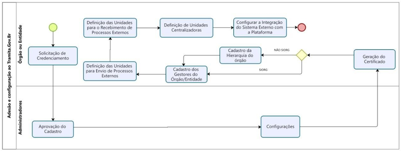

Configurações da Estrutura
===========================

Tendo o cadastro aprovado, o Gestor do protocolo terá o acesso liberado ao Portal de Administração, visando a configuração da estrutura organizacional da instituição.

No fluxo abaixo, estão consolidadas as principais atividades a serem realizadas pelo gestor responsável pelo Tramita.GOV.BR:
 

Geração do certificado digital
++++++++++++++++++++++++++++++

Para maiores informações. leia a seção `Gerar Certificado <https://manuais.processoeletronico.gov.br/pt-br/latest/TRAMITA.GOV.BR/MANUAL_PORTAL_DE_ADMINISTRACAO/ADMINISTRACAO.html#gerar-certificado>`_ do Manaul do Portal de Administração.

.. admonition:: Nota

   Caso o Gestor Tecnológico não seja o próprio órgão (Interno), a empresa indicada como Gestor Tecnológico é responsável pela geração do certificado digital e não o Gestor de Protocolo, uma vez que a infraestrutura tecnológica não é gerenciada pelo órgão solicitante.

Cadastro da Hierarquia
++++++++++++++++++++++

Para maiores informações. leia a seção `Hierarquia <https://manuais.processoeletronico.gov.br/pt-br/latest/TRAMITA.GOV.BR/MANUAL_PORTAL_DE_ADMINISTRACAO/PROTOCOLO.html#hierarquia>`_ do Manaul do Portal de Administração.

Cadastro de novos Gestores do Órgão/Entidade
++++++++++++++++++++++++++++++++++++++++++++

Para maiores informações. leia a seção `Gestores <https://manuais.processoeletronico.gov.br/pt-br/latest/TRAMITA.GOV.BR/MANUAL_PORTAL_DE_ADMINISTRACAO/PROTOCOLO.html#gestores>`_ do Manaul do Portal de Administração.

Definição de unidades administrativas para envio e recebimento de processos externos
++++++++++++++++++++++++++++++++++++++++++++++++++++++++++++++++++++++++++++++++++++

Para maiores informações. leia a seção `Unidades Administrativas <https://manuais.processoeletronico.gov.br/pt-br/latest/TRAMITA.GOV.BR/MANUAL_PORTAL_DE_ADMINISTRACAO/PROTOCOLO.html#unidades-administrativas>`_ do Manaul do Portal de Administração.

Definição de unidades centralizadoras de processos/documentos
+++++++++++++++++++++++++++++++++++++++++++++++++++++++++++++

Para maiores informações. leia a seção `Unidades Administrativas <https://manuais.processoeletronico.gov.br/pt-br/latest/TRAMITA.GOV.BR/MANUAL_PORTAL_DE_ADMINISTRACAO/PROTOCOLO.html#unidades-centralizadoras>`_ do Manaul do Portal de Administração.

Painel de Controle
++++++++++++++++++

Para maiores informações. leia a seção `Gerar Painel de Controle <https://manuais.processoeletronico.gov.br/pt-br/latest/TRAMITA.GOV.BR/MANUAL_PORTAL_DE_ADMINISTRACAO/ADMINISTRACAO.html#gerar-painel-de-controle>`_ do Manaul do Portal de Administração.