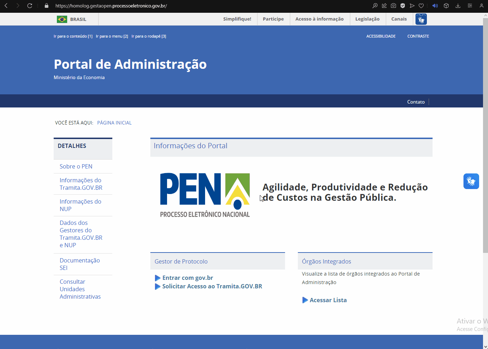
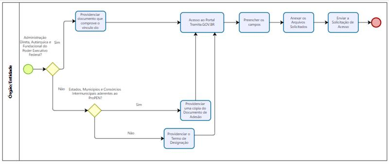
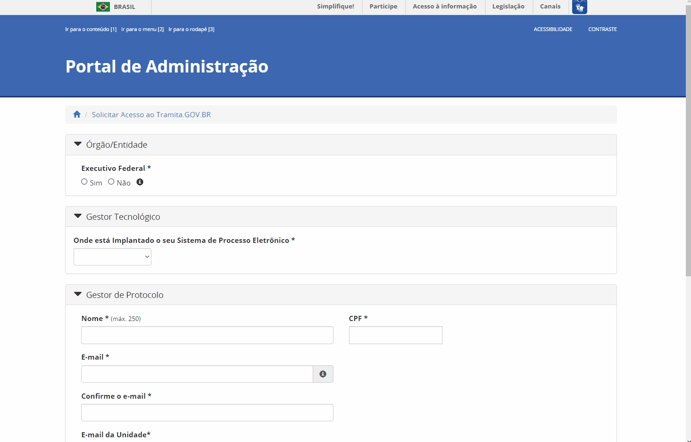

Solicitação de Acesso
=====================

Todo procedimento referente ao contato inicial do órgão ou entidade com o Tramita.GOV.BR é realizado em ambiente de homologação, com o objetivo de assegurar a correta configuração da plataforma antes de se autorizar sua adoção em ambiente de produção, de modo a minimizar eventuais falhas de operação e seus impactos nos órgãos usuários. 

Os procedimentos operacionais para a utilização do ambiente de homologação estão definidos nos capítulos `Configuração da Estrutura <https://manuais.processoeletronico.gov.br/pt-br/latest/TRAMITA.GOV.BR/MANUAL_TECNICO_OPERACIONAL/CONFIGURACAO_DA_ESTRUTURA.html#configuracoes-da-estrutura>`_ , `Implantação do Módulo de Conexão <https://manuais.processoeletronico.gov.br/pt-br/latest/TRAMITA.GOV.BR/MANUAL_TECNICO_OPERACIONAL/IMPLANTACAO_DO_MODULO_DE_CONEXAO.html#implantacao-do-modulo-de-conexao>`_ e `Acesso ao Ambiente de Produção <https://manuais.processoeletronico.gov.br/pt-br/latest/TRAMITA.GOV.BR/MANUAL_TECNICO_OPERACIONAL/ACESSO_AO_AMBIENTE_DE_PRODUCAO.html#acesso-ao-ambiente-de-producao>`_, abaixo, em modelo explicativo para a introdução facilitada ao sistema.

Acesso ao Portal de Administração
++++++++++++++++++++++++++++++++++

O presente Manual Técnico-Operacional trata apenas das operações a serem executadas no Portal de Administração do Tramita.GOV.BR e dos procedimentos de testes para validação da integração da plataforma ao SPE do órgão. Orientações específicas referentes à configuração do módulo de integração ao Tramita.GOV.BR do SEI https://github.com/pengovbr/mod-sei-pen . No caso de outros SPEs, a orientação é a leitura do Manual de Utilização da API disponível em: https://www.gov.br/gestao/pt-br/assuntos/processo-eletronico-nacional/destaques/material-de-apoio-2/tramita-gov.br/material-de-apoio-tramita.GOV.BR.  

* Para acessar o ambiente de Homologação, o endereço é https://homolog.gestaopen.processoeletronico.gov.br/. 

* No fluxo a seguir, estão detalhadas todas as etapas necessárias para solicitar o acesso ao Tramita.GOV.BR. 

* Assim, conforme o fluxo, as atividades dessa etapa são diferentes de acordo com a classificação do órgão ou da entidade interessada em realizar o acesso a plataforma. 

* É obrigatório que no mínimo um dos Gestores de Protocolo do órgão/entidade em processo de implantação preencher o `formulário de inclusão na Comunidade do Tramita.GOV.BR <https://forms.office.com/Pages/ResponsePage.aspx?id=aSnJPlFaGE-Kye-Y-6-peDi9G5TEeHJOgRQMfYkAx3hUOElTNllYNjA2WlgxV1ozV0k1S0hMQzU1RiQlQCN0PWcu>`_.  

Preenchimento do Cadastro
+++++++++++++++++++++++++

Para o envio da solicitação de acesso, todos os campos são de preenchimento obrigatório. Segue o passo a passo com as orientações para o preenchimento dos campos na tela de solicitação do cadastro.

.. figure:: _static/images/Campos_para_preenchimento_da_Tela_de_Acesso.gif

**a.Executivo Federal**

.. admonition:: Nota
   
   Os gestores de órgãos/entidades com estrutura hierárquica mantida pelo SIORG devem sempre marcar a unidade administrativa raiz. Por exemplo: o  Gestor que trabalha no Ministério da  Gestão e da Inovação em Serviços Públicos, ao solicitar o acesso, deve marcar a unidade administrativa" Ministério da Gestão e da Inovação em Serviços Públicos” e não unidades abaixo dela.

**a.1.** Caso o órgão ou a entidade pertença ao poder Executivo da esfera federal, marque a opção como **“Sim”**, para que a estrutura seja recuperada do cadastro do Órgão/Entidade no SIORG. Assim, o sistema apresentará a Unidade Administrativa raiz da estrutura do SIORG. Navegue pela estrutura até encontrar o Órgão/Entidade representado e selecione-o para prosseguir com a solicitação.

**b.Órgão ou entidade que não pertence ao executivo federal**

**b.1.** Caso o órgão ou a entidade representada não pertença ao poder Executivo Federal, marque a opção como “Não” e preencha manualmente os dados de identificação. Os dados solicitados são: Nome, Sigla, UF, CNPJ, Endereço e CEP.

** Campo Documento comprobatório 

O órgão solicitante deve informar o Sistema de Governo [1]_ e o Gestor Tecnológico [2]_.

  .. [1] O que é Sistema de Governo?
  
  O Sistema de Governo é o Sistema de Processo Administrativo Eletrônico (SPE) utilizado pelo órgão do solicitante. Alguns exemplos: SEI, SIPAC e SUAP. 

  Para mais informações é possível acessar o Item `2.3 da FAQ TramitaGOV.BR <https://wiki.processoeletronico.gov.br/pt-br/latest/Tramita_GOV_BR/Perguntas_frequentes/Conceitos_Gerais.html#o-que-e-sistema-de-processo-administrativo-eletronico-spe>`_. 

  .. [2] O que são Gestores Tecnológicos?
  
  Gestores Tecnológicos são órgãos responsáveis pela infraestrutura na qual o SPE está implantado. Alguns exemplos: Interno e Dataprev. Na opção Interno, o SPE é instalado na infraestrutura interna do próprio órgão. Por outro lado, o SPE pode ser implementado em uma infraestrutura externa, que não pertence ao órgão em questão, nesse caso o solicitante escolhe a empresa pública na qual o sistema está implantado. 

  Para mais informações é possível acessar o item `2.11 da FAQ Tramita GOV.BR <https://wiki.processoeletronico.gov.br/pt-br/latest/Tramita_GOV_BR/Perguntas_frequentes/Conceitos_Gerais.html#o-que-sao-gestores-tecnologicos>`_.  

Durante o preenchimento dos dados do Gestor de Protocolo, é solicitado um Documento Comprobatório, que muda conforme o tipo de solicitante de acesso à plataforma. Para identificar o documento correto para seu órgão ou entidade, consulte o quadro sinóptico abaixo. Ressalta-se que caso o documento informado no cadastro não for o correto, a solicitação de acesso é recusada.

.. list-table::
   :widths: 35 20 35
   :header-rows: 1

   - * Tipo de Solicitante
     * Fundamentação Legal
     * Documento Comprobatório
   - * Administração Direta, Autárquica e Fundacional do Poder Executivo Federal
     * Art. 1º, Parágrafo Único
     * Documento que comprove o vínculo do servidor com o órgão/entidade informado na solicitação [3]_
   - * os Estados, o Distrito Federal, os Municípios e os consórcios públicos intermunicipais partícipes do Programa Nacional de Processo Eletrônico – ProPEN, nos termos do disposto no Decreto nº 11.946, de 12 de março de 2024
     * Art. 4º, I
     * Documento de Adesão [3]_ [4]_
   - * os órgãos dos Poderes Judiciário e Legislativo federais, o Tribunal de Contas da União, o Ministério Público da União e a Defensoria Pública da União
     * Art. 4º, II
     * Termo de Designação [3]_ [4]_ [5]_
   - * os órgãos dos Poderes Judiciário e Legislativo federais, o Tribunal de Contas da União, o Ministério Público da União e a Defensoria Pública da União; 
     * Art. 4º, III 
     * Termo de Designação [3]_ [4]_ [5]_   
   - * os órgãos estaduais, distritais e municipais dos Poderes Executivo, Judiciário e Legislativo, os Tribunais de Contas dos Estados, do Distrito Federal e dos Municípios, os Ministérios Púbicos Estaduais e as Defensorias Públicas Estaduais ou do Distrito Federal
     * Art. 4º, IV
     * Termo de Designação [3]_ [4]_ [5]_
   - * as entidades da administração pública indireta estadual, distrital e municipal
     * Art. 4º, V
     * Termo de Designação [3]_ [4]_ [5]_  
   - * as pessoas jurídicas de direito privado sem fins lucrativos, de interesse coletivo e utilidade pública.
     * Art. 4º, VI 
     * Termo de Designação [3]_ [4]_ [5]_

.. admonition:: Notas

   .. [3] Em todos os casos, além do documento comprobatório, o solicitante deve incluir cópia de documento oficial que comprove o CPF informado no momento do cadastro; 

   .. [4] O solicitante do órgão que se enquadra no Art. 4º, I, II, III, IV, V ou VI deve informar o seu CPF, e não o da autoridade responsável pela assinatura do Documento Comprobatório. 

   .. [5] A solicitação de órgão que se enquadra no Art. 4º, II, III, IV, V ou VI será avaliada pela Secretaria de Gestão e Inovação do Ministério da Gestão e da Inovação em Serviços Públicos, consideradas a conveniência, a oportunidade e a capacidade de atendimento (Art. 4, Parágrafo único).

Análise do Cadastro para Acesso ao Tramita.GOV.BR
++++++++++++++++++++++++++++++++++++++++++++++++++

Após o envio da solicitação de cadastro de Acesso ao Tramita os administradores da plataforma receberão uma notificação para analisar o cadastro do primeiro Gestor de Protocolo.

No caso de órgão solicitante que se enquadra no Art. 4º, I, II, III, IV, V ou VI, além do preenchimento adequado do formulário de solicitação, a autorização de acesso depende de avaliação pela Secretaria de Gestão e Inovação do Ministério da Gestão e da Inovação em Serviços Públicos, consideradas a conveniência, a oportunidade e a capacidade de atendimento (Art. 4, Parágrafo único), a qual pode resultar em aprovação ou rejeição fundamentada da solicitação realizada pelo órgão. 

Efetivado o cadastro, este gestor se torna responsável pelo cadastro dos demais gestores de protocolo ligados ao seu órgão, bem como a configuração da hierarquia e a geração do certificado digital. Após a liberação do acesso, o primeiro gestor é incluído na Comunidade do Tramita GOV.BR utilizando o telefone informado no cadastro pelos gestores da plataforma. Caso o gestor não tenha interesse em permanecer na comunidade, ele tem autonomia para sair.

