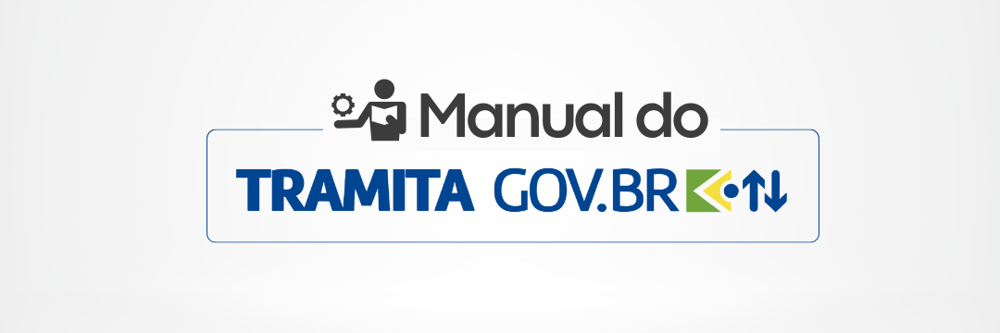

Manual Técnico-Operacional
==========================

Introdução
++++++++++

Este Manual técnico-operacional, primeiro a ser publicado sobre a temática do Processo Eletrônico Nacional (PEN), tem o objetivo de inaugurar uma nova etapa nas comunicações administrativas no âmbito da Administração Pública Federal direta, autárquica e fundacional. 

O Tramita.GOV.BR, plataforma disponibilizada e gerenciada pela Secretaria de Gestão e Inovação do Ministério da Gestão e da Inovação em Serviços Públicos, permite o trâmite de processos administrativos eletrônicos ou documentos avulsos entre os diversos sistemas existentes, tais como SEI, Sistema AGU de Inteligência Jurídica (SAPIENS), Sistema Integrado de Protocolização e Fluxo de Documentos Eletrônicos (e-DOC), Sistema Integrado de Patrimônio, Administração e Contratos (SIPAC Protocolo), Sistema Unificado de Administração Pública (SUAP), dentre outros. Compõem a estrutura do Tramita.GOV.BR: 

(i) Portal de Administração (`Link para acesso <https://gestaopen.processoeletronico.gov.br/>`_); 

(ii) Application Programming Interface (API) SOAP; 

(iii) Application Programming Interface (API) REST; e 

(iv) Módulo de conexão com o sistema de processo eletrônico (SPE). 

O projeto foi concebido para maximizar a compatibilidade entre diferentes sistemas, a partir de uma arquitetura bem estruturada e um padrão de interoperabilidade voltado para a preservação da informação processual, garantindo a integridade destas informações, de modo a se ter o mesmo teor processual nos diferentes órgãos pelos quais o processo tenha tramitado, e nunca o oposto. 

Dentre as principais vantagens do Tramita.GOV.BR, destacam-se: 

(i) Redução do tempo de tramitação entre órgãos/entidades; 

(ii) Tramitação 100% digital; 

(iii) Redução de custos financeiros e ambientais associados à impressão e à tramitação física; 

(iv) Infraestrutura centralizada pelo Ministério da Gestão e da Inovação em Serviços Públicos; 

(v) Tramitação segura de processos administrativos/documentos avulsos; 

(vi) Confirmação da realização do trâmite de processos administrativos /documentos avulsos; e 

(vii) Trâmite eletrônico independentemente da tecnologia e sistema de processo eletrônico adotado, devido à definição e ao estabelecimento de um protocolo comum para tramitação. 

Este guia é parte integrante da `Portaria SEGES nº 9.412, de 26 de outubro de 2022  <https://www.gov.br/compras/pt-br/acesso-a-informacao/legislacao/portarias/portaria-seges-me-no-9412-de-26-de-outubro-de-2022>`_, a qual estabelece as regras de implantação do Tramita.GOV.BR, no âmbito da administração pública federal direta, autárquica e fundacional, assim como para os órgãos e entidades dos Poderes da União, dos Estados, do Distrito Federal e dos Municípios, que tenham interesse em utilizar o sistema, conforme modelo constante do anexo da referida Portaria. 

Sumário
++++++++

.. toctree::

   :titlesonly:
   :maxdepth: 3
  
   REQUISITOS_BASICOS
   SOLICITACAO_DE_ACESSO
   CONFIGURACAO_DA_ESTRUTURA
   IMPLANTACAO_DO_MODULO_DE_CONEXAO
   ACESSO_AO_AMBIENTE_DE_PRODUCAO
   OUTRAS_INFORMACOES
   CREDITOS
