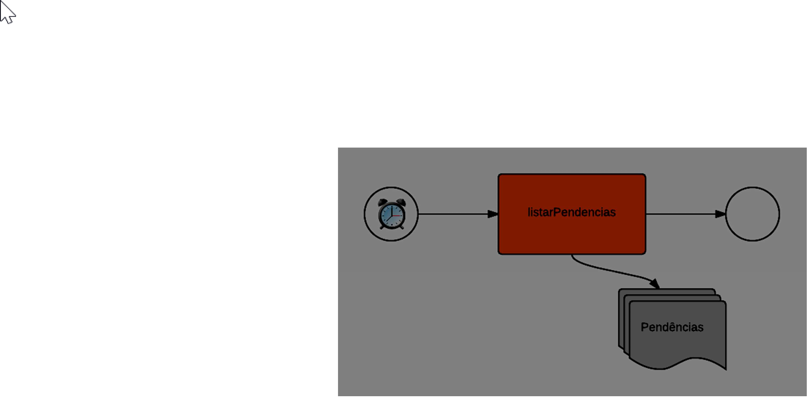
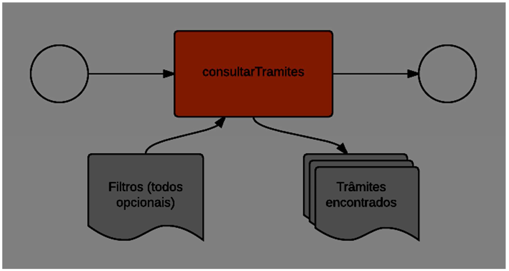
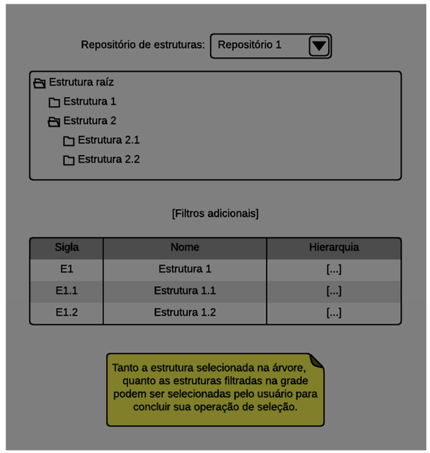
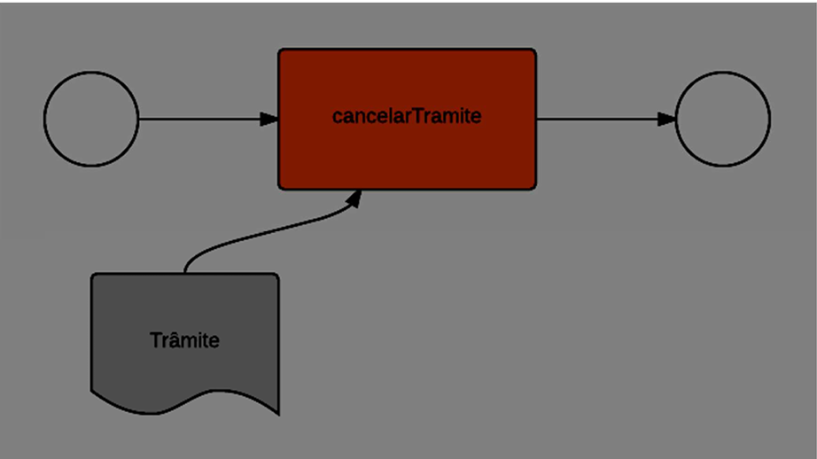
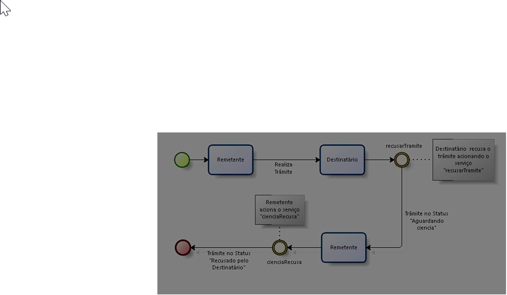
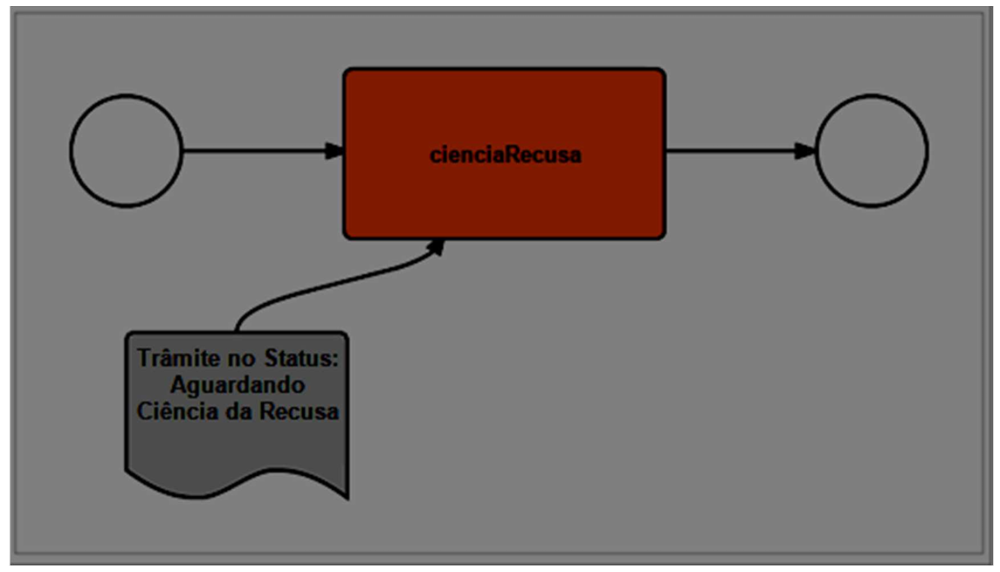
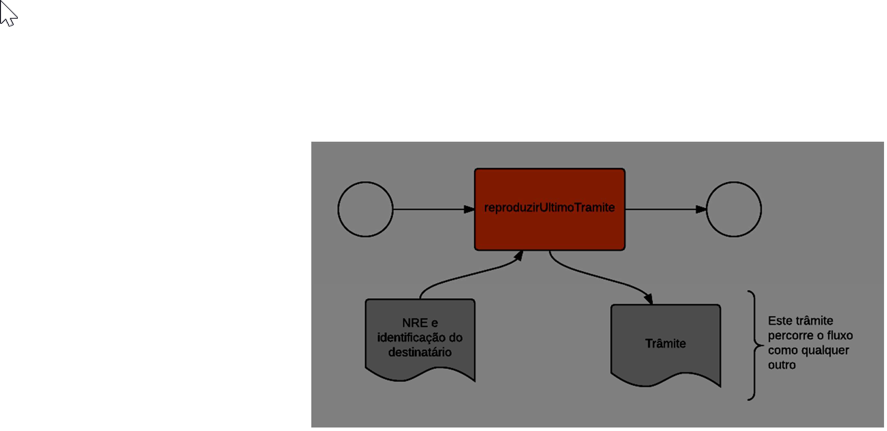
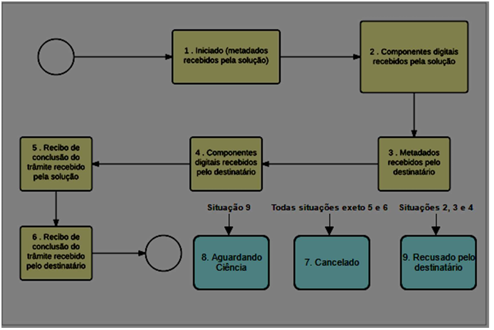

Manual de Fluxo do Trâmite
==========================

PRINCIPAIS ALTERAÇÕES:
----------------------

- Apresentação dos principais processos que compõem o processo de tramitação, bem como detalhamento em texto

- Em construção: trocar a palavra "processo" quando se trata de gestão de processos administrativos por "fluxo". Manter a palavra "processo" quando se trata de processos tramitados.

- Em construção: Inserir os fluxos referentes a documentos avulsos, além dos fluxos referentes a processos. 
Pergunta: No caso de documentos avulsos, eles são referentes a um processo já tramitado ou naturalmente, por ser um documento avulso de uma nova tramitação (novo NRE)? Caso seja a segunda opção, não há a verificação, correto?

Introdução
----------

Este documento visa servir de apoio para a integração de Sistemas de Processo Eletrônico (SPE)  ao canal de comunicação eletrônico do PEN (Processo Eletrônico Nacional).

O canal de comunicação, acima citado, trata-se de um software intermediário que faz o papel de terceiro confiável no trâmite de processos e documentos eletrônicos entre órgãos integrantes. 

Para se integrar à solução, o órgão interessado deve:

1. Inscrever seu sistema de processo eletrônico junto à equipe gestora do sistema;
2. Obter o acesso ao ambiente de homologação;
3. Desenvolver a integração com o catálogo de serviços de interoperabilidade no ambiente de homologação;
4. Obter o acesso ao ambiente de produção.

Este manual é focado no item 3, ou seja, ele considera que o órgão interessado já possui acesso ao ambiente de homologação e deseja iniciar as evoluções em seu sistema.

Processos do Fluxo de Trâmite
-----------------------------

Os processos do Fluxo de Trâmite se dividem em fluxos principais e fluxos auxiliares.
Como fluxos principais temos:

• Pré-Trâmite;

• Trâmite realizado com sucesso - Processo;

• Trâmite Recusado pelo destinatário;

• Trâmite Cancelado pelo Remetente;

• Trâmite Cancelado automaticamente.

Como fluxos auxiliares, temos:

• Listar pendências; 

• Consultar trâmites; 

• Consultar repositórios e estruturas organizacionais; 

• Retransmitir processo ou documento avulso. 
 

Os fluxos principais e auxiliares são compostos por diversos cenários concatenados conforme andamento de cada um. 

.. admonition:: Notas

   1) Os desenhos de processo, que representarão os Processos de Fluxos de Trâmite serão baseados em notação BPMN, com as seguintes representações: 

   * Pool ou "Piscina", representando um processo. 
   * Raias são as faixas horizontais com faixas contínuas da _Pool_, tendo como atores responsáveis por executar as caixas de atividades: Remetente, Solução e Destinatário. A analogia simples entre Pool ("Piscina") e as suas raias serve como ilustração com a notação BPMN;
   * Milestones são as faixas verticais listradas, tendo como marcos os Status (cenários);
   * Caixas de atividades claras: Atividades executadas pelos atores dentro de um determinado milestone;
   * Caixas de atividades escuras: Atividades executadas pelos atores dentro de um determinado milestone, mas que estão relacionadas com acionamento de um endpoint;
   * Outras representações (anotações, gateways e eventos iniciais, intermediários e finais).

Fluxos Principais de Utilização
--------------------------------

Nesta seção são descritos os fluxos de processo de utilização principais da Solução de interoperabilidade e quais são os cenários envolvidos em cada um deles. 

A explicação é composta do desenho do fluxo de processos e texto complementar. Basicamente são três as situações dos fluxos principais do Tramita.GOV.BR: Realizado, Cancelado e Recusado.

O fluxo Realizado será a base comparativa de todos os outros fluxos, por motivos didáticos. 

.. admonition:: Nota

   É sempre importante ressaltar que um trâmite recusado **não é um erro**.

Basicamente, temos os seguintes códigos de status (numerados de 1 a 10), com os respectivas descrições. 

• Iniciar o envio de Status 0 para Status 1 - "Aguardando o envio dos arquivos digitais";

• Iniciar o envio de um documento avulso; Status 2 - Arquivos digitais recebidos pelo Tramita GOV.BR;

• Enviar os componentes digitais do trâmite;

• Enviar o recibo de conclusão do envio dos componentes digitais;

• Receber metadados e componentes digitais; Status 3 - Metadados recebidos pelo sistema de processo eletrônico destinatário e Status 4 - Arquivos digitais recebidos pelo destinatário

• Assinar e enviar o recibo de conclusão do trâmite; e, Status 5 Recibo de conclusão recebido pelo Tramita GOV.BR

• Receber o recibo de conclusão do trâmite. Status 6 - Recibo de conclusão recebido pelo remetente

• Cancelar o trâmite. Status 7 - Trâmite cancelado. Essa transição pode acontecer nos seguintes status:1,2,3 ou 4;

• Recusar o trâmite:

Status 8 - Aguardando Ciência (O Remetente está aguardando confirmação da recusa do processo)

Status 9 - Recusado pelo Destinatário

Essa transição pode ser feita nos status 3 ou 4

• Status 10 - Trâmite cancelado automaticamente
Essa transição pode ser feita nos status 1,2,3 ou 4, após o trâmite estar parado por mais de 8 dias corridos nesses status citados. 

Pré-Trâmite;
^^^^^^^^^^^^
(Em construção)

A etapa de Pré-Trâmite é realizada antes dos Processos de Fluxos de Trâmites propriamente ditos nesse documento.
Na representação, é representado como o Macroprocesso "Fluxo de Escolha de destinatário"

Trâmite realizado com sucesso - Processo
^^^^^^^^^^^^^^^^^^^^^^^^^^^^^^^^^^^^^^^^

O Trâmite realizado com sucesso é representado pelo seguinte desenho de fluxo: 

.. figure:: _static/images/Fluxo_tramite_01-Tramite_Realizado.png

.. image:: _static/images/Fluxo_tramite_01-Tramite_Realizado.png
   :alt: Imagem grande
   :target: _static/images/Fluxo_tramite_01-Tramite_Realizado.png

Esse processo engloba os seguintes 

Iniciar o envio de um processo administrativo 
^^^^^^^^^^^^^^^^^^^^^^^^^^^^^^^^^^^^^^^^^^^^^

Quando uma unidade administrativa deseja tramitar um processo administrativo, o SPE remetente se encontra neste cenário. Pré-requisitos: 

• Metadados do processo administrativo a ser tramitado; 

• Identificação da unidade administrativa de destino, bem como seu repositório de estruturas organizacionais. 

A Figura abaixo descreve os serviços que devem ser chamados para execução deste cenário, a partir do endpoint enviarprocesso (/interoperabilidade/rest/v3/tramites/processo). 

.. figure:: _static/images/Fluxo_tramite_Cenario_01-envio_proc_adm_v02.png

Nota-se que há uma transição do Status 0 para o Status 1: A transição inicia após a finalização da Escolha de destinatário pelo Remetente. Após isso, a Solução Verifica possíveis tramitações anteriores do processo: caso o processo já foi tramitado alguma vez com sucesso, a solução recupera o NRE (Número de Registro Eletrônico), caso negativo, a solução gera um novo NRE.

Com isso, o Remetente aciona o serviço endpoint enviarprocesso para realizar a transição para o Status 1

Iniciar o envio de um documento avulso
^^^^^^^^^^^^^^^^^^^^^^^^^^^^^^^^^^^^^^

Quando uma unidade administrativa deseja tramitar um documento avulso, o SPE remetente encontra-se neste cenário. Pré-requisitos: 

• Metadados do documento avulso a ser tramitado; 

• Identificação das estruturas organizacionais que receberão o artefato. 

A Figura abaixo descreve o fluxo de chamadas para este cenário.

.. figure:: _static/images/Fluxo_tramite_Cenario_02-envio_DocAv_v02.png

Nota-se que há uma transição do Status 0 para o Status 1: A transição inicia após a finalização da Escolha de destinatário pelo Remetente. Após isso, a Solução gera um novo NRE.

Com isso, a Solução realiza transição para o Status 1 e aciona o serviço/endpoint enviarDocumento.

Enviar os componentes digitais do trâmite
^^^^^^^^^^^^^^^^^^^^^^^^^^^^^^^^^^^^^^^^^^

Após o início do trâmite, o SPE remetente deve enviar para a Solução os componentes digitais do processo ou documento tramitado. Pré-requisitos: 

• Ticket de envio de componentes digitais: número de identificação das pendências de envio, retornado na chamada do serviço que iniciou o trâmite; 

• Conteúdo binário dos componentes: deve ser exatamente o mesmo conteúdo que gerou o hash (espalhamento) que foi informado nos metadados na abertura do trâmite. 

• Número de Registro Eletrônico: número de identificação do trâmite a qual está enviando o componente digital. 

A Figura abaixo descreve o fluxo para envio dos componentes digitais de um trâmite. Note que o mesmo fluxo atende os trâmites de processo administrativo 

.. figure:: _static/images/Fluxo_tramite_Cenario_03-envio_CompDig_v02.png

Transição do Status 1 para o Status 2: A transição inicia após o acionamento do endpoint enviarprocesso. O remetente envia os arquivos digitais para a Solução: caso existam arquivos grandes dentro do processo para tramitação, o remetente aciona o serviço/endpoint enviarComponenteDigitalEmParte, caso contrário, somente o serviço enviarComponenteDigital. Em ambos os casos, a tarefa entra em looping até que todos os arquivos sejam enviados para a solução. 

Em seguida, a solução realiza a troca para o status 2.

Enviar o recibo de conclusão do envio dos componentes digitais
^^^^^^^^^^^^^^^^^^^^^^^^^^^^^^^^^^^^^^^^^^^^^^^^^^^^^^^^^^^^^^^

Após o remetente enviar todos os componentes digitais referentes ao trâmite para a Solução, a Solução gera o recibo de conclusão do envio dos componentes digitais do processo ou documento tramitado para uma possível consulta pelo remetente. Pré-requisitos: 

• IDT: identificador do trâmite. 

• Ter concluído o envio para a Solução de todos os componentes digitais solicitados. 

A Figura abaixo demonstra o fluxo desse cenário:

.. figure:: _static/images/Fluxo_tramite_Cenario_04-Recibo_conclusao_v02.png

Transição do Status 2 para o Status 3: após a solução a solução realizar a troca para o status 2, o Remetente aciona o serviço/endpoint downloadReciboDeEnvio. 
A partir desse momento, o Destinatário pode baixar processo ou documento avulso, aciona serviço/endpoint solicitarMetaDados e a solução realiza troca para status 3.

Receber metadados e componentes digitais
^^^^^^^^^^^^^^^^^^^^^^^^^^^^^^^^^^^^^^^^

O SPE, ao consumir o serviço de pendências (vide seção de cenários auxiliares), pode identificar um trâmite novo cujo destinatário está sob seu tratamento. Neste caso, ele deve seguir o descrito neste cenário. Pré-requisitos: 

• IDT: identificador do trâmite que está aguardando solicitação dos metadados por parte do SPE de destino. 

A Figura abaixo demonstra os serviços que devem ser chamados para conclusão deste cenário.

.. figure:: _static/images/Fluxo_tramite_Cenario_05-Receb_Metadados_CompDig_v02.png

Transição do Status 3 para o Status 4: após a troca para o status 3, o Destinatário recebe os arquivos digitais da solução: caso existam arquivos grandes dentro do processo para tramitação, o Destinatário aciona o serviço/endpoint downloadComponenteDigitalEmParte, caso contrário, somente o serviço downloadComponenteDigital. Em ambos os casos, a tarefa entra em looping até que todos os arquivos sejam baixados da solução.

Em seguida, a solução realiza a troca para o status 4.

Deve ser considerado que, a critério de cada SPE, o momento da solicitação dos metadados e o momento do recebimento dos componentes digitais podem divergir, a fim de permitir a melhor utilização dos recursos de tráfego de rede. Como exemplo, o SPE pode receber os metadados assim que a pendência surge para ele, mas agendar o recebimento dos componentes digitais para período de baixa utilização de rede.

Assinar e enviar o recibo de conclusão do trâmite 
^^^^^^^^^^^^^^^^^^^^^^^^^^^^^^^^^^^^^^^^^^^^^^^^^^

Após a conclusão do recebimento dos componentes digitais, o SPE precisa assinar um recibo de conclusão do trâmite. Essa assinatura é feita através do certificado digital que o SPE usa para se comunicar com a Solução de interoperabilidade. Pré-requisitos: 

• IDT do trâmite que está aguardando o recibo de conclusão; 

• Assinatura digital efetuada sobre os dados do recibo (o texto exato a ser assinado pode ser conferido na seção Textos assinados nos recibos). 

A Figura abaixo demonstra o fluxo de chamadas para o envio do recibo de trâmite.

.. figure:: _static/images/Fluxo_tramite_Cenario_06-AssEnv_RecConc_v02.png

Transição do Status 4 para o Status 5: após a solução realizar a troca para o status 4, ela mesma aciona o serviço/endpoint enviarReciboTramit. Em seguida, a solução realiza a troca para o status 5.

Receber o recibo de conclusão do trâmite
^^^^^^^^^^^^^^^^^^^^^^^^^^^^^^^^^^^^^^^^

Após o envio do recibo à Solução, assinado pelo SPE destinatário, o SPE remetente é notificado com uma pendência para receber este recibo. Este é o último passo antes que o trâmite seja dado como concluído dentro da Solução de interoperabilidade. Pré-requisitos: 

• IDT do trâmite na situação correspondente. 

A Figura abaixo demonstra o fluxo de chamadas para o recebimento do recibo de conclusão de trâmite.

.. figure:: _static/images/Fluxo_tramite_Cenario_07-Receber_RecConc_v02.png

Transição do Status 5 para o Status 6:após a solução realizar a troca para o status 5, o Remetente aciona o serviço/endpoint periodicamente listarPendências. Esse serviço fica em looping, verificando se existe pendências de status 5 (recebimento de recibo do Tramite). Somente quando existir pendência de status 5, o Remetente pode baixar o recibo de conclusão de Trâmite e acionar o serviço/endpoint downloadReciboTramite. A solução então realiza a troca para o status 6. Em complemento, caso o processo não foi tramitado alguma vez com sucesso (isto é, nunca havia recebido o status 6), o SPE irá armazenar o NRE. 

Trâmite Recusado pelo destinatário
^^^^^^^^^^^^^^^^^^^^^^^^^^^^^^^^^^
(Em construção)

Trâmite Cancelado pelo Remetente
^^^^^^^^^^^^^^^^^^^^^^^^^^^^^^^^^
(Em construção)

Trâmite Cancelado automaticamente
^^^^^^^^^^^^^^^^^^^^^^^^^^^^^^^^^
(Em construção)

Fluxos auxiliares de utilização 
^^^^^^^^^^^^^^^^^^^^^^^^^^^^^^^
(Em construção)

Nesta seção serão descritos os cenários de utilização auxiliares, ou seja, que não são essenciais para a efetivação de um trâmite completo, mas que atuam no auxílio para a busca de informações ou na execução de rotinas alternativas. Esses cenários são: 

• Listar pendências; 

• Consultar trâmites; 

• Consultar repositórios e estruturas organizacionais; 

• Cancelar envio de trâmite; 

• Recusar trâmite; 

• Informar ciência da recusa de trâmite; e 

• Retransmitir processo ou documento avulso. 

Listar pendências
^^^^^^^^^^^^^^^^^
(Em construção)

Todos os SPEs integrantes da Solução precisam ser notificados das suas pendências. Isso se dá através do consumo de um serviço, que retorna todos os trâmites que estão aguardando alguma ação do SPE solicitante, bem como a situação atual deste trâmite, que permite que o SPE identifique o que ele deve fazer em cada pendência. O único pré-requisito para a execução deste fluxo é ser um SPE integrante da Solução. 

A Figura abaixo demonstra a utilização deste serviço. Note que o objetivo é que o SPE chame repetidamente este fluxo.

Consultar trâmites
^^^^^^^^^^^^^^^^^^
(Em construção)

Os SPEs integrantes, por variados motivos, podem necessitar obter diversas informações (como a situação atual, histórico de mudança de situações, motivo e justificativa de recusa, IDT, NRE, etc.) de trâmites, sejam eles trâmites em execução ou já concluídos. O catálogo fornece um serviço específico para esta finalidade. A única restrição é que, um sistema consumidor deste serviço, só enxerga trâmites em que ele faz o papel de remetente ou destinatário. 

A Figura abaixo demonstra a utilização deste serviço. 

Consultar repositórios e estruturas organizacionais
^^^^^^^^^^^^^^^^^^^^^^^^^^^^^^^^^^^^^^^^^^^^^^^^^^^
(Em construção)

Em vários serviços da Solução, com destaque para os serviços de início de trâmite, os SPEs precisam obter a identificação de uma ou mais estruturas organizacionais. O catálogo de serviços possui 3 itens cuja finalidade é permitir que os sistemas forneçam a seguinte usabilidade para seus usuários:

• Caixa de seleção (combobox) de repositório de estruturas; 

• Com um repositório selecionado, apresentar uma árvore de estruturas organizacionais; 

• Com uma estrutura organizacional selecionada na árvore, permitir que o usuário filtre as estruturas filhas desta, através de parâmetros como nome, sigla e sigla completa. 

A Figura abaixo representa a proposta de usabilidade delineada acima.

Cancelar envio de trâmite 
^^^^^^^^^^^^^^^^^^^^^^^^^
(Em construção)

Após iniciar um trâmite de documento digital (avulso ou processo), o remetente pode desistir da operação, seja por motivos técnicos (algum hash que não foi calculado corretamente, por exemplo) ou por motivos negociais (a área identificou que o trâmite não deve mais ocorrer). Nesses casos, o SPE remetente deve cancelar o trâmite, e, para isto, os pré-requisitos são:

• possuir o IDT; e 

• o destinatário ainda não ter enviado o recibo assinado para a Solução. 

A Figura abaixo demonstra o fluxo para cancelamento de um trâmite.

Recusar trâmite 
^^^^^^^^^^^^^^^
(Em construção)

O SPE de destino de um trâmite pode, em determinadas circunstâncias, recusar um trâmite. 
Para isso ele precisa dos seguintes itens: 

• IDT do trâmite que já se encontra sob sua responsabilidade e ainda não foi concluído; 

• Motivo da recusa (uma das opções da enumeração definida pela própria Solução); 

• Justificativa da recusa (texto complementar ao motivo). 

A Figura abaixo demonstra o fluxo para recusa de trâmite.

Informar ciência da Recusa de Trâmite
^^^^^^^^^^^^^^^^^^^^^^^^^^^^^^^^^^^^^
(Em construção)

Caso o SPE de destino recuse um trâmite, tal trâmite ficará na situação/status “Aguardando Ciência da Recusa” para o SPE remetente. Desse modo o SPE remetente deve acionar o serviço “cienciaRecusa” para informar sua ciência do trâmite recusado. Para isso ele precisa do seguinte item: 

• IDT do trâmite que está aguardando a recusa (Status “Aguardando Ciência da Recusa”); 

A Figura abaixo demonstra o fluxo do Remetente informando a ciência da recusa de um trâmite recusado pelo Destinatário. 

A partir do momento em que o trâmite for recusado pelo Destinatário, apenas o Remetente visualizará os dados do trâmite, bem como suas situações/status. O resultado da execução do serviço “cienciaRecusa” é o trâmite com o status de “Recusado pelo Destinatário”.

Retransmitir processo ou documento avulso
^^^^^^^^^^^^^^^^^^^^^^^^^^^^^^^^^^^^^^^^^
(Em construção)

Neste cenário de utilização, o remetente deseja retransmitir um documento digital, avulso ou processo, para um determinado destinatário. Pré-requisitos: 

• NRE (Número de Registro Eletrônico) do artefato a tramitar; 

• Identificação da estrutura organizacional de destino. 

A Figura abaixo contém o fluxo para retransmitir o último trâmite. 

Máquina de estado das situações de trâmite
^^^^^^^^^^^^^^^^^^^^^^^^^^^^^^^^^^^^^^^^^^
(Em construção)

Todos os trâmites da Solução passam por uma máquina definida de estados. Os estados podem ser obtidos através de chamadas ao serviço de consulta de trâmites. A Figura abaixo destaca essa transição. 

Textos assinados nos recibos
^^^^^^^^^^^^^^^^^^^^^^^^^^^^
(Em construção)

Esta seção descreve os textos que são assinados nos recibos que trafegam pela Solução. Os textos são especificados também no esquema XSD recibo.xsd, parte integrante da documentação do catálogo de serviços. É importante frisar que a cadeia de bytes assinada deve ser a representação textual do XML sem nenhum espaço em branco extra ou caracteres de quebra de linha. 

• Recibo de conclusão do envio dos componentes digitais: 
   Quem assina? A Solução; 
   Quem pode solicitar? O remetente; 
   Elemento do XSD que especifica o formato: reciboDeEnvio; 
   Exemplo (com quebras de linha):

  <conteudoDoReciboDeEnvio> 
  <reciboDeEnvio> 
  <IDT>1</IDT> 
  <NRE>0000000001342016</NRE> 
  <dataDeRecebimentoDoUltimoComponenteDigital>2016-11-14T17:27:38.159-02:00
  </dataDeRecebimentoDoUltimoComponenteDigital>         
  <hashDoComponenteDigital>U3vAEFQSLIYYzR2ukdrA7GO...</hashDoComponenteDigital> 
  </reciboDeEnvio> 
  <cadeiaDoCertificado>MIIBnzCCAQigAwIBA...</cadeiaDoCertificado> 
  <hashDaAssinatura>eOvUtoaxhTG8RsfGMaUx...</hashDaAssinatura> 
  </conteudoDoReciboDeEnvio> 

* Recibo de conclusão do trâmite:
   Quem assina? O destinatário; 
   Quem recebe? A Solução (e disponibiliza para o remetente); 
   Elemento do XSD que especifica o formato: recibo; 
   Exemplo (com quebras de linha):

  <conteudoDoReciboDeTramite> 
  <recibo> 
  <IDT>1</IDT> 
  <NRE>0000000001342016</NRE> 
  <dataDeRecebimento>2016-11-14T17:27:59-02:00</dataDeRecebimento>            
  <hashDoComponenteDigital>U3vAEFQSLIYYzR2ukdrA7GO...</hashDoComponenteDigital> 
  </recibo> 
  <cadeiaDoCertificado>MIIBnzCCAQigAwIBA...</cadeiaDoCertificado> 
  <hashDaAssinatura>fRwSaPB953...</hashDaAssinatura> 
  </conteudoDoReciboDeTramite>

.. admonition:: Observações

   Alguns valores foram comprimidos para facilitar a leitura, mas devem ser concatenados por completo. O código de exemplo, parte integrante da documentação entregue como pacote de integração, exemplifica essa especificação.

   Quando existirem múltiplos hashes, a ordenação dos mesmos deve ser a alfabética (obtida considerando a codificação UTF-8) das representações em base 64. 
