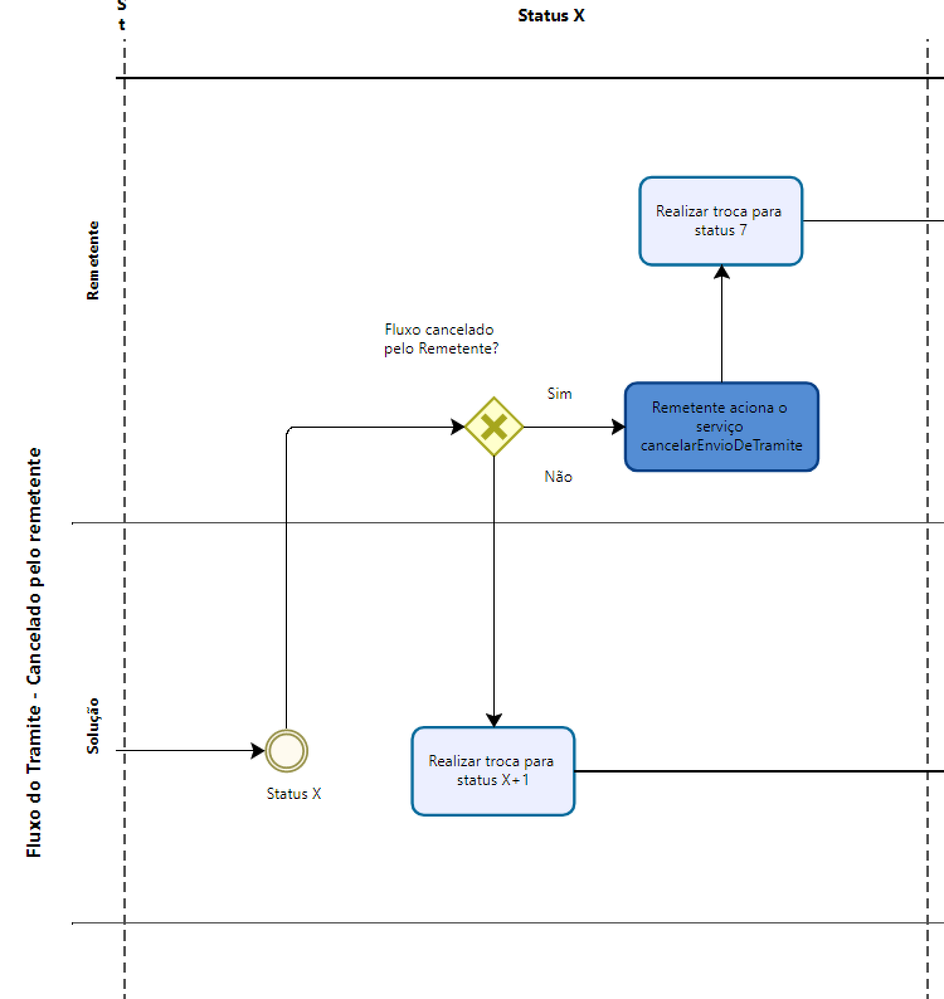

Manual de Fluxo do Trâmite
==========================

Introdução
----------

Este documento visa servir de apoio para a integração de Sistemas de Processo Eletrônico (SPE)  ao canal de comunicação eletrônico do PEN (Processo Eletrônico Nacional).

O canal de comunicação, acima citado, trata-se de um software intermediário que faz o papel de terceiro confiável no trâmite de processos e documentos eletrônicos entre órgãos integrantes. 

Para se integrar à solução, o órgão interessado deve:

1. Inscrever seu sistema de processo eletrônico junto à equipe gestora do sistema;
2. Obter o acesso ao ambiente de homologação;
3. Desenvolver a integração com o catálogo de serviços de interoperabilidade no ambiente de homologação;
4. Obter o acesso ao ambiente de produção.

Este manual é focado no item 3, ou seja, ele considera que o órgão interessado já possui acesso ao ambiente de homologação e deseja iniciar as evoluções em seu sistema.

Processos do Fluxo de Trâmite
-----------------------------

Os processos do Fluxo de Trâmite se dividem em fluxos principais e fluxos auxiliares.
Como fluxos principais temos:

• Pré-Trâmite;

• Trâmite realizado com sucesso - Processo;

• Trâmite Recusado pelo destinatário;

• Trâmite Cancelado pelo Remetente;

• Trâmite Cancelado automaticamente.

Como fluxos auxiliares, temos:

• Listar pendências; 

• Consultar trâmites; 

• Consultar repositórios e estruturas organizacionais; 

• Retransmitir processo ou documento avulso. 
 

Os fluxos principais e auxiliares são compostos por diversos cenários concatenados conforme andamento de cada um. 

.. admonition:: Notas

   1) Os desenhos de processo, que representarão os Processos de Fluxos de Trâmite serão baseados em notação BPMN, com as seguintes representações: 

   * Pool ou "Piscina", representando um processo. 
   * Raias são as faixas horizontais com faixas contínuas da _Pool_, tendo como atores responsáveis por executar as caixas de atividades: Remetente, Solução e Destinatário. A analogia simples entre Pool ("Piscina") e as suas raias serve como ilustração com a notação BPMN;
   * Milestones são as faixas verticais listradas, tendo como marcos os Status (cenários);
   * Caixas de atividades claras: Atividades executadas pelos atores dentro de um determinado milestone;
   * Caixas de atividades escuras: Atividades executadas pelos atores dentro de um determinado milestone, mas que estão relacionadas com acionamento de um endpoint;
   * Outras representações (anotações, gateways e eventos iniciais, intermediários e finais).

Fluxos Principais de Utilização
--------------------------------

Nesta seção são descritos os fluxos de processo de utilização principais da Solução de interoperabilidade e quais são os cenários envolvidos em cada um deles. 

A explicação é composta do desenho do fluxo de processos e texto complementar. Basicamente são três as situações dos fluxos principais do Tramita.GOV.BR: Realizado, Cancelado e Recusado.

O fluxo Realizado será a base comparativa de todos os outros fluxos, por motivos didáticos. 

.. admonition:: Nota

   É sempre importante ressaltar que um trâmite recusado **não é um erro**.

Basicamente, temos os seguintes códigos de status (numerados de 1 a 10), com os respectivas descrições. 

• Iniciar o envio de Status 0 para Status 1 - "Aguardando o envio dos arquivos digitais";

• Iniciar o envio de um documento avulso; Status 2 - Arquivos digitais recebidos pelo Tramita GOV.BR;

• Enviar os componentes digitais do trâmite;

• Enviar o recibo de conclusão do envio dos componentes digitais;

• Receber metadados e componentes digitais; Status 3 - Metadados recebidos pelo sistema de processo eletrônico destinatário e Status 4 - Arquivos digitais recebidos pelo destinatário

• Assinar e enviar o recibo de conclusão do trâmite; e, Status 5 Recibo de conclusão recebido pelo Tramita GOV.BR

• Receber o recibo de conclusão do trâmite. Status 6 - Recibo de conclusão recebido pelo remetente

• Cancelar o trâmite. Status 7 - Trâmite cancelado. Essa transição pode acontecer nos seguintes status:1,2,3 ou 4;

• Recusar o trâmite:

Status 8 - Aguardando Ciência (O Remetente está aguardando confirmação da recusa do processo)

Status 9 - Recusado pelo Destinatário

Essa transição pode ser feita nos status 3 ou 4

• Status 10 - Trâmite cancelado automaticamente
Essa transição pode ser feita nos status 1,2,3 ou 4, após o trâmite estar parado por mais de 8 dias corridos nesses status citados. 

Trâmite realizado com sucesso - Processo
^^^^^^^^^^^^^^^^^^^^^^^^^^^^^^^^^^^^^^^^

O Trâmite realizado com sucesso é representado pelo seguinte desenho de fluxo: 

.. figure:: _static/images/Fluxo_tramite_01-Tramite_Realizado.png

Iniciar o envio de um processo administrativo 
^^^^^^^^^^^^^^^^^^^^^^^^^^^^^^^^^^^^^^^^^^^^^

Quando uma unidade administrativa deseja tramitar um processo administrativo, o SPE remetente se encontra neste cenário. Pré-requisitos: 

• Metadados do processo administrativo a ser tramitado; 

• Identificação da unidade administrativa de destino, bem como seu repositório de estruturas organizacionais. 

A Figura abaixo descreve os serviços que devem ser chamados para execução deste cenário, a partir do endpoint enviarprocesso (/interoperabilidade/rest/v3/tramites/processo). 

.. figure:: _static/images/Fluxo_tramite_Cenario_01-envio_proc_adm_v02.png

Nota-se que há uma transição do Status 0 para o Status 1: A transição inicia após a finalização da Escolha de destinatário pelo Remetente. Após isso, a Solução Verifica possíveis tramitações anteriores do processo: caso o processo já foi tramitado alguma vez com sucesso, a solução recupera o NRE (Número de Registro Eletrônico), caso negativo, a solução gera um novo NRE.

Com isso, o Remetente aciona o serviço endpoint enviarprocesso (/interoperabilidade/rest/v3/tramites/processo) para realizar a transição para o Status 1.

Iniciar o envio de um documento avulso
^^^^^^^^^^^^^^^^^^^^^^^^^^^^^^^^^^^^^^

Quando uma unidade administrativa deseja tramitar um documento avulso, o SPE remetente encontra-se neste cenário. Pré-requisitos: 

• Metadados do documento avulso a ser tramitado; 

• Identificação das estruturas organizacionais que receberão o artefato. 

A Figura abaixo descreve o fluxo de chamadas para este cenário.

.. figure:: _static/images/Fluxo_tramite_Cenario_02-envio_DocAv_v02.png

Nota-se que há uma transição do Status 0 para o Status 1: A transição inicia após a finalização da Escolha de destinatário pelo Remetente. Após isso, a Solução gera um novo NRE.

Com isso, a Solução realiza transição para o Status 1 e aciona o serviço/endpoint enviarDocumento.

Enviar os componentes digitais do trâmite
^^^^^^^^^^^^^^^^^^^^^^^^^^^^^^^^^^^^^^^^^^

Após o início do trâmite, o SPE remetente deve enviar para a Solução os componentes digitais do processo ou documento tramitado. Pré-requisitos: 

• Ticket de envio de componentes digitais: número de identificação das pendências de envio, retornado na chamada do serviço que iniciou o trâmite; 

• Conteúdo binário dos componentes: deve ser exatamente o mesmo conteúdo que gerou o hash (espalhamento) que foi informado nos metadados na abertura do trâmite. 

• Número de Registro Eletrônico: número de identificação do trâmite a qual está enviando o componente digital. 

A Figura abaixo descreve o fluxo para envio dos componentes digitais de um trâmite. Note que o mesmo fluxo atende os trâmites de processo administrativo 

.. figure:: _static/images/Fluxo_tramite_Cenario_03-envio_CompDig_v02.png

Transição do Status 1 para o Status 2: A transição inicia após o acionamento do endpoint enviarprocesso. O remetente envia os arquivos digitais para a Solução: caso existam arquivos grandes dentro do processo para tramitação, o remetente aciona o serviço/endpoint enviarComponenteDigitalEmParte (tickets-de-envio-de-componente/{idTicketDeEnvio}/protocolos/componentes-a-enviar/partes/{parte}), caso contrário, somente o serviço enviarComponenteDigital (tickets-de-envio-de-componente/{idTicketDeEnvio}/protocolos/componentes-a-enviar). Em ambos os casos, a tarefa entra em looping até que todos os arquivos sejam enviados para a solução.

Em seguida, a solução realiza a troca para o status 2.

Enviar o recibo de conclusão do envio dos componentes digitais
^^^^^^^^^^^^^^^^^^^^^^^^^^^^^^^^^^^^^^^^^^^^^^^^^^^^^^^^^^^^^^^

Após o remetente enviar todos os componentes digitais referentes ao trâmite para a Solução, a Solução gera o recibo de conclusão do envio dos componentes digitais do processo ou documento tramitado para uma possível consulta pelo remetente. Pré-requisitos: 

• IDT: identificador do trâmite. 

• Ter concluído o envio para a Solução de todos os componentes digitais solicitados. 

A Figura abaixo demonstra o fluxo desse cenário:

.. figure:: _static/images/Fluxo_tramite_Cenario_04-Recibo_conclusao_v02.png

Transição do Status 2 para o Status 3: após a solução a solução realizar a troca para o status 2, o Remetente aciona o serviço/endpoint downloadReciboDeEnvio (/tramites/{idt}/recibo-de-envio). 

A partir desse momento, o Destinatário pode baixar processo ou documento avulso, aciona serviço/endpoint solicitarMetaDados (/tramites/{idt}) e a solução realiza troca para status 3.

Receber metadados e componentes digitais
^^^^^^^^^^^^^^^^^^^^^^^^^^^^^^^^^^^^^^^^

O SPE, ao consumir o serviço de pendências (vide seção de cenários auxiliares), pode identificar um trâmite novo cujo destinatário está sob seu tratamento. Neste caso, ele deve seguir o descrito neste cenário. Pré-requisitos: 

• IDT: identificador do trâmite que está aguardando solicitação dos metadados por parte do SPE de destino. 

A Figura abaixo demonstra os serviços que devem ser chamados para conclusão deste cenário.

.. figure:: _static/images/Fluxo_tramite_Cenario_05-Receb_Metadados_CompDig_v02.png

Transição do Status 3 para o Status 4: após a troca para o status 3, o Destinatário recebe os arquivos digitais da solução: caso existam arquivos grandes dentro do processo para tramitação, o Destinatário aciona o serviço/endpoint downloadComponenteDigitalEmParte (/tramites/{idt}/protocolos/componentes-digitais/partes/{parte}), caso contrário, somente o serviço downloadComponenteDigital (tramites/{idt}/protocolos/componentes-digitais). Em ambos os casos, a tarefa entra em looping até que todos os arquivos sejam baixados da solução.

Em seguida, a solução realiza a troca para o status 4.

Deve ser considerado que, a critério de cada SPE, o momento da solicitação dos metadados e o momento do recebimento dos componentes digitais podem divergir, a fim de permitir a melhor utilização dos recursos de tráfego de rede. Como exemplo, o SPE pode receber os metadados assim que a pendência surge para ele, mas agendar o recebimento dos componentes digitais para período de baixa utilização de rede.

Assinar e enviar o recibo de conclusão do trâmite 
^^^^^^^^^^^^^^^^^^^^^^^^^^^^^^^^^^^^^^^^^^^^^^^^^^

Após a conclusão do recebimento dos componentes digitais, o SPE precisa assinar um recibo de conclusão do trâmite. Essa assinatura é feita através do certificado digital que o SPE usa para se comunicar com a Solução de interoperabilidade. Pré-requisitos: 

• IDT do trâmite que está aguardando o recibo de conclusão; 

• Assinatura digital efetuada sobre os dados do recibo (o texto exato a ser assinado pode ser conferido na seção Textos assinados nos recibos). 

A Figura abaixo demonstra o fluxo de chamadas para o envio do recibo de trâmite.

.. figure:: _static/images/Fluxo_tramite_Cenario_06-AssEnv_RecConc_v02.png

Transição do Status 4 para o Status 5: após a solução realizar a troca para o status 4, ela mesma aciona o serviço/endpoint enviarReciboTramite (/tramites/{idt}/recibo). Em seguida, a solução realiza a troca para o status 5.

Receber o recibo de conclusão do trâmite
^^^^^^^^^^^^^^^^^^^^^^^^^^^^^^^^^^^^^^^^

Após o envio do recibo à Solução, assinado pelo SPE destinatário, o SPE remetente é notificado com uma pendência para receber este recibo. Este é o último passo antes que o trâmite seja dado como concluído dentro da Solução de interoperabilidade. Pré-requisitos: 

• IDT do trâmite na situação correspondente. 

A Figura abaixo demonstra o fluxo de chamadas para o recebimento do recibo de conclusão de trâmite.

.. figure:: _static/images/Fluxo_tramite_Cenario_07-Receber_RecConc_v02.png

Transição do Status 5 para o Status 6:após a solução realizar a troca para o status 5, o Remetente aciona o serviço/endpoint periodicamente listarPendências (tramites/pendentes). Esse serviço fica em looping, verificando se existe pendências de status 5 (recebimento de recibo do Tramite). Somente quando existir pendência de status 5, o Remetente pode baixar o recibo de conclusão de Trâmite e acionar o serviço/endpoint downloadRecibodeTramite (tramites/{idt}/recibo). A solução então realiza a troca para o status 6. Em complemento, caso o processo não foi tramitado alguma vez com sucesso (isto é, nunca havia recebido o status 6), o SPE irá armazenar o NRE.

Trâmite Recusado pelo destinatário
^^^^^^^^^^^^^^^^^^^^^^^^^^^^^^^^^^

Outro processo principal da solução é quando o trâmite é recusado pelo destinatário. O SPE de destino de um trâmite pode, em determinadas circunstâncias, recusar um trâmite. 

Para isso ele precisa dos seguintes itens: 

• IDT do trâmite que já se encontra sob sua responsabilidade e ainda não foi concluído; 

• Motivo da recusa (uma das opções da enumeração definida pela própria Solução); 
• Justificativa da recusa (texto complementar ao motivo).

O Trâmite Recusado pelo destinatário pode ser representado pelo seguinte desenho de fluxo:

Esse fluxo demonstra o processo em quais etapas ele pode ser recusado pelo destinatário em comparação ao fluxo de processo realizado com sucesso simplificado.

Nesse fluxo de processo simplificado, retiramos os detalhes as tarefas e os acionamentos dos endpoints, deixando somente os status como eventos intermediários e as suas transições. Para maiores detalhes desses status não detalhados, consulte cada um deles no TRÂMITE REALIZADO COM SUCESSO.

No fluxo de processo da recusa, temos basicamente 3 etapas: início, recusa e finalização. Será dado mais enfoque na recusa e na finalização, já que nessas etapas temos as ações e serviços específicos envolvidos no fluxo de trâmite recusado pelo destinatário. 

O início contempla os status 0, status 1 e status 2. As possíveis recusas estão nos status 3 e 4. E a finalização da recusa estão nos status 8 e 9.

Recusar o trâmite do processo
^^^^^^^^^^^^^^^^^^^^^^^^^^^^^

Após o início do trâmite (nesse contexto, pode-se interpretar como após o status 2), o trâmite pode sofrer a recusa. A recusa pode ser realizada em uma das duas etapas: quando o processo se encontra com o status 3 (“Metadados recebidos pelo destinatário”) ou com o status 4 (“Componentes digitais recebidos pelo destinatário”).
Assim que o trâmite recebe o status 3, para ele ter a recusa, o destinatário deve recusar o trâmite acionando o serviço/endpoint recusarTramite (/tramites/{idt}/recusa). A solução irá realizar a troca para o status 8 (Aguardando Ciência) para finalizar a recusa. 
Da mesma forma, na recusa no status 4, após passar pelo status 3, o trâmite também pode sofrer a recusa pelo destinatário: Assim que o trâmite recebe o status 4, para ele ter a recusa, o destinatário deve recusar o trâmite acionando o serviço recusarTramite (/tramites/{idt}/recusa). A solução irá realizar a troca para o status 8 (Aguardando Ciência) para finalizar a recusa.

A partir do momento em que o trâmite for recusado pelo Destinatário, apenas o remetente visualizará os dados do trâmite, bem como suas situações/status. 

Finalizar a recusa do trâmite do processo
^^^^^^^^^^^^^^^^^^^^^^^^^^^^^^^^^^^^^^^^^

Após o serviço/endpoint recusarTramite ter sido acionado e o trâmite ter recebido o status, 8 (Aguardando Ciência), o SPE do remetente recebe notificação da recusa. 

Em seguida o remetente aciona o serviço/endpoint realizarCienciaRecusa (/tramites/{idt}/ciencia) e realiza a troca de status para o 9 (Recusado pelo destinatário), concluindo o trâmite. 

.. admonition:: Notas 

   É importante retomar e reforçar o que foi mencionado no começo do Manual: “um trâmite recusado não é um erro.” Para ilustrar essa máxima do Tramita.GOV.BR, seguem os exemplos de recusa de trâmite: 

   * Um processo com o número de protocolo 02019.003483/2018-68 já existe no sistema de destino. OBS: A recusa é uma das três formas de conclusão de trâmite. Portanto, não é um erro. 

   * O tamanho máximo permitido para arquivos PDF é 20 Mb. OBS: A recusa é uma das três formas de conclusão de trâmite. Portanto, não é um erro. 

   * A Unidade "Advocacia Geral do Estado - AGE-MG" não está configurada para receber processos/documentos avulsos por meio da plataforma. OBS: A recusa é uma das três formas de conclusão de trâmite. Portanto, não é um erro.

Trâmite Cancelado pelo Remetente
^^^^^^^^^^^^^^^^^^^^^^^^^^^^^^^^^

Outro processo principal da solução é quando o trâmite é cancelado pelo remetente. Após iniciar um trâmite de documento digital (avulso ou processo), o remetente pode desistir da operação, seja por motivos técnicos (algum hash que não foi calculado corretamente, por exemplo) ou por motivos negociais (a área identificou que o trâmite não deve mais ocorrer). Nesses casos, o SPE remetente deve cancelar o trâmite, e, para isto, os pré-requisitos são: 

* possuir o IDT; e 
* o destinatário ainda não ter enviado o recibo assinado para a Solução.

O Trâmite Cancelado pelo remetente pode ser representado pelo seguinte desenho de fluxo:

Esse fluxo demonstra o processo em quais etapas ele pode ser cancelado pelo remetente em comparação ao fluxo de processo realizado com sucesso simplificado (semelhante ao fluxo de trâmite recusado). Naturalmente, nesse fluxo de processo simplificado, repete-se a retirada de detalhes das tarefas e dos acionamentos dos endpoints, deixando somente os status como eventos intermediários e as suas transições. Para maiores detalhes desses status não detalhados, consulte cada um deles no TRÂMITE REALIZADO COM SUCESSO. 

Conforme foi explicado acima, o processo consegue ser cancelado pelo remetente somente se esse não tiver enviado o recibo de conclusão do trâmite assinado para a Solução (status 5). Isto é: após ter iniciado o trâmite, e esse receber o status 2, o trâmite pode ser cancelado pelo remetente no status 1, 2, 3 e 4.

Cancelar o trâmite do processo

Após o início do trâmite (nesse contexto, pode-se interpretar como após o status 0), o trâmite pode sofrer o cancelamento.

O cancelamento pode ser realizado em uma das quatro etapas: 

- Status 1 “Aguardando o Envio de Componentes Digitais”
- Status 2: “Componentes digitais recebidos pela solução”
- Status 3: “Metadados recebidos pelo destinatário”
- Status 4: “Componentes digitais recebidos pelo destinatário”

Abaixo temos uma representação parcial do processo, com foco no cancelamento pelo remetente, onde o ‘X’ pode ser o status 1 a 4.

Todos eles têm a mesma mecânica, que é o remetente deve cancelar o trâmite acionando o serviço/endpoint cancelarEnvioDeTramite (/tramites/{idt}). A solução irá realizar a troca para o status 7 “Cancelamento” para finalizar o cancelamento.

Trâmite Cancelado automaticamente
^^^^^^^^^^^^^^^^^^^^^^^^^^^^^^^^^

Como complemento aos processos principais, o trâmite cancelado automaticamente é uma funcionalidade que a solução apresenta para não permitir os trâmites fiquem parados aguardando uma decisão dos atores envolvidos. Nesses casos, o SPE remetente deve cancelar o trâmite, e, para isto, os pré-requisitos são: 

* possuir o IDT; e 
* o trâmite ficar parado em um status por um tempo maior que o estipulado;

Basicamente, a solução verifica um timer que contabiliza o tempo em que um trâmite fica parado em um determinado status. Caso esse tempo ultrapasse o tempo máximo definido pela equipe do Tramita.GOV.BR, o trâmite é cancelado automaticamente.

O tempo máximo é um parâmetro que é configurado pela equipe do Tramita.GOV.BR. 

Cancelar automaticamente o trâmite do processo
^^^^^^^^^^^^^^^^^^^^^^^^^^^^^^^^^^^^^^^^^^^^^^

Após o início do trâmite (nesse contexto, pode-se interpretar como após o status 0), o trâmite pode sofrer o cancelamento automático

O cancelamento automático pode ser realizada em uma das quatro etapas: 

* Status 1 “Aguardando o Envio de Componentes Digitais”
* Status 2: “Componentes digitais recebidos pela solução”
* Status 3: “Metadados recebidos pelo destinatário”
* Status 4: “Componentes digitais recebidos pelo destinatário”

Abaixo temos uma representação parcial do processo, com foco no cancelamento pelo remetente, onde o ‘X’ pode ser o status 1 a 4.

Todos eles têm a mesma mecânica, que é solução deve cancelar automaticamente (após o tempo máximo estipulado) o trâmite acionando o serviço/endpoint cancelarEnvioDeTramite (/tramites/{idt}). A solução irá realizar a troca para o status 10 “Cancelado Automaticamente” para finalizar o cancelamento automático.

