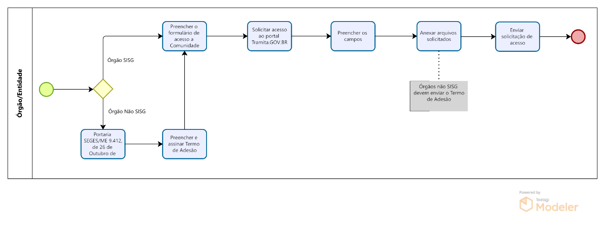
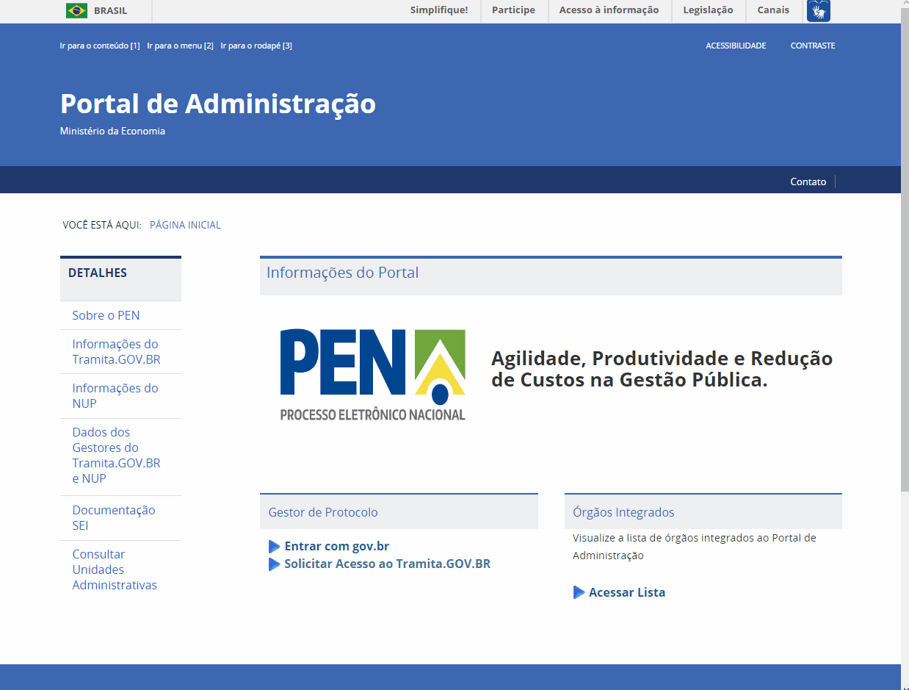

Solicitação de Acesso
=====================

Todo procedimento referente ao contato inicial do órgão ou entidade com o Tramita.GOV.BR é realizado em ambiente de homologação, com o objetivo de assegurar a correta configuração da plataforma antes de se autorizar sua adoção em ambiente de produção, de modo a minimizar eventuais falhas de operação e seus impactos nos órgãos usuários. 

Os procedimentos operacionais para a utilização do ambiente de homologação estão definidos nos capítulos `Configuração da Estrutura <https://manuais.processoeletronico.gov.br/pt_BR/latest/TRAMITA.GOV.BR/CONFIGURACAO_DA_ESTRUTURA.html#configuracoes-da-estrutura>`_ , `Implantação do Módulo de Conexão <https://manuais.processoeletronico.gov.br/pt_BR/latest/TRAMITA.GOV.BR/IMPLANTACAO_DO_MODULO_DE_CONEXAO.html#implantacao-do-modulo-de-conexao>`_ e `Acesso ao Ambiente de Produção <https://manuais.processoeletronico.gov.br/pt_BR/latest/TRAMITA.GOV.BR/ACESSO_AO_AMBIENTE_DE_PRODUCAO.html#acesso-ao-ambiente-de-producao>`_, abaixo, em modelo explicativo para a introdução facilitada ao sistema. Os dados referentes ao ambiente de produção estão no capítulo `Outras Informações <https://manuais.processoeletronico.gov.br/pt_BR/latest/TRAMITA.GOV.BR/OUTRAS_INFORMACOES.html#outras-informacoes>`_.

Acesso ao Portal de Administração
++++++++++++++++++++++++++++++++++

O presente Manual Operacional trata apenas das operações a serem executadas no Portal de Administração do Tramita.GOV.BR e dos procedimentos de testes para validação da integração da plataforma ao SPE do órgão. Orientações específicas referentes à configuração do módulo de integração ao Tramita.GOV.BR do SEI https://github.com/pengovbr/mod-sei-pen . No caso de outros SPEs, a orientação é a leitura do Manual de Utilização da API disponível em: https://www.gov.br/gestao/pt-br/assuntos/processo-eletronico-nacional/destaques/material-de-apoio-2/tramita-gov.br/material-de-apoio-tramita.GOV.BR.  

* Para acessar o ambiente de Homologação, o endereço é https://homolog.gestaopen.processoeletronico.gov.br/. 

.. figure:: _static/images/Portal_administracao.gif

* No fluxo a seguir, estão detalhadas todas as etapas necessárias para solicitar o acesso ao Tramita.GOV.BR. 

* Assim, conforme o fluxo, as atividades dessa etapa são diferentes de acordo com a classificação do órgão ou da entidade interessada em realizar o acesso a plataforma. 

* É obrigatório que no mínimo um dos Gestores de Protocolo do órgão/entidade em processo de implantação preencher o formulário de inclusão na Comunidade do Tramita.GOV.BR por meio do `link <https://forms.office.com/Pages/ResponsePage.aspx?id=aSnJPlFaGE-Kye-Y-6-peDi9G5TEeHJOgRQMfYkAx3hUOElTNllYNjA2WlgxV1ozV0k1S0hMQzU1RiQlQCN0PWcu>`_.  

* Órgãos ou entidades não integrados ao SISG, conforme conceituado no Capítulo Definições. 

Preenchimento do Cadastro
+++++++++++++++++++++++++

Para o envio da solicitação de acesso, todos os campos são de preenchimento obrigatório. Segue o passo a passo com as orientações para o preenchimento dos campos na tela de solicitação do cadastro.

**a.Executivo Federal**

.. admonition:: Nota
   
   Os gestores de órgãos/entidades com estrutura hierárquica mantida pelo SIORG devem sempre marcar a unidade administrativa raiz. Por exemplo: o  Gestor que trabalha no Ministério da  Gestão e da Inovação em Serviços Públicos, ao solicitar o acesso, deve marcar a unidade administrativa" Ministério da Gestão e da Inovação em Serviços Públicos” e não unidades abaixo dela.

**a.1.** Caso o órgão ou a entidade pertença ao poder Executivo da esfera federal, marque a opção como **“Sim”**, para que a estrutura seja recuperada do cadastro do Órgão/Entidade no SIORG. Assim, o sistema apresentará a Unidade Administrativa raiz da estrutura do SIORG. Navegue pela estrutura até encontrar o Órgão/Entidade representado e selecione-o para prosseguir com a solicitação.

.. figure:: _static/images/Selecao_de_orgao_Entidade.gif

**b.Órgão ou entidade que não pertence ao executivo federal**

**b.1.** Caso o órgão ou a entidade representada não pertença ao poder Executivo Federal, marque a opção como “Não” e preencha manualmente os dados de identificação. Os dados solicitados são: Nome, Sigla, UF, CNPJ, Endereço e CEP.

.. figure:: _static/images/Tela_de_Cadastro_orgaos_nao_SIORG.gif

** Campo Documento comprobatório 

O órgão solicitante deve informar o Gestor Tecnológico¹.

::

  ¹O que são Gestores Tecnológicos?

  Gestores Tecnológicos são órgãos responsáveis pela infraestrutura na qual o SPE está implantado. Atualmente, existem duas opções: Interno e Dataprev. Na opção Interno, o SPE é instalado na infraestrutura interna do próprio órgão. Em contraste, o SPE pode ser implementado em uma infraestrutura externa, que não pertence ao órgão em questão.

  Para mais informações é possível acessar o item 2.11 da FAQ Tramita GOV.BR

Durante o preenchimento dos dados do Gestor de Protocolo, o sistema solicita a anexação de uma Portaria ou outro documento de designação, que comprove sua competência para exercer esta função para o Órgão/ Entidade solicitante. 

Os órgãos/entidades não integrantes da administração pública federal direta, autárquica e fundacional devem **obrigatoriamente** incluir o Termo de Adesão ao Tramita.GOV.BR nesse campo, conforme modelo aprovado pela `Portaria SEGES nº 9.412, de 26 de outubro de 2022  <https://www.gov.br/compras/pt-br/acesso-a-informacao/legislacao/portarias/portaria-seges-me-no-9412-de-26-de-outubro-de-2022>`_.

Análise do Cadastro para Acesso ao Tramita.GOV.BR
++++++++++++++++++++++++++++++++++++++++++++++++++

Após o envio da solicitação de cadastro de Acesso ao Tramita os administradores da plataforma receberão uma notificação para analisar o cadastro do primeiro Gestor de Protocolo.

Nessa análise, serão verificados o instrumento normativo, a vinculação ao órgão indicado e os demais dados cadastrais informados pelo solicitante. Uma vez aprovada esta solicitação, o solicitante será notificado por e-mail para dar continuidade ao processo.

Efetivado o cadastro, este gestor se torna responsável pelo cadastro dos demais gestores de protocolo ligados ao seu órgão, bem como a configuração da hierarquia e a geração do certificado digital. Para os casos em que o Gestor Tecnológico não seja o próprio órgão (Interno), a empresa sinalizada como Gestor Tecnológico é responsável pela geração do certificado digital e não o Gestor de Protocolo, uma vez que a infraestrutura tecnológica não é gerenciada pelo órgão solicitante.

