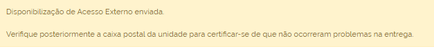

Usuário Externo
================

Disponibilização de Acesso Externo para Acompanhamento de Processo
++++++++++++++++++++++++++++++++++++++++++++++++++++++++++++++++++

Recurso destinado a liberação de acesso a um processo a usuários externos interessados.

Para realizar a liberação, o usuário deverá acessar o processo e clicar no ícone “**Gerenciar Disponibilizações de Acesso Externo**” |gerenciar_acesso_externo|.

.. figure:: _static/images/10-UE-tela_processo_gerenciar_acesso_externo.gif

A tela “**Gerenciar Disponibilizações de Acesso Externo**” será aberta. Nela, o usuário deverá preencher os campos:

* **E-mail da Unidade**: selecionar o e-mail da Unidade geradora do processo;
* **Destinatário**: campo para informar o usuário ao qual será disponibilizado o acesso ao processo.
   * **Filtrar somente usuários externos**: Caso selecionada esta flag, o campo destinatário só retornará os usuários externos.
* **E-mail do Destinatário**: será preenchido automaticamente com o e-mail relacionado ao usuário indicado no campo Destinatário, caso o usuário tenha email cadastrado. Caso não tenha, será necessário inserir um email para contato, neste campo.
* **Motivo**: campo destinado ao preenchimento do motivo para disponibilização de acesso do processo ao 
* **Tipo**
   * **Acompanhamento integral do processo**: caso esta flag seja selecionada, o usuário terá acesso a visualização de todos os documentos da pasta.
   * **Disponibilização de documentos**: caso esta flag seja a escolhida, o usuário poderá selecionar os documentos que o usuário externo poderá visualizar. Para tanto, clicar no ícone de pesquisa |Pesquisar|, selecionar os protocolos e clicar em transpor.

.. |Pesquisar| image:: _static/images/10-UE-icone_pesquisar.png
   :align: middle
   :width: 25

.. figure:: _static/images/10-UE-tela_selecionar_protocolos_acesso_externo.gif

* **Permitir Inclusão de Documentos**: se o usuário selecionado no campo destinatário for um usuário externo, será possível por meio da marcação desta flag permitir que o usuário externo inclua documentos no processo. Ao selecionar esta flag, o campo “Tipos de documentos liberados para inclusão” será aberto. Nele, o usuário poderá definir os tipos de documentos para esta liberação por meio do ícone de pesquisa |Pesquisar|.
* **Validade (dias)**: indicar o tempo, em dias úteis, que o processo ficará disponível para visualização do usuário externo.
* **Senha**: campo para inclusão da senha SUPER.GOV.BR.

.. |Pesquisar| image:: _static/images/10-UE-icone_pesquisar.png
   :align: middle
   :width: 25

.. figure:: _static/images/10-UE-gerenciar_disponibilizacao_externo_formulario.png

O sistema emitirá uma mensagem confirmando a disponibilização do Acesso Externo.

As informações sobre a Disponibilização efetuada passarão a constar na Lista de Disponibilizações de Acesso Externo, que fica no fim da tela “**Gerenciar Disponibilizações de Acesso Externo**”.

Nessa Lista, constam as seguintes informações sobre as Disponibilizações de Acesso Externo efetuadas: Destinatário (nome e endereço de e-mail); Unidade responsável; data e hora da Disponibilização; data da Validade; data e hora da Visualização; data e hora do Cancelamento, se for o caso.

.. figure:: _static/images/10-UE-gerenciar_disponibilizacao_externo_mensagem.png

Na coluna Ações, estarão disponíveis os seguintes ícones:

* **Cancelar Liberação de Assinatura Externa** |cancelar_liberacao|: permite o cancelamento da Liberação de Assinatura Externa; 
* **Visualização Integral do Processo** |visualizacao_integral|: indica que foi liberada a visualização integral do processo, juntamente com a Liberação de Assinatura Externa; 
* **Com disponibilização de documentos** |disponibilizacao_documetos|: indica que foram disponibilizados um ou mais documentos adicionais para consulta, juntamente com a Liberação de Assinatura Externa. Ao clicar no ícone, será apresentada a relação de documentos disponibilizados;
* **Permitida a inclusão de documentos** |inclusao_documentos|: indica que foi liberada a possibilidade de que o usuário com liberação para assinatura, também inclua documentos no processo. Ao clicar no ícone, será a relação com os tipos de documentos permitidos.

.. |cancelar_liberacao| image:: _static/images/10-UE-icone_cancelar_liberacao.png
   :align: middle
   :width: 25

.. |visualizacao_integral| image:: _static/images/10-UE-icone_visualizacao_integral.png
   :align: middle
   :width: 25

.. |disponibilizacao_documetos| image:: _static/images/10-UE-icone_disponibilizacao_documentos.png
   :align: middle
   :width: 25

.. |inclusao_documentos| image:: _static/images/10-UE-icone_permitir_incusao.png
   :align: middle
   :width: 25

Após a Disponibilização do Acesso Externo, o interessado receberá, no e-mail indicado, um link para acesso ao processo, bem como a informação do prazo de validade da disponibilização.

Ao clicar no link, o interessado será direcionado para a tela “**Acesso Externo com Acompanhamento Integral do Processo**” ou para a tela “**Acesso Externo com Disponibilização Parcial de Documentos**”, conforme o caso. Nessas telas, serão exibidos: os dados de cadastro do processo, a Lista de Protocolos e a Lista de Andamentos do processo. 

Na Lista de Protocolos, é possível acessar o conteúdo dos documentos que foram disponibilizados. Para isso, basta clicar sobre o número do Protocolo correspondente. 

O usuário poderá ainda gerar um arquivo em formato PDF contendo os documentos disponibilizados no processo, por meio do botão Gerar PDF; ou gerar um arquivo ZIP, por meio do botão Gerar ZIP.

.. figure:: _static/images/10-UE-tela_gerar_PDF_ZIP.png

.. figure:: _static/images/10-UE-tela_gerar_PDF_ZIP_resultado.png

Gerenciar Assinaturas de Usuários Externos
++++++++++++++++++++++++++++++++++++++++++

Recurso que possibilita atribuir a possibilidade de usuários externos assinem documentos.

Para permitir ao usuário externo assinar documentos produzidos no SUPER.GOV.BR, o usuário deverá acessar o processo, selecionar o documento que deverá ser assinado e clicar no ícone “Gerenciar Liberações para Assinatura Externa” |gerenciar_liberacoes|.

.. figure:: _static/images/10-UE-tela_gerenciar_liberacoes.gif

A tela “**Gerenciar Assinaturas Externas**” será aberta. Nela, o usuário deverá preencher os campos:

* **E-mail da Unidade**: selecionar o email da Unidade geradora do processo;
* **Liberar Assinatura Externa para**: indicar o usuário externo que terá a liberação para assinatura de documento.
* **Com visualização integral do processo**: caso esta flag seja selecionada, o usuário terá acesso a visualização de todos os documentos da pasta.

.. admonition:: Nota

   Se a opção “**Com visualização integral do processo**” for marcada, o usuário externo terá acesso ao conteúdo do processo e poderá acompanhar seu trâmite mesmo após a assinatura do documento. Se a opção não for marcada, o usuário só terá acesso ao número do processo e ao conteúdo do documento indicado para assinatura.

* **Protocolos adicionais disponibilizados para consulta**: Caso não seja disponibilizada a visualização integral do processo, neste campo poderão ser selecionados os protocolos que o usuário externo poderá visualizar. Para tanto, clicar no ícone de pesquisa |Pesquisar|, selecionar os protocolos e clicar em transpor.

.. |Pesquisar| image:: _static/images/10-UE-icone_pesquisar.png
   :align: middle
   :width: 25

.. figure:: _static/images/10-UE-tela_selecionar_protocolos_acesso_externo_transpor.gif

* **Permitir Inclusão de Documentos**: flag que possibilita ao usuário permitir que o usuário externo inclua documentos no processo. Ao selecionar esta flag, o campo “Tipos de documentos liberados para inclusão” será aberto. Nele, o usuário poderá definir os tipos de documentos para esta liberação por meio do ícone de pesquisa |Pesquisar|.
* **Validade (dias)**: indicar o tempo, em dias úteis, que o documento ficará disponível para assinatura do usuário externo.
* **Senha**: campo para inclusão da senha SUPER.GOV.BR.

.. |Pesquisar| image:: _static/images/10-UE-icone_pesquisar.png
   :align: middle
   :width: 25

.. figure:: _static/images/10-UE-tela_gerenciar_assinaturas_formulario.png

Após a liberação (por meio de clique no botão “**Liberar**”), o sistema encaminhará um email com o link para acesso ao SUPER.GOV.BR. Tal ação é informada ao usuário por meio de alerta disponível em tela.

.. figure:: _static/images/10-UE-gerenciar_liberacao_externo_mensagem.png

Além disso, no fim da tela “**Gerenciar Assinaturas Externas**”, ficará disponível a Lista de Liberações de Assinatura Externa. Nela, constam as seguintes informações sobre as Liberações de Assinatura:

* endereço de e-mail do Usuário Externo; 
* Unidade responsável; 
* data e hora da Liberação; 
* Validade; 
* data e hora da Visualização e da Utilização; 
* data e hora do Cancelamento, se for o caso.

.. figure:: _static/images/10-UE-gerenciar_assinaturas_externas.png

Na coluna Ações, estarão disponíveis os seguintes ícones:

* **Cancelar Liberação de Assinatura Externa** |cancelar_liberacao|: permite o cancelamento da Liberação de Assinatura Externa; 
* **Visualização Integral do Processo** |visualizacao_integral|: indica que foi liberada a visualização integral do processo, juntamente com a Liberação de Assinatura Externa;
* **Com disponibilização de documentos** |disponibilizacao_documetos|: indica que foram disponibilizados um ou mais documentos adicionais para consulta, juntamente com a Liberação de Assinatura Externa. Ao clicar no ícone, será apresentada a relação de documentos disponibilizados;
* **Permitida a inclusão de documentos** |inclusao_documentos|: indica que foi liberada a possibilidade de que o usuário com liberação para assinatura, também inclua documentos no processo. Ao clicar no ícone, será a relação com os tipos de documentos permitidos.

.. |cancelar_liberacao| image:: _static/images/10-UE-icone_cancelar_liberacao.png
   :align: middle
   :width: 25

.. |visualizacao_integral| image:: _static/images/10-UE-icone_visualizacao_integral.png
   :align: middle
   :width: 25

.. |disponibilizacao_documetos| image:: _static/images/10-UE-icone_disponibilizacao_documentos.png
   :align: middle
   :width: 25

.. |inclusao_documentos| image:: _static/images/10-UE-icone_permitir_incusao.png
   :align: middle
   :width: 25
