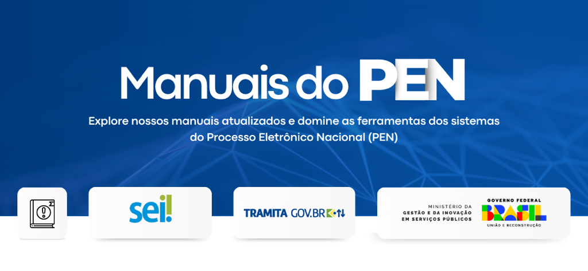

PEN - Manuais de Sistemas
=========================

Olá, usuário das soluções do Processo Eletrônico Nacional

Aqui você encontrará os manuais atualizados dos sistemas do Processo Eletrônico Nacional (PEN). Explore e domine as ferramentas e funcionalidades do Sistema Eletrônico de Informações - SEI e da plataforma Tramita GOV.BR que já estão disponíveis com conteúdo de referência atualizado e revisado pela equipe do PEN.

Acesse todas essas informações no menu lateral dessa página de manuais do PEN, nesse mesmo endereço: `http://manuais.processoeletronico.gov.br <http://manuais.processoeletronico.gov.br>`_.

.. toctree::
   :hidden:
   :titlesonly:
   
   SEI/index
   
.. toctree::
   :hidden:
   :titlesonly:
   
   MODULOS-SEI/index

.. toctree::
   :hidden:
   :titlesonly:   

   TRAMITA.GOV.BR/index
