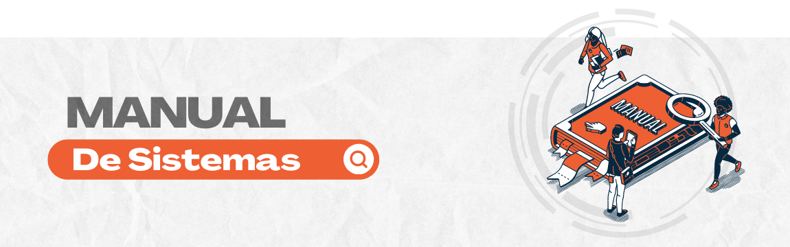

Manual SUPER.GOV.BR 1.0
=======================

Este manual foi elaborado pela equipe do Departamento de Processo Eletrônico Nacional em Rede. Sua construção foi baseada em documentações relativas ao sistema SEI, dando destaque à “Cartilha do Usuário Sistema Eletrônico de Informações (SEI)” elaborada pelo Diretoria de Administração e Logística do Ministério da Economia e ao “Guia Prático do SEI” elaborado pelo Superior Tribunal de Justiça (STJ). 

O objetivo deste material é apresentar aos usuários os recursos e facilidades fornecidas pelo SUPER.GOV.BR 1.0 (base SEI), permitindo uma melhor experiência no uso da ferramenta no dia a dia. Além disso, entendemos este material em processo de melhoria contínua, podendo sofrer revisões devido a melhorias de funcionalidade ou mesmo revisões para tornar as redações mais claras e esclarecedoras aos usuários. Todos os servidores fazem parte de processo e podem realizar sugestões sempre que entenderem necessário.

A equipe do PEN construiu este material pensando em você! Desejamos que você utilize todos os recursos oferecidos pelo SUPER.GOV.BR e que o sistema possa auxiliá-lo na execução, tramitação, guarda e recuperação das informações do dia a dia.

**Departamento de Informações, Serviços e Sistemas de Gestão (DTGES)** / **Coordenação-Geral de Soluções Negociais em Processo Eletrônico (CGESP)**

Introdução
==========

O SUPER.GOV.BR 1.0 é um sistema de gestão de processos e documentos arquivísticos eletrônicos, baseado no Sistema Eletrônico de Informações (SEI), que tem o objetivo de aprimorar a gestão documental e tramitação de processos administrativos eletrônicos, contribuindo para o controle, a padronização e a manutenção de documentos via processos digitais, bem como para o aumento da eficiência da gestão pública e da transparência dos processos de trabalho.

Sua interface moderna e responsividade possibilita sua utilização, também, em dispositivos móveis.

O SUPER.GOV.BR 1.0 é um dos produtos do projeto Processo Eletrônico Nacional (PEN), sendo uma das soluções de processo administrativo eletrônico empregada pela Administração Pública Federal, conforme artigo 16 da Lei 14.063 e Parecer PGFN.

O Processo Eletrônico Nacional (PEN), sob coordenação do Ministério da Economia, é uma iniciativa conjunta de órgãos e entidades de diversas esferas da Administração Pública, pautada pela colaboração e construção de uma infraestrutura pública de processo administrativo eletrônico, que visa à obtenção de substanciais melhorias no desempenho da gestão processual com ganhos em agilidade, eficiência, eficácia e efetividade da ação governamental, além de promover a utilização de meios eletrônicos para a realização dos processos administrativos com segurança, transparência, economicidade e facilitar o acesso do cidadão às instâncias administrativas.

O marco legal de implantação do PEN, no Poder Executivo, foi o Decreto n° 8.539, de 2015, que estabeleceu o uso de meio eletrônico para a realização de processos administrativos nos órgãos e entidades da Administração Pública direta, autárquica e fundacional, sendo sua operacionalização de responsabilidade da Secretaria de Gestão (SEGES), do Ministério da Economia (ME), e, especificamente, do Departamento de Normas e Sistemas de Logísticas (DELOG), conforme dispõe o art. 128, do Decreto nº 9.745, de 2019.

.. toctree::
   :hidden:
   :titlesonly:
   
   SEI/index
   
.. toctree::
   :hidden:
   :titlesonly:
   
   MODULOS-SEI/index

.. toctree::
   :hidden:
   :titlesonly:
   
   REFERENCIAS/index

   